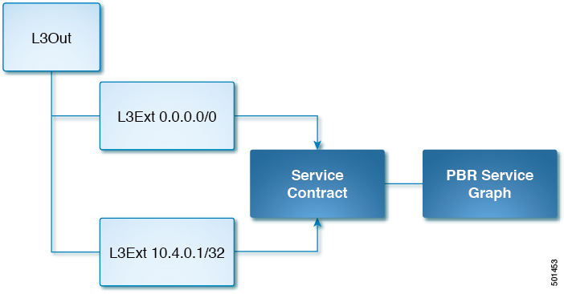

# Cisco Network Fabric and Kubernetes Integration

- [Overview](#overview)
- [Hardware Requirements](#hardware-requirements)
- [Kubernetes Compatibility Matrix](#kubernetes-compatibility-matrix)
- [Workflow for Kubernetes Integration](#workflow-for-kubernetes-integration)
   * [Planning for Kubernetes Integration](#planning-for-kubernetes-integration)
   * [Prerequisites for Integrating Kubernetes with Cisco ACI](#prerequisites-for-integrating-kubernetes-with-cisco-aci)
   * [Provisioning Cisco ACI to Work with Kubernetes](#provisioning-cisco-aci-to-work-with-kubernetes)
   * [Preparing the Kubernetes Nodes](#preparing-the-kubernetes-nodes)
   * [Installing Kubernetes and Cisco ACI Containers](#installing-kubernetes-and-cisco-aci-containers)
   * [Verifying the Kubernetes Integration](#verifying-the-kubernetes-integration)
- [Unprovisioning Kubernetes from the ACI Fabric](#unprovisioning-kubernetes-from-the-aci-fabric)
- [Uninstalling the CNI Plug-In](#uninstalling-the-cni-plug-in)
- [Upgrade the CNI Plug-in](#upgrade-the-cni-plug-in)
- [Using Policy](#using-policy)
   * [Network Policy and EPGs](#network-policy-and-epgs)
   * [Mapping to Cisco APIC](#mapping-to-cisco-apic)
   * [Creating and Mapping an EPG](#creating-and-mapping-an-epg)
   * [The acikubectl Command](#the-acikubectl-command)
   * [Load Balancing External Services](#load-balancing-external-services)
      + [Load Balancing External Services Across Multiple L3Out](#load-balancing-external-services-across-multiple-l3out)
- [Draining a Node](#draining-a-node)
- [Service Subnet Advertisement](#service-subnet-advertisement)
   * [Configuring Service Subnet Advertisement](#configuring-service-subnet-advertisement)
   * [Verifying Service Subnet Advertisement](#verifying-service-subnet-advertisement)
- [Service Account Hardening](#service-account-hardening)
   * [Checking the Current Administrative Privileges](#checking-the-current-administrative-privileges)
   * [Modifying Administrative Account Permissions](#modifying-administrative-account-permissions)
- [Feature and Configuration Details](#feature-and-configuration-details)
- [Troubleshooting Kubernetes Integration](#troubleshooting-kubernetes-integration)
   * [Troubleshooting Checklist](#troubleshooting-checklist)
   * [Troubleshooting Specific Problems](#troubleshooting-specific-problems)
      + [Collecting and Exporting Logs](#collecting-and-exporting-logs)
      + [Troubleshooting External Connectivity](#troubleshooting-external-connectivity)
      + [Troubleshooting POD EPG Communication](#troubleshooting-pod-epg-communication)
      + [Troubleshooting Endpoint Discovery](#troubleshooting-endpoint-discovery)
      + [Troubleshooting Pod Health Check](#troubleshooting-pod-health-check)
      + [Troubleshooting aci-containers-host](#troubleshooting-aci-containers-host)
      + [Datapath tracing with acikubectl](#datapath_tracing_with_acikubectl)


# Overview
Kubernetes is an open source system that automates the deployment, scaling and managing containers in a network. Beginning with Cisco APIC Release 3.0(1), you can integrate Kubernetes on bare-metal servers into the Cisco Application Centric Infrastructure (ACI).

To integrate Kubernetes with the Cisco ACI, you perform a series of tasks. Some you perform in the network to set up the Cisco Application Policy Infrastructure Controller (APIC); others you perform on the Kubernetes server. Once you have integrated Kubernetes, you can use the Cisco APIC to view Kubernetes in the Cisco ACI.
This document provides the workflow for integrating Kubernetes and specific instructions for setting up the Cisco APIC. However, it is assumed that you are familiar with Kubernetes and containers and can install Kubernetes. Specific instructions for installing Kubernetes are beyond the scope of this document.


# Hardware Requirements
This section provides the hardware requirements:

1. Connecting the servers to Gen1 hardware or Cisco Fabric Extenders (FEXes) is not supported and results in a non working cluster.
2. The use of symmetric policy-based routing (PBR) feature for load balancing external services requires the use of Cisco Nexus 9300-EX or -FX leaf switches. For this reason, the Cisco ACI CNI Plug-in is only supported for clusters that are connected to switches of those models.

**&#9432; Note**
>UCS-B is supported as long as the UCS Fabric Interconnects are connected to Cisco Nexus 9300-EX or -FX leaf switches.


# Kubernetes Compatibility Matrix
The following table displays the compatibility matrix for the Kubernetes offerings:
https://www.cisco.com/c/dam/en/us/td/docs/Website/datacenter/aci/virtualization/matrix/virtmatrix.html


# Workflow for Kubernetes Integration
This section provides a high-level description of the tasks required to integrate Kubernetes into the Cisco ACI fabric.
1. Prepare for the integration.

    Set up the subnets and VLANs in your network, following instructions in the section ["Planning for Kubernetes Integration"](#planning-for-kubernetes-integration)

2. Fulfill the prerequisites.

    Make sure that you fulfill all the prerequisites in the section ["Prerequisites for Integrating Kubernetes with Cisco ACI"](#prerequisites-for-integrating-kubernetes-with-cisco-aci)

3. Provision the Cisco APIC to work with Kubernetes.

    Download a provisioning tool, which includes a sample configuration file. Then update the configuration file with information you previously gathered about your network. Then run the provisioning tool with the information about your network. See the section ["Provisioning Cisco ACI to Work with Kubernetes"](#provisioning-cisco-aci-to-work-with-kubernetes)

4. Prepare the Kubernetes node.
   
    Set up networking for the node to support Kubernetes installation. This includes configuring an uplink interface, subinterfaces, and static routes. See the section ["Preparing the Kubernetes Nodes"](#preparing-the-kubernetes-nodes)

5. Install Kubernetes and Cisco ACI containers.

    Use the appropriate method for your setup. See the section ["Installing Kubernetes and Cisco ACI Containers"](#installing-kubernetes-and-cisco-aci-containers)

6. Verify the integration.

    Use the Cisco APIC GUI to verify that Kubernetes has been integrated into the Cisco ACI. See the section ["Verifying the Kubernetes Integration"](#verifying-the-kubernetes-integration)


## Planning for Kubernetes Integration
Various network resources are required to provide capabilities to the Kubernetes cluster, including several subnets, and routers.

1. You need the following subnets:

    - Node subnet:

        The subnet used for Kubernetes control traffic. It is where the Kubernetes API services are hosted. Make the node subnet a private subnet and make sure that it has access to the Cisco Application Policy Infrastructure Controller (APIC) management address.

    - Pod subnet:

        The subnet from which the IP addresses of Kubernetes pods are allocated. Make the pod subnet a private subnet.

        **&#9432; Note**
        > This subnet specifies the starting address for the IP pool that is used to allocate IP addresses to pods and your Cisco ACI bridge domain IP. For example, if you define it as 192.168.255.254/16, it is a valid configuration from a Cisco ACI perspective. However, your containers will not get an IP address because there are no free IPs after 192.168.255.254 in this subnet. We suggest to always use the first IP address in the POD subnet. In this example: 192.168.0.1/16.

    - Node service subnet:

        The subnet used for internal routing of load-balanced service traffic. Make the node service subnet a private subnet.

        **&#9432; Note**
        > Similarly to the Pod subnet note, configure it with the first IP in the subnet.

    - External service subnets:

        Pools from which load-balanced services are allocated as externally accessible service IPs.
        The externally accessible service IPs could be globally routable. Configure the next-hop router to send traffic to these IPs to the fabric. There are two such pools: One is used for dynamically allocated IPs and the other is available for services to request a specific fixed external IP.

2. You need the following VLANS for local fabric use:

    - Node VLAN: The VLAN used by the physical domain for Kubernetes nodes.
    - Service VLAN: The VLAN used for delivery of load-balanced service traffic.
    - Infra VLAN: The infra VLAN used by the Cisco ACI fabric.

In addition to providing network resources, read and understand the guidelines in the knowledge base article [Cisco ACI and OpFlex Connectivity for Orchestrators.](https://www.cisco.com/c/en/us/support/cloud-systems-management/application-policy-infrastructure-controller-apic/tsd-products-support-series-home.html)


## Prerequisites for Integrating Kubernetes with Cisco ACI
The following are required before you can integrate Kubernetes with the Cisco ACI fabric:

1. A working Cisco ACI installation
2. An attachable entity profile (AEP) set up with interfaces that are desired for the Kubernetes deployment
3. A Layer 3 Outside connection, along with a Layer 3 external network to serve as external access
4. Virtual routing and forwarding (VRF) configured.

    **&#9432; Note**
    > The VRF and L3Out in Cisco ACI that are used to provide outside connectivity to Kubernetes external services can be in any tenant. The most common usage is to put the VRF and L3Out in the common tenant or in a tenant that is dedicated to the Kubernetes cluster. You can also have separate VRFs, one for the Kubernetes bridge domains and one for the L3Out, and you can configure route leaking between them.

5. Any required route reflector configuration for the Cisco ACI fabric
6. A next-hop router that is connected to the Layer 3 external network capable of doing appropriate external access and configured with the required routes.

In addition, the Kubernetes cluster must be up through the fabric-connected interface on all the hosts. The default route should be pointing to the ACI node subnet bridge domain. This is not mandatory, but it simplifies the routing configuration on the hosts and is the recommend configuration. If you choose not to follow this design, all Kubernetes related traffic must go through the fabric.


## Provisioning Cisco ACI to Work with Kubernetes
Use the acc-provision tool to provision the fabric for the Kubernetes VMM domain and generate a `.yaml` file that Kubernetes uses to deploy the required Cisco Application Centric Infrastructure (ACI) container components.

ACI CNI in nested mode is only supported with VMM-integrated VMware (with dVS).

**Procedure**
1. Install `acc-provision` using the package posted in `pypi` (https://pypi.org/project/acc-provision/).

    Use the `pip install acc-provision` command to install from pypi.

    **&#9432; Note**
    > ACI-CNI support is generally backward compatible with the ACI, OpenShift, Kubernetes and Rancher releases and it is recommended to always install the latest packages (however if required, use the pip install acc-provision command to deploy a specific release)

2. Generate a sample configuration file that you can edit. e.g:

    `acc-provision -f kubernetes-1.29 --sample > aci-containers-config.yaml`

    The command generates a configuration file that looks like the following example:

```yaml

#
# Configuration for ACI Fabric
#
aci_config:
  system_id: mykube             # Every opflex cluster must have a distinct ID
  #apic-refreshtime: 1200       # Subscrption refresh-interval in seconds; Max=43200
  #apic_refreshticker_adjust: 150 # How early (seconds) the subscriptions to be refreshed than actual subscription refresh-timeout. Min=1, Max=65535
  #apic_subscription_delay: 100 # Delay after each subscription query in milliseconds; Min=1, Max=65535
  #opflex_device_delete_timeout: 1800   # Timeout in seconds to delete old opflex devices; Min=1, Max=65535
  #tenant:
    #name: pre_existing_tenant  # Add pre_existing_tenant name if it's manually created on the APIC
  apic_hosts:                   # List of APIC hosts to connect for APIC API
  - 10.1.1.101
  vmm_domain:                   # Kubernetes container domain configuration
    encap_type: vxlan           # Encap mode: vxlan or vlan
    mcast_range:                # Every opflex VMM must use a distinct range
      start: 225.20.1.1
      end: 225.20.255.255
    nested_inside:              # Include if nested inside a VMM;
                                #   supported for Kubernetes
    # elag_name: fab-elag       # elag name on APIC, this is required for ESXi vDS >= 6.6.0
    # type: vmware              # Specify the VMM vendor (supported: vmware)
    # name: myvmware            # Specify the name of the VMM domain

    # Mandatory field for Openshift on ESX flavor
    # Loadbalancer IP used to create duplicate service file for
    # router-default service in Openshift on ESX case. This has to be
    # the same LB IP used during installation
    # installer_provisioned_lb_ip: 192.168.18.201

  # The following resources must already exist on the APIC.
  # They are used, but not created, by the provisioning tool.
  aep: kube-cluster             # The AEP for ports/VPCs used by this cluster
  vrf:                          # This VRF used to create all kubernetes EPs
    name: mykube-vrf
    tenant: common              # This can be system-id or common
  l3out:
    name: mykube_l3out          # Used to provision external IPs
    external_networks:
    - mykube_extepg             # Used for external contracts
  #custom_epgs:                 # List of additional endpoint-group names
  #  - custom_group1            # to configure for use with annotations
  #  - custom_group2


#
# Networks used by ACI containers
#
net_config:
  node_subnet: 10.1.0.1/16      # Subnet to use for nodes
  pod_subnet:
  - 10.2.0.1/24       # Subnet to use for Kubernetes Pods
  - 10.2.1.1/24       # Subnet to use for Kubernetes Pods
  extern_dynamic: 10.3.0.1/24   # Subnet to use for dynamic external IPs
  extern_static: 10.4.0.1/24    # Subnet to use for static external IPs
  node_svc_subnet: 10.5.0.1/24  # Subnet to use for service graph
  kubeapi_vlan: 4001            # The VLAN used by the physdom for nodes
                                #   (Kubernetes only)
  service_vlan: 4003            # The VLAN used by LoadBalancer services
  infra_vlan: 4093              # The VLAN used by ACI infra
  #interface_mtu: 1600          # min = 1280 for ipv6, max = 8900 for VXLAN
  #interface_mtu_headroom: 100  # MTU Headroom in bytes to be left for Header
                                # Must be >= 50
                                # Default value si set to 100
  #service_monitor_interval: 5  # IPSLA interval probe time for PBR tracking
                                # default is 5, set to 0 to disable, max: 65535
  #pbr_tracking_non_snat: true  # Default is false, set to true for IPSLA to
                                # be effective with non-snat services
  #disable_wait_for_network: true  # Default is false, set to true if the ACI
                                   # CNI should not wait for datapath to be
                                   # ready before returning success for pod
                                   # interface creation
 #duration_wait_for_network: 210  # Duration in seconds that ACI should wait
                                  # for datapath to be ready.
                                  # Default is 210 seconds.
                                  # Only enabled if disable_wait_for_network
                                  # is set to false.

#
# Configuration for container registry
# Update if a custom container registry has been setup
#
registry:
  image_prefix: noiro                   # e.g: registry.example.com/noiro
  # image_pull_secret: secret_name      # (if needed)
  # dpu_init_version: <version>
  # dpu_control_server: ip:port # e.g: 192.168.20.1:5000
  # use_digest: true   # option to pull images using digest, override if needed, default is false.

#kube_config:
  # aci_multipod: True #override if multipod setup, default is False
  # opflex_device_reconnect_wait_timeout: 10  # Timeout in seconds to wait for reconnect when opflexOdev is diconnected for a node
                                              # before triggering a dhcp release and renew of vlan interface
  # aci_multipod_ubuntu: True #override if multipod setup with ubuntu nodes, default is False (Used only for rke)
  # dhcp_renew_max_retry_count: 10  #max number of times dhcp renew should be executed before giving up
  # dhcp_delay: 10  #delay between dhcp release and dhcp renew in seconds
  # hpp_optimization: True #override if needed, default is False
  # disable_hpp_rendering: False              # set to true to disable HPP rendering which disables k8s network policies functionality, default is false
  # no_wait_for_service_ep_readiness: True    #override if needed, default is False
  # service_graph_endpoint_add_delay:
        # delay: 30                     #Delay in seconds
        # services:                     #List of services for which delay should be added
        # - name: "service-name1"
        #   namespace: "service-ns1"
        # - name: "service-name2"
        #   namespace: "service-ns2"
        #   delay: 60                   # per service delay that overrides common delay
  # add_external_subnets_to_rdconfig: True               #override if needed, default is False
  # ovs_memory_request: "512Mi"         # override if needed, default is "128Mi"
  # ovs_memory_limit: "20Gi"            # override if needed, default is "1Gi"
  # aci_containers_memory_request: "512Mi", # kind: LimitRange, memory request, override if needed, default is "128Mi"
  # aci_containers_memory_limit": "20Gi",    # kind: LimitRange, memory limit, override if needed, default is "3Gi"
  # reboot_opflex_with_ovs: "false"     # override if needed, default is "true"
  # snat_operator:
        # disable_periodic_snat_global_info_sync: True
        # sleep_time_snat_global_info_sync: 60 # Sleep time in seconds for snat_global_info_sync, default is 60; Min=1, Max=300
  # node_snat_redirect_exclude:
  #     - group: router
  #       labels:
  #       - worker
  #       - router
  #       - infra
  #     - group: infra
  #       labels:
  #       - infra
  #       - router
  #opflex_mode: ""                      #override if needed, supported modes are "physical", "dpu" and "overlay"
  #opflex_agent_prometheus: "true" # Set to "true" if enabling opflex-agent prometheus metrics, default is "false"
  # opflex_agent_opflex_asyncjson_enabled": "false" # set to "true" for enabling opflex-agent opflex asyncjson, default is "false"
  # opflex_agent_ovs_asyncjson_enabled: "false" # set to "true" for enabling opflex-agent ovs asyncjson, default is "false"
  # opflex_agent_policy_retry_delay_timer: 60   # set opflex agent policy retry delay time, value in seconds, default=10, min=1
  # use_system_node_priority_class: True        # override if needed, default is False
  # aci_containers_controller_memory_request: "256Mi"   # override if needed, default is aci_containers_memory_request
  # aci_containers_controller_memory_limit: "5Gi"       # override if needed, default is aci_containers_memory_limit
  # aci_containers_host_memory_request: "256Mi"         # override if needed, default is aci_containers_memory_request
  # aci_containers_host_memory_limit: "5Gi"             # override if needed, default is aci_containers_memory_limit
  # mcast_daemon_memory_request: "256Mi"                # override if needed, default is aci_containers_memory_request
  # mcast_daemon_memory_limit: "5Gi"                    # override if needed, default is aci_containers_memory_limit
  # opflex_agent_memory_request: "256Mi"                # override if needed, default is aci_containers_memory_request
  # opflex_agent_memory_limit: "5Gi"                    # override if needed, default is aci_containers_memory_limit
  # acc_provision_operator_memory_request: "256Mi"      # override if needed, default is aci_containers_memory_request
  # acc_provision_operator_memory_limit: "5Gi"          # override if needed, default is aci_containers_memory_limit
  # aci_containers_operator_memory_request: "256Mi"     # override if needed, default is aci_containers_memory_request
  # aci_containers_operator_memory_limit: "5Gi"         # override if needed, default is aci_containers_memory_limit
  # toleration_seconds: 100 # set tolerationSeconds value for controller pod, default value is 60 and 600 for non rke and rke flavors respectively.
  # opflex_openssl_compat: True                         # default is False, use when turning of FIPS on the host
  # enable_opflex_agent_reconnect: True                 # default is False, set it as True to enable opflex agent reconnect after vm migration
  # opflex_agent_statistics: False                      # default is True, set this to False if statistics load is very high
  # add_external_contract_to_default_epg: True          # override if needed, default is False
  # apic_connection_retry_limit: 5                      # number of times the controller tries to communicate with APIC before switching to next APIC if unsuccessful, default is 5
  # taint_not_ready_node: True                          # default is False, set to True if you want to make the node in not ready state unschedulable till the host agent initalization is complete.

#
# Configuration for ACI CNI Operator
#
# operator_managed_config:
    #enable_updates: True # Default is False

#drop_log_config:
  # enable: False         # default is True
  # disable_events: True  # default is False

#multus:
  # disable: False       # default is True

#sriov_config:
  # enable: True     # default is False
  # device_info:
    # isRdma: True   # default is false
    # devices: ""    # default is "1014","101e"

#dpu_config:
    # enable: True          # default is false
    # ip: ""                # default is "192.168.200.2"
    # user: ""              # default is "opflex"
    # ovsdb_socket_port: "" # default is "6640"
    # masterNodeIp: ""

#nodepodif_config:
  # enable: True     # default is False, set to True to enable ERSPAN feature

# Configuration for RKE2 cluster

#rke2_config:
  # logging_namespace: "cattle-logging" #override if needed, default is "cattle-logging"
  # monitoring_namespace: "cattle-prometheus" #override if needed, default is "cattle-prometheus"

#logging:
  #controller_log_level: debug      # default log level is info
  #hostagent_log_level: debug       # default log level is info
  #opflexagent_log_level: debug     # default log level is info
  #operator_log_level: debug        # default log level is info
```

> [!Note]
    > Do not modify the Cisco ACI bridge domain configuration that is pushed by the acc-provisioning tool. Setting the bridge domain to flood results in a broken environment.

3. Edit and save the sample configuration file, providing information from your network.

4. Provision the Cisco ACI fabric.

    Example:

    `acc-provision -c aci-containers-config.yaml -o aci-containers.yaml -f kubernetes-<version> -a -u [apic username] -p [apic password]`

    This command generates the file `aci-containers.yaml` that you use after installing Kubernetes. It also creates the files `user-[system id].key` and `user-[system id].crt` that contain the certificate used to access Cisco APIC. Save these files in case you change the configuration later and want to avoid disrupting a running cluster because of a key change. This step also generates a tar.gz file called `aci-containers.yaml.tar.gz` that contains all the .yaml resources in aci-containers.yaml required by the Cisco ACI Container Network Interface (CNI) plug-in operator.

    **&#9432; Note**
    > The file aci-containers.yaml is security sensitive. It contains keys necessary for connecting to the Cisco APIC administration API.

5. (Optional): Advanced optional parameters can be configured to adjust to custom parameters other than the ACI default values or base provisioning assumptions:

    - If your VMM’s multicast address for the fabric is different from 225.1.2.3, you can configure it using the following:

        ```yaml
        aci_config:
            vmm_domain:
                mcast_fabric: 225.1.2.3
        ```
    - If you are using VLAN encapsulation, you can specify vlan-pool for it as follows:

        ```yaml
        aci_config:
            vmm_domain:
                encap_type: vlan
                vlan_range:
                    start: 10
                    end: 25
        ```

    - If you want to use an existing User, or Key, or Cert, add the following:
        ```yaml
        aci_config:
            sync_login:
                username: <name>
                certfile: <pem-file>
                keyfile: <pem-file>
        ```

    -  If provisioning in a system nested inside of virtual machines, enter the name of an existing preconfigured VMM domain in Cisco ACI into the aci_config section under the vmm_domain of the configuration file.
        ```yaml
        nested_inside:
            type: vmware
            name: myvmware
        ```

    Refer section [Feature and Configuration Details](#feature-and-configuration-details) to check more available options

## Preparing the Kubernetes Nodes
After you provision Cisco Application Centric Infrastructure (ACI), you prepare networking for the Kubernetes nodes.

**Procedure**
1. Configure your uplink interface with NIC bonding or not, depending on how your AEP is configured.

    Set the MTU on this interface to at least 1600, preferably 9000.
    
    **&#9432; Note**
    > The Node Uplink Interface MTU needs to account for the VXLAN header overhead of the container traffic. By default, the container interface MTU is 1500 but it can be increased up to 8900 through the interface_mtu parameter.

2. Create a subinterface on your uplink interface on your infra VLAN.

    Configure this subinterface to obtain an IP address using DHCP. Set the MTU on this interface to 1600.

3. Configure a static route for the multicast subnet 224.0.0.0/4 through the uplink interface used for VXLAN traffic.

4. Create a subinterface on your uplink interface on your node VLAN. For example, which is called `kubeapi_vlan` in the configuration file.

    Configure an IP address on this interface in your node subnet. Then set this interface and the corresponding node subnet router as the default route for the node.

    **&#9432; Note**
    > Note Many Kubernetes installer tools look specifically for the default route to choose interfaces for API server traffic and other traffic. It’s possible to install with the default route on another interface. To accomplish this, you set up several static routes into this interface and override your installer configuration. However, we recommend setting up the default route through the node uplink.

5. Create the `/etc/dhcp/dhclient-eth0.4093.conf` file with the following content, inserting the MAC address of the Ethernet interface for each server on the first line of the file:

    **&#9432; Note**
    > If you have a single interface, you could name the file just `dhclient.conf` and not need the interface name, as in `dhclient-eth0.4093.conf`

    Example:

    ```sh
    send dhcp-client-identifier 01:<mac-address of infra VLAN interface>;
    request subnet-mask, domain-name, domain-name-servers, host-name;
    send host-name gethostname();
    option rfc3442-classless-static-routes code 121 = array of unsigned integer 8;
    option ms-classless-static-routes code 249 = array of unsigned integer 8;
    option wpad code 252 = string;
    also request rfc3442-classless-static-routes;
    also request ms-classless-static-routes;
    also request static-routes;
    also request wpad;
    also request ntp-servers;
    ```

    The network interface on the infra VLAN requests a DHCP address from the Cisco Application Policy Infrastructure Controller (APIC) infrastructure network for OpFlex communication. Make sure that the server has a client configuration for this interface to receive all the correct DHCP options with the lease.

    If you need information on how to configure a VPC interface for the Kubernetes servers, see "Manually Configure the Host vPC" in the [Cisco ACI with OpenStack OpFlex Deployment Guide for Red Hat](https://www.cisco.com/c/en/us/support/cloud-systems-management/application-policy-infrastructure-controller-apic/tsd-products-support-series-home.html) on Cisco.com.

    **&#9432; Note**
    > The infra VLAN interface in your environment may be a basic Linux-level subinterface, such as eth0.4093

6. If you have a separate management interface for the node being configured, configure any static routes that you need to
access your management network on the management interface.

7. Ensure that Open vSwitch (OVS) is not running on the node.

8. Informational: Here is an example of the interface configuration (/etc/network/interfaces):

    ```sh
    # Management network interface (not connected to ACI)
    auto ens160
    iface ens160 inet static
        address  192.168.66.17
        netmask 255.255.255.0
        up route add -net 10.0.0.0/8 gw 192.168.66.1
        dns-nameservers  192.168.66.1

    # Interface connected to ACI
    auto ens192
    iface ens192 inet manual
    mtu 1600

    # ACI Infra VLAN
    auto ens192.3095
    iface ens192.3095 inet dhcp
        mtu 1600
        up route add -net 224.0.0.0/4 dev ens192.3095
        vlan-raw-device ens192

    # Node Vlan
    auto ens192.4001
    iface ens192.4001 inet static
        address  12.1.0.101
        netmask 255.255.0.0
        mtu 1600
        gateway 12.1.0.1
        vlan-raw-device ens192
    ```

9. Tune the `igmp_max_memberships` kernel parameter.

    The Cisco ACI Container Network Interface (CNI) plug-in gives you the flexibility to place Namespaces, Deployment, and PODs into dedicated endpoint groups (EPGs).

    To ensure that Broadcast, Unknown Unicast and Multicast traffic (BUM) is not flooded to all the EPGs, Cisco ACI allocates a dedicated multicast address for BUM traffic replication for every EPG that is created.

    Recent kernel versions set the default for the igmp_max_memberships parameter to 20, limiting the maximum number of EPGs that can be utilized to 20. To have more than 20 EPGs, you can increase the igmp_max_memberships with the following steps:

    (a) Check the current configured maximum with the following command:

        sysctl net.ipv4.igmp_max_memberships

    (b) Edit the `/etc/sysctl.d/99-sysctl.conf` file and add the following line:

        net.ipv4.igmp_max_memberships = Max_Number_Of_EPGs

    (c) Restart the node or issue the following command:

        sysctl -p

    (d) Verify that the new limit is correctly configured with the following command:

        sysctl net.ipv4.igmp_max_memberships

    **&#9432; Note**
    > Note For more details about the igmp_max_memberships kernel parameter, see the article "Documentation for /proc/sys" on The Linux Kernel Archives website. Go to the Documentation section and search for "Documentation for pro/sys/net."


## Installing Kubernetes and Cisco ACI Containers
After you provision Cisco ACI and prepare the Kubernetes nodes, you can install Kubernetes and ACI containers. You can use any installation method you choose appropriate to your environment. This procedure provides guidance and high-level instruction for installation; for details, consult Kubernetes documentation.

When installing Kubernetes, ensure that the API server is bound to the IP addresses on the node subnet and not to management or other IP addresses. Issues with node routing table configuration and API server advertisement addresses are the most common problems during installation. Should problems occur, check these first.

Install Kubernetes so that it is configured to use a Container Network Interface (CNI) plug-in, but do not install a specific CNI plug-in configuration through your installer. Instead, deploy the CNI plug-in.

Run the `acc-provision` command as detailed above, in the *Provisioning Cisco ACI to Work with Kubernetes* section. After running acc-provision, it will output ACI-CNI deployment yaml (referred to as aci-containers.yaml in the document) which refers to the ACI-CNI container images.

If the cluster has access to the external world, there is an easier option to obtain the ACI-CNI container images. All released container images are always posted on quay.io/noiro. You can point to these images by setting the following configuration in the acc-provision input file:

```yaml
registry:
    image_prefix: quay.io/noiro
```

**&#9432; Note**
> Instead of quay.io, the images can also be loaded into a local registry, and that local registry can be specified in the above configuration.

**Procedure**
Install the CNI plug-in using the following command

    kubectl apply -f aci-containers.yaml

You can perform the command wherever you have kubectl set up, generally from a Kubernetes master node. The command installs the following:
- ACI Containers Host Agent and OpFlex agent in a DaemonSet called aci-containers-host • Open vSwitch in a DaemonSet called aci-containers-openvswitch
- ACI Containers Controller in a deployment called aci-containers-controller.
- Other required configurations, including service accounts, roles, and security context


## Verifying the Kubernetes Integration
After you have performed the previous steps, you can verify the integration in the Cisco APIC GUI. The integration creates a tenant, three EPGs, and a VMM domain.

**Procedure**
1. Log in to the Cisco APIC.

2. Go to `Tenants > tenant`

    The tenant should have the name that you specified in the configuration file that you edited and used in installing Kubernetes and the ACI containers.

3. In the tenant navigation pane, expand the following: `tenant > Application Profiles > application profile > Application EPGs`

    If the cluster has the system_id `cluster1`, the application profile is named `aci-containers-cluster1`. You should see three folders inside the Application EPGs folder:
    - **aci-containers-default**: The default EPG for containers that are otherwise not mapped to any specific EPG.
    - **aci-containers-nodes**: The EPG for the Kubernetes nodes.
    - **aci-containers-system**: The EPG for the kube-system Kubernetes namespace. This typically contains the kube-dns pods that provide DNS services for a Kubernetes cluster.
    - **aci-containers-istio**: The EPG where the Istio control plane pods are brought up.

4. In the tenant navigation pane, expand the `Networking -> Bridge Domains` folders. You should see two bridge domains:

    - **aci-containers-cluster1-node-bd**: The bridge domain used by the node EPG.
    - **aci-containers-cluster1-pod-bd**: The bridge domain used by all pods.

5. If you deploy Kubernetes with a load balancer, go to `Tenants > common`, expand `L4-L7 Services`, and perform the following steps:

    (a) Open the L4-L7 Service Graph Templates folder; you should see a template for Kubernetes.

    (b) Open the L4-L7 Devices folder; you should see a device for Kubernetes.

    (c) Open the Deployed Graph Instances folder; you should see an instance for Kubernetes.

6. Go to `VM Networking > Inventory`

7. In the `Inventory` navigation pane, expand the `Kubernetes` folder.

    You should see that a VMM domain, with the name that you provided in the configuration file, is created and that the domain contains a folder called `Nodes` and a folder called `Namespaces`.


# Unprovisioning Kubernetes from the ACI Fabric
This section describes how to uprovision Kubernetes from the ACI fabric.

**Procedure**
Example:

`acc-provision -c aci-containers-config.yaml -o aci-containers.yaml -d -u [apic username] -f kubernetes-<version> -p [apic password]`

This command unprovisions the resources that have been allocated for this Kubernetes. This also deletes the tenant. If you are using a shared tenant with other clusters, the code ensures that the shared tenant is not deleted.


# Uninstalling the CNI Plug-In
This section describes how to uninstall the CNI plug-in.

**Procedure**
Uninstall the CNI plug-in using the following command E.g:

`kubectl delete -f aci-containers.yaml`


# Upgrade the CNI Plug-in

Refer document [ACI CNI Plugin upgrade](aci-cni-plugin-upgrade.md) to upgrade the cni plug-in and [Generate tar.gz for cluster upgrade](generate-tar-for-upgrade.md) to generate tar.gz while doing cluster upgrade.

# Using Policy

## Network Policy and EPGs
The Cisco ACI and Kubernetes integration was designed to offer a highly flexible approach to policy. It was based on two premises: that Kubernetes templates no need to change when they run on Cisco ACI, and that developers not be forced to implement any APIC configuration to launch new applications. At the same time, the solution optionally exposes Cisco ACI EPGs and contacts to Kubernetes users if they choose to leverage them for application isolation.

By default, Cisco plug-ins create an EPG and a bridge domain in APIC for the entire Kubernetes cluster. All pods by default are attached to the new EPG, has no special properties. The container team or the network team do not need to take any further action for a fully functional Kubernetes cluster—as one might find in a public cloud environment. Also, security enforcement can occur based on usage of the Kubernetes NetworkPolicy API. NetworkPolicy objects are transparently mapped into Cisco ACI and enforced for containers within the same EPG and between EPGs.

The following is an example of NetworkPolicy in Kubernetes:

```yaml
apiVersion: networking.k8s.io/v1
kind: NetworkPolicy
metadata:
  name: test-network-policy
  namespace: default
spec:
  podSelector:
    matchLabels:
      role: db
  ingress:
  - from:
    - namespaceSelector:
        matchLabels:
          project: myproject
    - podSelector:
        matchLabels:
          role: frontend
    ports:
    - protocol: TCP
      port: 6379
```

However, in many cases, you may want to leverage EPGs and contracts in a more flexible way to define policy. You can create additional EPGs and contracts either directly or through the Cisco APIC.

To move namespaces, deployments, replication controllers, or pods into these EPGs, a Kubernetes user simply applies an annotation to any of these objects specifying the application profile and EPG. The running pods automatically shift to the new EPG, and any configured contracts are applied. In this model, it is still possible to use Kubernetes NetworkPolicy, which is honored regardless of how pods are mapped to EPGs.


## Mapping to Cisco APIC
Each Kubernetes cluster is represented by a tenant within Cisco APIC. By default, all pods are placed in a single EPG created automatically by the plug-ins. However, it is possible to map a namespace, deployment, or pod to a specific application profile and EPG in Kubernetes through Kubernetes annotations.

While this is a highly flexible model, there are three typical ways to use it:
- EPG=Kubernetes Cluster—This is the default behavior and provides the simplest solution. All pods are placed in a single EPG, aci-containers-default.

- EPG=Namespace—This approach can be used to add namespace isolation to Kubernetes. While Kubernetes does not dictate network isolation between namespaces, many users may find this desirable. Mapping EPGs to namespaces accomplishes this isolation.

- EPG=Deployment—A Kubernetes deployment represents a replicated set of pods for a microservice. You can put that set of pods in its EPG as a means of isolating specific microservices and then use contracts between them.


## Creating and Mapping an EPG
Use this procedure to create an EPG, using annotations to map namespaces or deployments into it.
For information about EPGs and bridge domains, see the [Cisco APIC Basic Configuration Guide.](https://www.cisco.com/c/en/us/support/cloud-systems-management/application-policy-infrastructure-controller-apic/tsd-products-support-series-home.html)


**&#9432; Note**
> Beginning with Cisco APIC Release 5.2(1), a fault is raised against the VMM domain on APIC, if annotated objects are not resolved in a new EPG. The description of the fault includes, namespace/ deployment/ pod details. The next correct annotation clears the fault instances on APIC. The corresponding MO is vmmClusterFaultInfo.

**Procedure**
1. Log in to Cisco APIC.
2. Create the EPG and add it to the bridge domain `aci-containers-cluster1-pod-bd`.
3. Attach the EPG to the VMM domain.
4. Configure the EPG to consume contracts in the Kubernetes tenant, assuming tenant name is `cluster1`:
    - Consume:  aci-containers-cluster1-icmp, aci-containers-cluster1-dns, aci-containers-cluster1-api
    
        aci-containers-cluster1-api is optional.

    - Provide: aci-containers-cluster1-icmp, aci-containers-cluster1-health-check
    
5. Configure the EPG to consume contracts in the common tenant:

    Consume: cluster1-l3out-allow-all (optional)

6. Create any contracts you need for your application and provide and consume them as needed.

7. Apply annotations to the namespaces or deployments. You can apply annotations in three ways:
    - Through kubectl:
    
        - Deployment example:

            `kubectl --namespace=namespace annotate deployment deployment opflex.cisco.com/endpoint-group='{"tenant":"tenant","app-profile":"app-profile","name":"EPG"}'`

        - Namespace example:

            `kubectl annotate namespace namespace opflex.cisco.com/endpoint-group='{"tenant":"tenant","app-profile":"app-profile","name":"EPG"}'`

    - Through acikubectl:

        - Deployment example:

            `acikubectl set default-eg deployment deployment -n namespace -t kube -a app-profile -g EPG`
        
        - Namespace example:
        
            `acikubectl set default-eg namespace namespace -t kube -a app-profile -g EPG`


    - Through the .yaml file:

        annotations:
        opflex.cisco.com/endpoint-group: {
        "tenant":"tenant",
        "app-profile":"app-profile",
        "name":"EPG"
        }


## The acikubectl Command
The `acikubectl` command is a command-line utility that provides an abbreviated way to manage Cisco ACI policies for Kubernetes objects and annotations. It also enables you to debug the system and collect logs.

The `acikubectl` command includes a `--help` option that displays descriptions of the command's supported syntax and options, as seen in the following example:
```sh
acikubectl -–help
Available Commands:
  completion       Generate the autocompletion script for the specified shell
  debug            Commands to help diagnose problems with ACI containers
  get              Get a value
  help             Help about any command
  policy           output the gbp_inspect policies into a file for all the host-agent pods
  set              Set a value
  trace_pod_to_ext Trace ip packet's flow in ovs from pod to outside cluster communication
  trace_pod_to_pod Trace ip packet's flow in ovs for pod to pod communication
  trace_pod_to_svc Trace ip packet's flow in ovs from pod to service communication
  version          Print the client and server versions for the current context acikubectl version
```

## Load Balancing External Services
For Kubernetes services that are exposed externally and need to be load balanced, Kubernetes does not handle the provisioning of the load balancing. It is expected that the load balancing network function is implemented separately. For these services, Cisco ACI takes advantage of the symmetric policy-based routing (PBR) feature available in the Cisco Nexus 9300-EX or FX leaf switches in ACI mode.

On ingress, incoming traffic to an externally exposed service is redirected by PBR to one of the Kubernetes nodes that hosts at least one pod for that particular service. Each node hosts a special service endpoint that handles the traffic for all external services hosted for that endpoint. Traffic that reaches the service endpoint is not rewritten by the fabric, so it retains its original destination IP address. It is not expected that the Kubernetes pods handle traffic that is sent to the service IP address, so Cisco ACI performs the necessary network address translation (NAT).

If a Kubernetes worker node contains more than one IP pod for a particular service, the traffic is load balanced a second time across all the local pods for that service.

A simplified view of the Cisco ACI policy model required for the north-south load balancer is shown in the following illustration.

Figure 1. Load Balancer Logical Path



In the example, service IP 10.4.0.1 is exposed as an external service. It is presented as a /32 Layer 3 external network. This network provides a contract that is consumed by the default /0 Layer 3 external network. Traffic that comes into the fabric from the outside hits this contract and is redirected by the service graph to the correct set of Kubernetes service endpoints.

The Cisco ACI Kubernetes integration components are responsible for automatically writing the Cisco ACI policy that implements the external service into Cisco ACI.

### Load Balancing External Services Across Multiple L3Out

ACI CNI supports load balancing external services across multiple L3Outs. However, the service contract must be configured manually on the external EPG in the consumer direction. Also, if the L3Out is in a different tenant and/or VRF, then you need to change the contract scope accordingly. This can be done by annotating the service with "opflex.cisco.com/ext_service_contract_scope=<scope>". If the ext_service_contract_scope annotation is not set, or if it set as an empty string (i.e. opflex.cisco.com/ext_service_contract_scope=””) then, the contract scope is set to context (VRF). Setting any scope other than context will also set the "import-security" attribute for the subnet associated with the External EPG that is consuming the contract. This allows the service to be reachable across the VRFs.


# Draining a Node
This section describes how to drain the pods on a node.

**Procedure**

1. Drain the node. Example:

    `kubectl drain --ignore-daemonsets <nodename>`

2. After the drain is finished, scale the controller down to 0 replicas. Example:

    `kubectl scale deployment aci-containers-controller --replicas=0 -n aci-containers-system`

3. Remove the old annotations from the node by editing the node description and remove the opflex.cisco.com annotations and save the changes. Example:

    `kubectl edit node <nodename>`

4. Find and delete the hostagent pod for the drained node. Example:

    `kubectl delete pod aci-containers-host-xxxx -n aci-containers-system`

    **&#9432; Note**
    > The pod remains in Terminating state until you uncordon it. For Kubernetes clusters installed before Cisco Application Centric Infrastructure (ACI) Container Network Interface (CNI) version 5.0, the Cisco ACI CNI pods run in the kube-system namespace.

5. Bring the controller up again. Example:

    `kubectl scale deployment aci-containers-controller --replicas=1 -n aci-containers-system`

6. Bring back the node. Example:

    `kubectl uncordon <nodename>`

7. Verify annotations are present and that the hostagent pod is running. Example:

    ```sh
    kubectl describe node <nodename> | grep cisco
    kubectl get pods -n aci-containers-system -o wide | grep <nodename>
    ```


# Service Subnet Advertisement
By default, service subnets are not advertised externally, requiring that external routers be configured with static routes. However, you can configure Cisco Application Centric Infrastructure (ACI) to advertise the service subnets through a dynamic routing protocol.

To configure and verify service subnet advertisement, complete the procedures in this section.

## Configuring Service Subnet Advertisement
Complete the following steps to configure service subnet advertisement.

**&#9432; Note**
> Perform this procedure for all border leafs that are required to advertise the external subnets.

1. Add routes to null to the subnets:

    (a) Log in to Cisco Application Policy Infrastructure Controller (APIC).

    (b) Go to **Tenant > Networking > External Routed Networks > *your_L3-Out* > Logical Node Profile > *your_node_profile***

    (c) In the node profile work pane, double-click a node.

    (d) In the **Node Association** dialog box, in the **Static Routes** area, click the + (plus) icon.

    (e) In the **Create Static Route** dialog box, in the **Prefix** field, enter the static route IP address and network mask that is assigned to the outside network.

    **&#9432; Note**
    > Add a static route for external dynamic and external static subnets. Leave the **Next Hop Addresses** field empty. A null interface is automatically created.

    (f) Click Submit.
        In the **Node Association** dialog box, click Close.

    (g) In the **Node Association** dialog box, in the **Static Routes** area, repeat steps 1d through 1e for each node.


2. Create match rules for the route map and add the subnet.

    (a) Go to **Tenant > Networking > External Routed Networks > Match Rules for Route Map.**

    (b) Right-click **Match Rules for Route Map** and choose **Create Match Rule for a Route Map**.

    (c) In the **Create Match Rule** dialog box, in the **Name** field, enter a name for the match rule.

    (d) In the **Match Prefix** area, click the + (plus) icon.

    (e) In the **IP** field, enter the static route IP address and network mask that you entered in step 1e.

    (f) Click **Update** and then click **Submit**.

3. Create a route map for the L3 Out, add a context to it, and choose the match rules.

    (a) Go to **Tenant > Networking > External Routed Networks > *your_L3-Out* > Route Maps/Profiles**.

    (b) Right-click **Route Maps/Profiles**, and choose **Create Route Maps/Profiles**.

    (c) In the **Create Route Map** dialog box, from the **Name** drop-down list, choose **default-export**.

    (d) In the **Type** area, make sure that **Match Prefix AND Routing Policy** is chosen.

    (e) In the **Contexts** area, click the + (plus) icon.

    (f) In the **Create Route Control Context** dialog box, with the **Order** selector, choose **0**.

    (g) In the **Name** field, enter a name for the policy context.

    (h) In the **Action** area, make sure that **Permit** is chosen.

    (i) From the **Match Rule** drop-down list, choose the rule that you created in Step 2c.

    (j) Click **OK** and then click **Submit**.


**What to do next**
Verify that the external routers have been configured with the external routes. See the section [Verifying Service Subnet Advertisement.](#verifying-service-subnet-advertisement)


## Verifying Service Subnet Advertisement
Use NX-OS style CLI to verify that the external routers have been configured with the external routes. Perform the commands for each for the border leafs.

**Before you begin**
Ensure that your border leafs are configured with routes to Null0 for extern_static and extern_dynamic subnets (10.3.0.1/24 and 10.4.0.1/24 in the following example):

```sh
fab2-apic1# fabric 203 show ip route vrf common:k8s | grep null0 -B1
10.3.0.1/24, ubest/mbest: 1/0
    *via , null0, [1/0], 04:31:23, static
10.4.0.1/24, ubest/mbest: 1/0
    *via , null0, [1/0], 04:31:23, static
```

**Procedure**
1. Check the route maps applied to your dynamic routing protocol that permits the advertisement of the subnets.

    Find your route map for static routes. Example:

    ```sh
    fabric 203 show ip ospf vrf common:k8s  | grep route-map
      Table-map using route-map exp-ctx-2981889-deny-external-tag
        static route-map exp-ctx-st-2981889
        direct route-map exp-ctx-st-2981889
        bgp route-map exp-ctx-proto-2981889
        eigrp route-map exp-ctx-proto-2981889
        coop route-map exp-ctx-st-2981889
    ```

2. Find the specific route for each of the nodes, looking for entries that match the name of the match rule. Example:

    In the example, k8s-svc-export is the name of the match rule in Cisco Application Policy Infrastructure Controller (APIC).

    ```sh
    fabric 203 show route-map exp-ctx-st-2981889 | grep k8s-svc-export
        ip address prefix-lists: IPv4-st19-2981889-exc-ext-out-k8s-svc-export2k8s-svc-export0k8s-svc-export-dst

    fabric 204 show route-map  exp-ctx-proto-2981889 | grep k8s-svc-export
        ip address prefix-lists: IPv4-proto19-2981889-exc-ext-out-k8s-svc-export2k8s-svc-export0k8s-svc-export-dst
    ```

3. Verify that the IP addresses are correct for each of the nodes. Example:

    ```sh
    fab2-apic1# fabric 203 show ip prefix-list IPv4-st19-2981889-exc-ext-out-k8s-svc-export2k8s-svc-export0k8s-svc-export-dst
    ----------------------------------------------------------------
    Node 203 (Leaf203)
    ----------------------------------------------------------------
    ip prefix-list IPv4-st19-2981889-exc-ext-out-k8s-svc-export2k8s-svc-export0k8s-svc-export-dst: 2 entries
        seq 1 permit 10.3.0.1/24
        seq 2 permit 10.4.0.1/24

    fab2-apic1# fabric 204 show ip prefix-list IPv4-proto19-2981889-exc-ext-out-k8s-svc-export2k8s-svc-export0k8s-svc-export-dst
    ----------------------------------------------------------------
    Node 204 (Leaf204)
    ----------------------------------------------------------------
    ip prefix-list IPv4-proto19-2981889-exc-ext-out-k8s-svc-export2k8s-svc-export0k8s-svc-export-dst: 2 entries
        seq 1 permit 10.3.0.1/24
        seq 2 permit 10.4.0.1/24
    ```


# Service Account Hardening
Every time that you create a cluster, a dedicated user account is automatically created in Cisco Application Policy Infrastructure Controller (APIC). This account is an administrative account with read and write permissions for the whole fabric.

Read and write permissions at the fabric level could be a security concern in case of multitenant fabrics where you do not want the cluster administrator to have administrative access to the Cisco Application Centric Infrastructure (ACI) fabric.

You can modify the dedicated user account limits and permissions. The level and scope of permission that is required for the cluster account depend on the location of the networking resources:

(The networking resources include the bridge domain, virtual routing and forwarding (VRF), and Layer 3 outside (L3Out).)

- When cluster resources are in the cluster dedicated tenant, the account needs read and write access to the cluster tenant and the cluster container domain.

- When cluster resources are in the common tenant, the account needs read and write access to the common tenant, the cluster tenant, and the cluster container domain.

## Checking the Current Administrative Privileges
Complete the following procedure to see the current administrator privileges for the Cisco Application Centric Infrastructure (ACI) fabric.

1. Log in to Cisco Application Policy Infrastructure Controller (APIC).
2. Go to **Admin > AAA > Users**.
3. Click the username associated with your cluster.
4. Scroll to the security domain and verify the following:
    - That the security domain "all" has role admin "writePriv" and "readPriv"
    - That the security domain "common" has role read-all "readPriv"

## Modifying Administrative Account Permissions
After you configure the fabric, you can see a new tenant and Cisco Application Centric Infrastructure (ACI) user. Its name is equal to the *system_id* parameter specified in the Cisco ACI Container Network Interface (CNI) configuration file. Complete the following procedure to modify administrative permissions:

**&#9432; Note**
> This procedure works whether cluster resources are in the same tenant or when virtual routing and forwarding (VRF) and Layer 3 Outside (L3Out) are in the common tenant. However, if VRF and L3Out are in the common tenant, you must give write permission to the common tenant In Step 3.

**Procedure**
1. Log in to the Cisco Application Policy Infrastructure Controller (APIC).
2. Create a new security domain by completing the following steps:

    (a) Go to **Admin > AAA > Security**.

    (b) Right-click **Security** and choose **Create Security Domain**.

    (c) In the **Create Security Domain** dialog box, enter a name for the security name and click **Submit**.
        We recommend that you use the Kubernetes *system_id* name. Entering a description is optional.

3. Go to **Admin > AAA > Users** and complete the following steps:

    (a) Double-click the *system_id* username.

    (b) In the **Local User** dialog box, scroll to the **Security Domains** area.

    (c) Expand **Security Domain all**, right-click **Role Admin**, and then click **Delete** from the drop-down list.

    (d) Click the + (plus) icon.

    (e) In the **Add User Domain** dialog box, choose the container *system_id* domain.
        You now add two new roles.

    (f) Click the + (plus) icon.

    (g) From the **Name** drop-down list, choose **Admin**, from the **Access Type** drop-down list, choose **Write Privilege**, and then click **Update**.

    **&#9432; Note**
    > Complete the following three steps only if the cluster resources—such as the bridge domain, virtual routing and forwarding (VRF), and Layer 3 outside (L3Out)—are in the common tenant.

    (h) From the drop-down list, choose **common**.

    (i) Click the + (plus) icon.
    
    (j) From the **Name** drop-down list, choose **Admin**, from the **Access Type** drop-down list, choose **Write Privilege**, and then click **Update**

    (k) Click **Submit**.

4. Create a custom role-based access control (RBAC) rule to allow the container account to write information into the container domain by completing the following steps:

    (a) Go to **Admin > Security** and in the **User Management - Security** central pane, choose **RBAC Rules** and **Explicit Rules**.

    (b) Click the tools icon and choose Create RBAC Rule from the drop-down list.

    (c) In the **Create RBAC Rule** dialog box, in the **DN** field, enter comp/prov-Kubernetes/ctrlr-[system_id]-system_id.

    Example: If your system_id is "k8s," the DN is comp/prov-Kubernetes/ctrlr-[k8s]-k8s

    (d) From the **Domain** drop-down list, choose the security domain that you created in Step 2.

    (e) Set the **Allow Writes** option to **Yes**.
    
    (f) Click **Submit**

5. Map the security domain to the cluster tenant by completing the following steps:

    (a) Go to **Tenants**, choose the tenant for the Kubernetes *system_id*, and then in the **Tenant** central pane, choose **Policy**.

    (b) In the **Security Domains** area, click the + (plus) icon.

    (c) From the **Name** drop-down list, choose the newly created security name, click **Update**, and then click **Submit**.


# Feature and Configuration Details

This section explains features / configuration options available in acc provision input file and how to use them.

- [Dual-Stack Support for K8s/OCP with ACI CNI](dual-stack.md)
- [Multipod VM Migration](multipod-vm-migration.md)
- [Pre-existing Tenant](pre-existing-tenant.md)
- [Add External Subnets To Rdconfig](add-external-subnets-to-rdconfig.md)
- [Automatic ingress contract assignment for service type LoadBalancer](ingress-contract-assignment-for-lb-service.md)
- [Exclude cluster nodes from snat redirect](node-snat-redirect-exclude.md)
- [VMWare vSphere DVS ELAG](vsphere-dvs-elag.md)
- [Generate tar.gz for cluster upgrade](generate-tar-for-upgrade.md)
- Host Protection Policy
    - [Host Protection Policies Optimization](hpp-optimization.md)
    - [Disable Host Protection Policy Rendering](disable-hpp-rendering.md)
    - [Host Protection Policies Distribution Optimization](hpp-distribution-optimization.md)
- Opflex Agent
    - [Drop Log](opflex-agent-drop-log.md)
    - [Asyncjson](opflex-agent-asyncjson.md)
    - [Openssl compatibility](opflex-agent-openssl-compatibility.md)
    - [Policy retry delay timer](opflex-agent-policy-retry-delay-timer.md)
    - [Enable opflex agent reconnect after vm migration is complete](enable-opflex-agent-reconnect.md)
    - [OpFlex support for ERSPAN with OVS](opflex-agent-erspan.md)
    - [Opflex agent reset wait delay timer](opflex-agent-reset-wait-delay-timer.md)
- ACI Pod
    - [Log level](aci-pods-log-level.md)
    - [Memory request and limit](aci-pods-memory-request-limit.md)
    - [Priority Class](aci-pods-priority-class.md)
    - [Toleration Seconds Configuration](toleration-seconds.md)
    - [Image registry](aci-pods-image-registry.md)
    - [Exclude acc provision operator container](acc-provision-operator-exclude.md)
- APIC
    - [ACI day-zero provision using APIC Out Of Band management IP](apic-oobm-ip.md)
    - [APIC refresh time and refresh ticker](apic-refresh-time-ticker.md)
- [PBR tracking for non snat, service monitor interval](pbr-tacking-non-snat-and-service-monitor-interval.md)
- [SNAT Service Graph Contract Scope](snat-operator-contract-scope.md)
- [Taint NotReady Node](taint-not-ready-node.md)
- [Service BD - Unknown MAC unicast action](unknown-mac-unicast-action.md)


# Troubleshooting Kubernetes Integration
This section contains instructions for troubleshooting the Kubernetes integration with Cisco ACI.

## Troubleshooting Checklist
This section contains a checklist to troubleshoot problems that occur after you integrate Kubernetes with Cisco ACI.

**Procedure**

1. Check for faults on the fabric and resolve any that are relevant.

2. Check that the API server advertisement addresses use the node subnet, and that the nodes are configured to route all Kubernetes subnets over the node uplink. Typically, the API server advertisement address is pulled from the default route on the node during installation. If you are putting the default route on a different network than the node uplink interfaces, you should do so—in addition to configuring the subnets from the planning process and the cluster IP subnet used internally for Kubernetes.

3. Use following command to collect logs for the container aci-containers-controller and also node specific logs for any errors: 

   `acikubectl debug cluster-report -o cluster-report.tar.gz`


## Troubleshooting Specific Problems

### Collecting and Exporting Logs
Collecting and exporting logs can help you and Cisco Support troubleshoot problems.

**Procedure**

Enter the following command to collect and export Kubernetes logs:

`acikubectl debug cluster-report -o cluster-report.tar.gz`

---

### Troubleshooting External Connectivity
Follow the instructions in this section if external connectivity is not working.

**Procedure**
1. Check configuration of the next-hop router.
2. When contracts are not enforced by the fabric, you cannot access external services from the next-hop router. You can access external services from an IP address that is not in the subnet configured on the next-hop router interface.

---

### Troubleshooting POD EPG Communication
Follow the instructions in this section if communication between two pod EPGs is not working.

**Procedure**
1. Check the contracts between the pod EPGs.
2. Verify that there is a contract that allows ARP traffic. All pods are in the same subnet so Address Resolution Protocol (ARP) is required.

---

### Troubleshooting Endpoint Discovery
If an endpoint is not automatically discovered, either EPG does not exist or mapping of the annotation to EPG is not in place. Follow the instructions in this section to troubleshoot the problem.

**Procedure**
1. Ensure that the EPG name, tenant, and application are spelled correctly.
2. Make sure that the VMM domain is mapped to an EPG.

---

### Troubleshooting Pod Health Check
Follow the instructions in this section if the pod health check doesn't work.

**Procedure**
1. Ensure that the health check contract exists between the pod EPG and the node EPG.

---

### Troubleshooting aci-containers-host
Follow the instructions in this section if the mcast-daemon inside aci-containers-host fails to start.

**Procedure**
1. Check the mcast-daemon log messages. Example:

    `kubectl -n kube-system logs aci-containers-host-[xxxxx] mcast-daemon`

    If the following error message is present `Fatal error: open: Address family not supported by protocol`, ensure that IPv6 support is enabled in the kernel. IPv6 must be enabled in the kernel for the mcast-daemon to start.

---

### Datapath tracing with acikubectl
Refer the [document](datapath_tracing_with_acikubectl.md) to perform OVS datapath packet trace on host.
