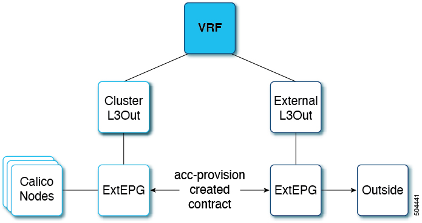

# Cisco ACI and Calico Integration


- [Overview](#overview)
- [Prerequisites](#prerequisites)
- [BGP Peering Topology](#bgp-peering-topology)
- [Configuring Cisco APIC External L3Out](#configuring-cisco-apic-external-l3out)
- [Configuring Cisco APIC and Generating Calico Manifests](#configuring-cisco-apic-and-generating-calico-manifests)
- [Verifying ACI Provisioning](#verifying-aci-provisioning)
   * [Verifying Cisco APIC Configuration](#verifying-cisco-apic-configuration)
   * [Verifying the Node Network](#verifying-the-node-network)
- [Applying Generated Manifests](#applying-generated-manifests)
- [Verifying the Calico CNI Installation](#verifying-the-calico-cni-installation)
- [Troubleshooting](#troubleshooting)
- [Cisco APIC and Cluster Cleanup](#cisco-apic-and-cluster-cleanup)


# Overview

This document has details about the Cisco ACI integration with Calico 3.26.3 using the Tigera operator. The integration is based on the Autonomous System (AS) per cluster design for BGP peering. This document has details about how to provision the Cisco APIC, and install the Calico CNI. For more information, you can also see the *Cisco Application Centric Infrastructure Calico Design White Paper*.


# Prerequisites

The required prerequisites are:
- Minimum supported Kubernetes version is 1.21.
- SSH access to the nodes in the Kubernetes cluster.
- Minimum Cisco ACI version is 5.0, to support floating switch virtual interfaces (SVI).

**&#9432; Note**	
> The recommended Cisco ACI version for the Calico integration is Release 5.2(x).


# BGP Peering Topology

For the BGP design options, see the *Calico over IP fabrics* section in the Calico documentation.

In the context of this documentation, the AS per Cluster design has been chosen. Each Kubernetes node in a cluster will have the same AS number and will peer via eBGP with a pair of ACI Top-of-Rack (ToR) switches configured in a vPC pair. For more information about the design, see the AS Per Cluster design overview section in the [Cisco Application Centric Infrastructure Calico Design White Paper](https://www.cisco.com/c/en/us/solutions/collateral/data-center-virtualization/application-centric-infrastructure/white-paper-c11-743182.html) document.


# Configuring Cisco APIC External L3Out

You must manually pre-configure the APIC before running the **acc-provision** command.

**Before you begin**

Configure the external L3Out which is used to provide connectivity outside of the ACI fabric to, for example, reach the corporate network or the internet. The Cluster L3Out is automatically created by acc-provision and is used to provide connectivity to the Kubernetes Nodes. This dual L3Out approach is the preferred approach as it allows to:

- Decouple the cluster eBGP peering from external router peering
- Support deploying multiple clusters in dedicated L3Outs without having to modify the external connectivity L3Out
- Support a shared L3Out design where different VRFs are used for the kubernetes clusters and the External L3Out

The figure below shows the external L3Out and the cluster L3Out.




**Procedure**

---

1. Create a tenant, VRF, AEP and Layer 3 domain using the standard procedures.
2. Create an external L3Out. It should have the VRF and L3 domain mapped, and have an external EPG attached to it. The procedure for creating an external L3Out is provided here:
    -  Log in to APIC using your credentials.
    - Navigate to the **Tenants** tab, and choose the tenant created in Step 1.
    - Under the selected tenant, go to **Networking > L3Outs**. Using the dropdown list on the right hand side corner, create a new L3Out.
    - Enter a unique name for the L3Out.
    - Attach the VRF and L3 Domain created in Step 1. Click **Next**.
    - In the **Nodes and Interfaces** section, select a Node, Router ID, Interface, and an IP Address (with a mask). Click **Next**.
    - In the **External EPG** section, create a new external EPG; give a name to the external EPG
    - Click **Finish**.


# Configuring Cisco APIC and Generating Calico Manifests

Use this procedure to configure the Cisco APIC and generate manifests to install the Calico CNI.

**Procedure**

---

1. Install the acc-provision deb package. Verify the installation by running the **acc-provision –version **command.
2. Create an input yaml file. Sample input file is described below:

```yaml
aci_config:
  apic_hosts:
    - 10.30.120.100             # List of APIC hosts to connect for APIC API
  vrf:                          # VRF used to create all kubernetes EPs
    name: mykube-vrf
    tenant: common              # This can be system-id or common

  cluster_l3out:
    name: calico_l3out            # This is the l3out created by acc-provision
    aep: kube-cluster             # The AEP for ports/VPCs used by this cluster
    svi:
      type: floating                          # Interface type. Only "floating" is supported
      floating_ip: 2.100.101.100/24           # Should be an IP in the node subnet
      secondary_ip: 2.100.101.254/24          # Should be an IP in the node subnet
      vlan_id: 13                             # VLAN use to connect the node to ACI
      mtu: 9000                               # 9000 is the recommended value.
    bgp:
      secret: test                  # BGP password
      peering:
        prefixes: 500               # limit how many prefixes we can accept from a single K8s node. Default is 500
        remote_as_number: 64512     # Calico BGP AS number
        aci_as_number: 2            # ACI BGP AS APIC> system> system settings > BGP Route Reflector

  l3out:
    name: mykube_l3out          # External l3Out Name
    external_networks:
    - mykube_extepg             # Kubernetes External EPG Name

net_config:
  node_subnet: 2.100.101.0/24       # Subnet to use for nodes
  pod_subnet: 20.2.0.0/16           # Subnet to use for Kubernetes Pods
  extern_dynamic: 20.3.0.0/16       # Subnet to use for Service External IPs and Service LoadBalancer IPs to be advertised over BGP.
  cluster_svc_subnet: 10.96.0.0/12  # Subnet to use for Kubernetes Service Cluster IPs to be advertised over BGP

calico_config:
  net_config: {}
    # block_size: 20            # IPAM IPV4 block size. Valid values are 20-32(inclusive). Default value is 26.
                                # Updating the block size on an already installed cluster is not supported.

topology:                       # Refer to the white paper for more details
  rack:                         # Each rack has a pair of ToR leaf switches and Kubernetes nodes
  - id: 1                       # "id" of a ToR, and is user assigned.
    aci_pod_id: 1
    leaf:                       # User should only provide anchor nodes in the input file
    - id: 101                   # Node id of anchor nodes
      local_ip: 2.100.101.201   # The IP address of the peer
    - id: 102
      local_ip: 2.100.101.202
    node:  
    - name: k8s-node1           # K8s nodes
    - name: k8s-node2
  - id: 2
    aci_pod_id: 1
    leaf:
    - id: 103
      local_ip: 2.100.101.203
    node:  
    - name: k8s-node3
    - name: k8s-node4
```

3. Run the acc-provision command. Example:

    `acc-provision -f calico-3.26.3 -c calico_input.yaml -z calico_output.tar.gz -a -u admin -p test`

    **&#9432; Note**
    > The output file should be in tar.gz format.


# Verifying ACI Provisioning

Before starting the Kubernetes cluster installation, follow the procedures indicated below to verify that the ACI fabric is configured correctly to support networking for the cluster. The tasks listed below are optional, but recommended.

- Verifying Cisco APIC Configuration
- Verifying the Node Network

## Verifying Cisco APIC Configuration

Use this procedure to verify the provisioning of the Cisco APIC.

**Procedure**

1. Log in to the Cisco APIC GUI. On the menu bar, choose **Tenant > Networking> L3Outs > Logical Node Profiles**. Confirm that the configured nodes section has all the anchor nodes provided in the input file.

2. Go to **Logical Node Profiles > Logical Interface Profile**. On the right hand side, select Floating SVI and verify whether all the anchor nodes are added along with the VLAN and MTU from the input file. Select the anchor node and verify that the secondary IP is correct. Under Path Attributes, ensure the Domain and Floating IP are correct.

3. Go to the configured interface profile and select a BGP Peer. The remote AS should be the remote_as_number from the input file and the Local-AS Number should be the aci_as_number from the input file.


## Verifying the Node Network

Use this procedure to verify that the node network and the external network are working properly.

**Procedure**

1. Check the node to external connectivity. Verify that you have external connectivity from every node. Use:
    
    `wget www.google.com`

    returns 200.

2. Check the node-to-node connectivity. From every node, check that you can ping all other nodes.

3. Use the BIRD docker image to deploy a BGP speaker inside a docker container. This will ensure successful BGP peering.
To run this docker image, you need to write a bird.conf file which has all the BGP configuration inputs. See Github. To understand how to write the bird.conf file, see the relevant *Bird documentation*. An example of bgp_template config section and is provided below:

    ```
    # Template for all BGP clients
    template bgp bgp_template {
        local as 64512;          # This is the remote_as_number from the input file described earlier

    protocol bgp k8sbm2bm4 from bgp_template {
        neighbor 2.100.101.201 as 2;    # The IP address is the local_ip of the anchor nodes from the input file.
                                        # Protocol bgp should be defined for each anchor node.
                                        # as 2 is the aci_as_number from the input file
    }
    protocol bgp k8sbm2bm5 from bgp_template {
        neighbor 2.100.101.202 as 2;
    }
    ```

4. Use command

    ```sh
    $ docker run --rm --net=host --uts=host --cap-add=NET_ADMIN --cap-add=NET_BROADCAST --cap-add=NET_RAW -v /path/to/config:/etc/bird:ro ibhde/bird4
    ```
    
    to deploy a BGP speaker inside the docker container using the bird.conf file as the input file.

    **&#9432; Note**
    > Here the /path/to/config is the path to bird.conf file created in step 3.

5. Run `$ docker exec -it -n <container_id> /bin/sh` to enter the docker container.

6. Run `$ birdc` to activate the bird client.

7. Use the **show protocols all** command. The displayed output should show the BGP established status for all the peers.


# Applying Generated Manifests

This section describes how to apply the generated manifests by running the `acc-provision` command. The generated tar file has 3 separate files. Unpack the tar file by running the `tar -xvzf` tar_file command, and run the commans in the following order:

(a) tigera_operator.yaml: This file consists of all the CRDs; run the `kubectl apply -f tigera_operator.yaml` command.

(b) custom_resources_aci_calico.yaml: This file has all the custom resources; run the `kubectl apply -f custom_resources_aci_calico.yaml` command.

(c) custom_resources_calicoctl.yaml: This file contains all the calicoctl custom resources; run the `calicoctl apply -f custom_resources_calicoctl.yaml` command.


# Verifying the Calico CNI Installation

Use this procedure to verify if the calico CNI is up and running, and if the BGP neighborship is established.

**Procedure**

1. Use the `kubectl get pods -A` command to check if the tigera-operator pod is running in the tigera-operator namespace.
2. Use the `kubectl get pods -A` command to check if the pods in the calico-apiserver and calico-system namespaces are running.
3. Verify that the core DNS pods transition from pending to running status.
4. Use the ip route command on the node to verify the route configuration. You should see a pod subnet on a remote node that is advertised with that node address as the next hop. An example of this route configuration is shown below. The highlighted is the route added as a result of the configuration.

    ```sh
    default via 2.100.101.201 dev bond0.13
    default via 172.253.253.1 dev enp1s0f0 proto dhcp src 172.253.253.114 metric 100
    2.100.101.0/24 dev bond0.13 proto kernel scope link src 2.100.101.11
    8.8.8.8 dev bond0.13 scope link
    10.2.0.0/16 via 2.100.101.1 dev bond0.13
    20.2.113.128/26 via 2.100.101.12 dev bond0.13 proto bird
    blackhole 20.2.218.128/26 proto bird
    20.2.218.130 dev caliedf3ae24134 scope link
    172.17.0.0/16 dev docker0 proto kernel scope link src 172.17.0.1 linkdown
    172.253.253.0/24 dev enp1s0f0 proto kernel scope link src 172.253.253.114
    172.253.253.1 dev enp1s0f0 proto dhcp scope link src 172.253.253.114 metric 100
    ```

    You should be able to see one such route for each node that is part of the cluster.


# Troubleshooting

Use this procedure for troubleshooting common issues.

**Procedure**

1. Use the ping command to check node-to-node connectivity inside the cluster, and node-to-external connectivity.
    - Get the internal ip address of the nodes by running `kubectl get nodes -o wide`
    - Run the `ping <ip-address>` command from one node to another. Shown below is a succesful ping output:

        ```sh
        noiro@test-node:~$ ping 2.100.101.x
        PING 2.100.101.x (2.100.101.x) 56(84) bytes of data.
        64 bytes from 2.100.101.x: icmp_seq=1 ttl=64 time=0.290 ms
        64 bytes from 2.100.101.x: icmp_seq=2 ttl=64 time=0.282 ms
        64 bytes from 2.100.101.x: icmp_seq=3 ttl=64 time=0.251 ms
        64 bytes from 2.100.101.x: icmp_seq=4 ttl=64 time=0.231 ms
        ^C
        --- 2.100.101.x ping statistics ---
        4 packets transmitted, 4 received, 0% packet loss, time 3076ms
        rtt min/avg/max/mdev = 0.231/0.263/0.290/0.023 ms
        ```

2. Ensure there are no faults on cluster L3Out.

    In Cisco APIC GUI, navigate to `Tenants > *Tenant_name* > Networking > L3Out`, and check the faults for cluster L3Out on the right-hand corner. If there are any faults, the affected object and a description of the fault are displayed.

3. Check if the external L3Out is functional on the APIC. Ensure the following:

    - The correct L3 domain and VRF are mapped to the external L3Out.
    - No faults on the external L3Out.
    - External EPG is available, and has the contract configured.

4. Check the routes for all pod subnets on each node. If a route is missing for a particular node, check whether calico-node pod is up for that node.
If the calico-node pod is crashing, check the logs of the pod and fix them by following the upstream instructions and/or restart the node. For upstream troubleshooting, see the `Calico Tigera.io Troubleshooting` documentation.

5. Check if the BGP neighborship is successful.

    To verify this, enter the calico-node pod and activate the bird client. See example, below:

    ```sh
    user@k8snode:~$ kubectl exec -it -n calico-system  <calico-node-pod-name> /bin/sh
    sh-4.4# birdcl
    ```

    Once the bird client is activated, run “show protocols all” to verify the neighborship. It should have an entry for each k8s node. An example output is shown below.

    ```sh
    Node_2_100_101_201 BGP      master   up     13:38:59    Established
    Description:    Connection to BGP peer
    Preference:     100
    Input filter:   ACCEPT
    Output filter:  calico_export_to_bgp_peers
    Routes:         4 imported, 3 exported, 1 preferred
    Route change stats:     received   rejected   filtered    ignored   accepted
        Import updates:              4          0          0          0          4
        Import withdraws:            0          0        ---          0          0
        Export updates:             18          1         13        ---          4
        Export withdraws:            0        ---        ---        ---          1
    BGP state:          Established
        Neighbor address: 2.100.101.201
        Neighbor AS:      2
        Neighbor ID:      1.1.4.101
        Neighbor caps:    refresh restart-aware AS4
        Session:          external multihop AS4
        Source address:   2.100.101.12
        Hold timer:       2/3
        Keepalive timer:  1/1
    Node_2_100_101_202 BGP      master   up     2022-08-18  Established
    Description:    Connection to BGP peer
    Preference:     100
    Input filter:   ACCEPT
    Output filter:  calico_export_to_bgp_peers
    Routes:         4 imported, 4 exported, 0 preferred
    Route change stats:     received   rejected   filtered    ignored   accepted
        Import updates:              4          0          0          0          4
        Import withdraws:            0          0        ---          0          0
        Export updates:            260          1        252        ---          7
        Export withdraws:          236        ---        ---        ---          1
    BGP state:          Established
        Neighbor address: 2.100.101.202
        Neighbor AS:      2
        Neighbor ID:      1.1.4.102
        Neighbor caps:    refresh restart-aware AS4
        Session:          external multihop AS4
        Source address:   2.100.101.12
        Hold timer:       3/3
        Keepalive timer:  1/1
    ```

6. Check if the BGP neighborship is successful on APIC.

    In the Cisco APIC GUI, navigate to L3Out > Logical Node Profiles > Configured Nodes. Under each configured node, a BGP for VRF section is available, and under that, are the neighbors. Ensure all the node IPs are present.

7. Check for proxy issue.

    If the Calico apiserver pods are crashing, or the describing apiservice shows Context deadline exceeded (Client.Timeout exceeded while awaiting headers), it is a proxy issue. To resolve this, add .calico-apiserver.svc, and the service’s cluster IP address to the no_proxy list. After updating the no_proxy env variable, restart the apiserver pods.


# Cisco APIC and Cluster Cleanup

To unprovision Cisco APIC and uninstall the CNI, run following command

`acc-provision -f calico-3.26.3 -c input.yaml -z output.tar.gz -d -u admin -p password`

Example:

`acc-provision -f calico-3.26.3 -c calico_input.yaml -z calico_output.tar.gz -d -u admin -p pw1`

To clean up the cluster by deleting the CNI and its resources, use the following commands:

```sh
kubectl delete installation default
kubectl delete –f tigera_operator.yaml
kubectl delete -f custom_resources_aci_calico.yaml
```

Restart the coredns pods after running the above commands.
