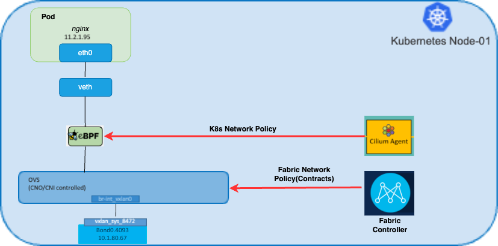

# Cilium-1.15.x Integration with ACI-CNI

- [Overview](#overview)
- [Installation](#installation)
    * [Assumptions](#assumptions)
    * [Prerequisites](#prerequisites)
- [Kubernetes](#kubernetes)
- [OpenShift](#openshift)
- [Hubble](#hubble)
    * [Hubble API Access](#hubble-api-access)
    * [Hubble GUI Access](#hubble-gui-access)
- [Validation](#validation)
- [Troubleshooting](#troubleshooting)
- [Appendix](#appendix)
- [References](#references)
  


## Overview
In this guide, we'll demonstrate how to integrate Cilium with ACI-CNI using CNI-chaining on both Kubernetes and OpenShift platforms. The aim is to delegate network policy enforcement to Cilium, thereby offloading this enforcement from ACI CNI.


<div style="display: flex; flex-direction: column; align-items: center;">
    <div style="display: flex; justify-content: center;">
        
    </div>
    <p style="text-align: center;">Architecture</p>
</div>


## Installation

### Assumptions
The steps are executed as post-installation procedures once the cluster is operational with ACI CNI. While it's possible to generate the CNI chaining manifests before installation, here Cilium is installed as a post-installation step.

### Prerequisites

- Install Cilium CLI for Linux distribution: [Cilium Getting Started](https://docs.cilium.io/en/stable/gettingstarted/k8s-install-default/)
- Install Hubble CLI for Linux distribution: [Hubble Setup](https://docs.cilium.io/en/stable/gettingstarted/hubble_setup/)

## Kubernetes
**Install Accprovision**
```sh
git clone https://github.com/noironetworks/acc-provision.git
cd acc-provision/provision/
python3 setup.py install
```

**Configuration**

Add the following configuration to acc_provision_input.yaml file:

```
# Configuration for ACI Fabric
kube_config
  disable_hpp_rendering: True

cilium_chaining:
  enable: True

```

This configuration enables the addition of Cilium custom configuration required for any available flavor. It also disables any HPP rendering by ACI as a result of applying the network policy over the cluster, ensuring the policy enforcement is not done by ACI.

**Run the acc_provision command**
```
acc-provision -a -c acc_provision_input.yaml  -f kubernetes-1.27 -u <user> -p <password> -o aci_deployment.yaml -z aci deployment.yaml.tar.gz
```

**Replace opflex conf file** 

Rename the file "01-opflex.conf" to "10-opflex.conf" in the directory "/etc/cni/net.d" on each node. This ensures that the kubelet picks the configuration file lexicographically and once cilum 05-cilium.conflist is deployed , it will be picked first which have cni-chaining configuration. 

**Apply the aci_deployment.yaml manifest**
```
kubectl apply -f aci_deployment.yaml
```


**Run cilium install command**

```
cilium install --version 1.15.3 --set cni.chainingMode=generic-veth --set cni.customConf=true --set cni.configMap=cni-configuration --set enableIPv4Masquerade=false --set routingMode=native --set hubble.relay.enabled=true --set hubble.ui.enabled=true
```


After running the above command, the Cilium agent will be running on every node. Hubble will be installed as an observability tool.

Arguments Description
- cni.chainingMode=generic-veth: This is based on a generic veth device model that our CNI plugin is based on.
- cni.customConf=true: To enable Cilium CNI configuration management.
- cni.configMap: Name of a ConfigMap containing a source CNI configuration file.
- enableIPv4Masquerade=false: Disables masquerading of IPv4 traffic leaving the node from endpoints.
- routingMode=native: Enables native-routing mode leveraging the native Linux networking and routing capabilities. Employs BPF (Berkeley Packet Filter) programs to interact with the networking stack enhancing performance and efficiency.
- hubble.relay.enabled=true: When enabled, Cilium deploys Hubble Relay alongside Cilium agents, collecting and forwarding network flow data for centralized monitoring and analysis.
- hubble.ui.enabled=true: Enables Hubble UI.

**Restart pods under tests to enforce Cilium CNI.**


# OpenShift

**Install acc-provision**

```sh
git clone https://github.com/noironetworks/acc-provision.git
cd acc-provision/provision/
python3 setup.py install
```

**Configuration**

Add the following configuration to acc_provision_input.yaml file:

```
# Configuration for ACI Fabric
kube_config
  disable_hpp_rendering: True

cilium_chaining:
  enable: True
  
```

The above configuration enables the addition of cilium custom configuration required for any available flavor. Also it will disables any hpp rendering by aci as a result of applying the network policy over the cluster. This will ensure the policy enforcement is not done by ACI.  

**Run the acc_provision command**
```
acc-provision -a -c acc_provision_input.yaml  -f openshift-4.14 -esx -u <user> -p <password> -o aci_deployment.yaml -z aci deployment.yaml.tar.gz 
```

**Replace opflex conf file** 

Rename the file "01-opflex.conf" to "10-opflex.conf" in the directory "/etc/cni/net.d" on each node. This ensures that the kubelet picks the configuration file lexicographically and once cilum 05-cilium.conflist is deployed , it will be picked first which have cni-chaining configuration. 

**Apply the aci_deployment.yaml manifest**
```
kubectl apply -f aci_deployment.yaml
```


**Run cilium install command**

```
cilium install  --version 1.15.3   --set cni.chainingMode=generic-veth --set cni.customConf=true --set cni.configMap=cni-configuration  --set enableIPv4Masquerade=false  --set routingMode=native --set hubble.relay.enabled=true --set hubble.ui.enabled=true --set cni.binPath=/var/lib/cni/bin --set cni.confPath=/etc/kubernetes/cni/net.d --set kubeProxyReplacement="false" 
```


After running the above command, the Cilium agent will be running on every node. Hubble will be installed as an observability tool.

Arguments Description
- cni.chainingMode=generic-veth: This is based on a generic veth device model that our CNI plugin is based on.
- cni.customConf=true: To enable Cilium CNI configuration management.
- cni.configMap: Name of a ConfigMap containing a source CNI configuration file.
- enableIPv4Masquerade=false: Disables masquerading of IPv4 traffic leaving the node from endpoints.
- routingMode=native: Enables native-routing mode leveraging the native Linux networking and routing capabilities. Employs BPF (Berkeley Packet Filter) programs to interact with the networking stack enhancing performance and efficiency.
- hubble.relay.enabled=true: When enabled, Cilium deploys Hubble Relay alongside Cilium agents, collecting and forwarding network flow data for centralized monitoring and analysis.
- hubble.ui.enabled=true: Enables Hubble UI.
- cni.binPath=/var/lib/cni/bin: Setting custom cni binary path for openshift 
- cni.confPath=/etc/kubernetes/cni/net.d: Setting custom cni conf path for openshift 
- kubeProxyReplacement="false" – This is needed for openshift, because  right now CNO (Cluster Network Operator) is deployed with kubeproxy which  runs on each node and is managed by the Cluster Network Operator (CNO). kube-proxy maintains network rules for forwarding connections for endpoints associated with services.Currently all our installation have kube-proxy enabled. If we disable the functionality via cilium then pods will start crashing and network connectivity gets lost.  

**Restart openshift-dns pods**

**Restart pods under tests to enforce Cilium CNI.**

# Hubble

Observability is provided by **Hubble** which enables deep visibility into the communication and behavior of services as well as the networking infrastructure in a completely transparent manner. **Hubble** is able to provide visibility at the node level, cluster level or even across clusters in a **Multi-Cluster (Cluster Mesh)** scenario.

Traffic can be validated on both cli and UI level.

## Hubble API Access:

* Port Forwarding of hubble relay
    ```
    cilium hubble port-forward&
    ```

* Check hubble status
    ```
    hubble status
    ```

* Query API and look for flows: 
    ```
    hubble observe -n <namespace> -f  
    ```

More information for inspecting flows via cli can be found here: https://docs.cilium.io/en/stable/gettingstarted/hubble_cli/#hubble-cli 

 
## Hubble GUI Access
* Port forwarding of hubble UI service

    ```
    cilium hubble ui --port-forward 12000& 
    ```

* SSH tunnel to Orch Node
    ```
    ssh -L 5905:localhost:5905 user@ip ssh -t -L 5905:127.0.0.1:12000 user@ip
    ```
* Access via local browser
    ```
    http://localhost:5905
    ```


# Validation

## Cilium & Hubble Installation Check

- ```cilium status```

```
    /¯¯\
 /¯¯\__/¯¯\    Cilium:             OK
 \__/¯¯\__/     Operator:           OK
 /¯¯\__/¯¯\    Envoy DaemonSet:    disabled (using embedded mode)
 \__/¯¯\__/     Hubble Relay:       OK
    \__/               ClusterMesh:        disabled

DaemonSet              cilium             Desired: 4, Ready: 4/4, Available: 4/4
Deployment             cilium-operator    Desired: 1, Ready: 1/1, Available: 1/1
Deployment             hubble-ui          Desired: 1, Ready: 1/1, Available: 1/1
Deployment             hubble-relay       Desired: 1, Ready: 1/1, Available: 1/1

Containers:            cilium             Running: 4
                       cilium-operator    Running: 1
                       hubble-ui          Running: 1
                       hubble-relay       Running: 1

Cluster Pods:          6/6 managed by Cilium
Helm chart version:    1.15.1

```

- ```hubble status```
```
Healthcheck (via localhost:4245): Ok
Current/Max Flows: 13,449/16,380 (82.11%)
Flows/s: 6.75
Connected Nodes: 4/4
```


# Troubleshooting

**Issue**: Traffic not getting denied by deny networkpolicy

**Root Cause**: kubelet didn’t picked chaining cni conf. 

**Solution**: Ensure that cni conf files are present as show below on every node:

- Kubernetes Platform  
  ```
  user@k8s24-node-4:~$ cd /etc/cni/net.d/ 

  user@k8s24-node-4:/etc/cni/net.d$ ls 

  05-cilium.conflist  10-opflex-cni.conf  200-loopback.conf 
  ```
 

- OpenShift Platform 
  ```
  ssh core@192.168.52.5 

  [core@ocp412-master3 ~]$ls /etc/kubernetes/cni/net.d/ 

  05-cilium.conflist  10-opflex-cni.conf 
  ```
 

The configuration file should be in lexicographical order. If there is 01-opflex.conf file is present, remove it from every node and ensure that you are using custom aci-containers-host-agent container image that deploys 10-opflex-cni.conf. 


# Appendix
- cni config 
  ```
  apiVersion: v1 

  kind: ConfigMap 

  metadata: 

    name: cni-configuration 

    namespace: kube-system 

  data: 

    cni-config: |- 

      { 

        "name": "generic-veth", 

        "cniVersion": "0.3.1", 

        "plugins": [ 

          { 

            "cniVersion": "0.3.1", 

            "supportedVersions": [ "0.3.0", "0.3.1", "0.4.0" ], 

            "type": "opflex-agent-cni", 

            "wait-for-network": true, 

            "wait-for-network-duration": 210, 

            "ipam": {"type": "opflex-agent-cni-ipam"} 

          }, 

          { 

            "type": "portmap", 

            "snat": true, 

            "capabilities": {"portMappings": true} 

          }, 

          { 

            "type": "cilium-cni" 

          } 

        ] 

      } 
  ```


- Disable KubeProxy in OpenShift 

  ```
  apiVersion: operator.openshift.io/v1 # change config.openshift.io/v1 to operator.openshift.io/v1 

  kind: Network 

  metadata: 

    creationTimestamp: null 

    name: cluster 

  spec: 

    clusterNetwork: 

    - cidr: 10.254.0.0/16 

      hostPrefix: 24 

    externalIP: 

      policy: {} 

    networkType: Cilium 

    deployKubeProxy: false # add the new deployKubeProxy: false line.  

    serviceNetwork: 

    - 172.30.0.0/16 

  status: {} 
  ```

# References 

- https://docs.cilium.io/en/latest/ 

- https://kube-ovn.readthedocs.io/zh-cn/stable/en/advance/with-cilium/ 

- https://hackmd.io/@mauilion/openshift_install 
