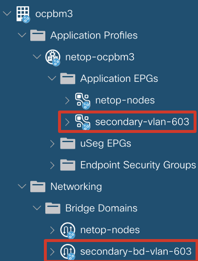
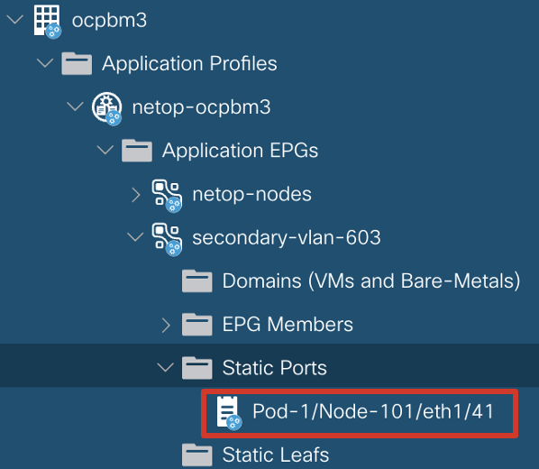

# Cisco Network Operator - Additional Interfaces

# Table of Contents

- [1. Overview](#1-overview)
- [2. Mechanism](#2-mechanism)
- [3. Installation](#3-installation)
  - [3.1 Pre-requisites](#31-pre-requisites)
  - [3.2. Installation](#32-installation)
- [4. Quick Start Guide ](#4-quick-start-guide)
  - [4.1 Orchestrate fabric configurartion for SR-IOV interfaces connected to POD](#41-orchestrate-fabric-configurartion-for-sr-iov-interfaces-connected-to-pod)
  - [4.2 Orchestrate fabric configurartion for MACVLAN interfaces connected to POD](#42-orchestrate-fabric-configurartion-for-macvlan-interfaces-connected-to-pod)
  - [4.3 Provisioning multiple VLANs within the same NetworkAttachmentDefiniton](#43-provisioning-multiple-vlans-within-the-same-networkattachmentdefiniton)

## 1. Overview

Creation of additional networks is supported when using OpenShift’s default OVN-Kubernetes CNI as the primary CNI for the primary interface and the acc-provision flavor openshift-sdn-ovn-baremetal. Openshift nodes are installed with the primary OVN Kubernetes CNI and Network Operator CNI chained under multus. CNI chaining allows to insert Network Operator to the chain of the network operations and influence the pod lifecycle, ensure the network connectivity is present before the CNI informs kubelet and cri-o container runtime that network plumbing is successful. We can manage network attachment for secondary interfaces, set up required configuration in Cisco ACI fabric, and have the configuration's intent consistently upheld via this feature.

## 2. Mechanism

Additional networks can be created on OpenShift clusters which use OpenShift’s default OVN-Kubernetes CNI as the primary CNI using this feature. These additional networks are isolated using VLAN configuration on the Cisco ACI fabric. Automating the configuration of these VLANs is achieved by leveraging a Chained CNI configuration using the following configuration:

```yaml
chained_cni_config:
  secondary_interface_chaining: True
     secondary_vlans:              # VLANs for additional networks
     - 402
     - 403-406
     - 410, 425
```
A new AEP is required for the additional network and can be configured as follows:

```yaml
aci_config:
  secondary_aep: kube-cluster-2 # The AEP for additional networks
```

**&#9432;** ___NOTE:___ _A fault (vmmClusterFaultInfo) is generated in Cisco ACI, if a Kubernetes namespace, deployment, or pod is annotated with an EPG name that does not resolve to an existing EPG. A log statement is added in the aci-containers-controller log to alert the user. The fault will be cleared upon the next correct annotation, or when the aci-containers-controller restarts, or when the annotated namespace, deployment, or pod is deleted._

## 3. Installation

Installation can be done using the acc-provision tool, which will generate Kubernetes manifests and prepare Cisco ACI day-0 configuration.

Optionally, you can use acc-provision tool to pre-provision Cisco ACI networking for the Openshift cluster connectivity for primary CNI.

### 3.1 Pre-requisites

Before installation of the chained CNI to automate ACI fabric stitching for secondary interfaces, the following pre-requisites must be met:

1.	Install Openshift on Baremetal (validated installation methods: assisted-installer or UPI with PXE boot). Validated Openshift version: 4.12
2.	Install the following operators:
    * Multus (Openshift installation enables by default installation of multus)
    * SRIOV Operator
    * NMstate Operator
    * Ensure that LLDP is disabled on the NIC firmware
      * i.e. for Intel X710 `ethtool --set-priv-flags <eth_name> disable-fw-lldp on`
      * Note: This configuration should be implemented with a `machineconfig` otherwise will not persist between reboots
    * Enable LLDP on the node uplink interfaces designed for secondary interfaces.
      * i.e. using [nmstate](https://nmstate.io/features/lldp.html) operator


### 3.2. Installation

1. Install acc-provision on a host that has access to APIC.

    `pip install acc-provision==6.0.3.1`

2.  Prepare a YAML file named "acc-provision-input.yaml" that includes initial information about the environment, such as the APIC IP address, Tenant, VRF, CNI image registry information, and any additional parameters specified in the document. Please refer to the example "acc-provision-input-config.yaml" file for reference.

```yaml
aci_config:
  system_id: ocpbm3                   # Unique cluster name, if the Tenant is not specified this is also the tenant name
  tenant:
    name: ocpbm3                      # Add pre_existing_tenant name if it's manually created on the APIC
  apic_hosts:                         # List of APIC hosts to connect for APIC API
    - 10.0.0.1
  aep: ocp-bm-3                       # The AEP for primary CNI used by this cluster
  physical_domain:
    domain: ocp-bm-3-ovn              # physical domain name used for primary interfaces (will be attached to AAEP provided).
  vrf:                                # This VRF used for primary and secondary BDs
    name: ocp-bm-3-vrf
    tenant: common                    # Tenant where VRF is defined
  l3out:
    name: ocp3-extnet                 # Used to attach contract between primary CNI network and external world
    external_networks:
    - ocpbm3-extnet-epg               # Used for external contracts
  secondary_aep: ocp-bm-3-multus      # AAEP for secondary CNI interfaces

net_config:
  # node_subnet: 10.10.0.1/24         # Subnet to use for nodes IGNORED SINCE WE SET true for skip_node_network_provisioning
  # kubeapi_vlan: 502                 # The VLAN used by the physdom for nodes IGNORED SINCE WE SET true for skip_node_network_provisioning
 
chained_cni_config:
  secondary_interface_chaining: true   # enable chained config
  use_global_scope_vlan: true              # use unique VLANs per leaf switch.
  skip_node_network_provisioning: true     # if true, Cisco CNI do not provision EPG/BD for node network (must be provisioned before Openshift cluster will be installed).
  vlans_file: "nad_vlan_map_input.csv"     # path to the CSV file with the VLAN information.
  # primary_interface_chaining: false      # (optional) enable CNI chaining for primary CNI – Network Operator will check connectivity to gateway prior allowing Pod to start. Currently not supported by Red Hat.
  # primary_cni_path: "/mnt/cni-conf/cni/net.d/10-ovn-kubernetes.conf” # (optional) if specified, primary CNI will be chained as well – this is not required by current use-case.
  secondary_vlans: [101,102,103,104,201]   # (optional) definite list of all vlans that should be populated in VLAN Pool for secondary intefaces
  enable_container_l3_peering_model: true  # (optional) if true, enable CNF L3 model.
  include_network_attachment_definition_crd: False # (optional) if True, NAD CRD will be generated in deployment.
  use_system_id_for_secondary_names: False # (Optional) if True, adds system_id as prefix of the default autogenerated names for secondary BDs

registry:                                  # Registry information
  image_prefix: quay.io/noiro
  aci_containers_host_version: 6.0.3.1.81c2369       # for production use GA image tag 6.0.3.1.81c2369
  aci_containers_controller_version: 6.0.3.1.81c2369 # for production use GA image tag 6.0.3.1.81c2369
```

3. Specific parameters for chained mode:

You can create new Tenant or use pre-existing one:
```yaml
aci_config:
  system_id: ocpbm3        # Unique cluster name, if the Tenant is not specified this is also the tenant name
  tenant:
    name: ocpbm3           # Add pre_existing_tenant name if it's manually created on the APIC
```
* 2 AAEPs should be created before running acc-provision (prerequisite):
  * `aci_config.aep` - AAEP for primary CNI interfaces
  * `aci_config.secondary_aep` - AAEP for secondary CNI interface
* 2 Physical Domains (can be provided or if not specified, will be created):
  * `aci_config.physical_domain.domain` - Phys Dom for primary CNI interfaces (should exists)
  * Phys Dom for secondary CNI interfaces – automatically created with the name: `<system_id>-secondary`
* `chained_cni_config.secondary_interface_chaining` – enables CNI chaining with MACVLAN and SRIOV CNI plugins for secondary interfaces.
* `chained_cni_config.skip_node_network_provisioning` - Network provisioning for primary CNI (BD/EPG is specific VRF / Tenant, contract to provided L3out).
* `chained_cni_config.use_global_scope_vlan` – for a given VLAN one EPG is created even if multiple Network Attachment Definition refers to the same VLAN. If False, for each NAD using the same VLAN unique EPG will be created.
* `chained_cni_config.vlans_file` – read CSV file to load VLAN id and create NadVlanMap Custom Resource at Day-0. This feature has been developed to meet specific Customer CNF operation guidance.
* `chained_cni_config.secondary_vlans` – List of VLANs used by CNO to provision VLAN Pool attached to <system_id>-secondary physical domain. This domain is attached to the EPGs created by CNO. If ip_sheet is specified, the vlan pool can be populated from the excel sheet.
* `chained_cni_config.enable_container_l3_peering_model` - Enables CNF L3 model. By default it is disabled.
* `chained_cni_config.include_network_attachment_definition_crd` - Enabling will generate the NAD CRD in deployment. By default it is disabled.
* `chained_cni_config.use_system_id_for_secondary_names` - Enabling will add system_id as a prefix of the default autogenerated names for secondary BDs

4. Run acc-provision on the host that has access to APIC. Script will generate output file.

   __Warning__: This steps will push configuration to APIC

```bash
acc-provision -a -c acc-provision-config.yml -u <apic_user> -p <apic_password> -f openshift-sdn-ovn-baremetal -o acc_deployment.yaml
```
5. Apply the output file to the openshift cluster

```bash
oc apply -f acc_deployment.yaml
```

6. Once manifest applied to the Openshift cluster, you should see following resources:

```
[root@ocp-3-orch macvlan-2]# oc get pods -n aci-containers-system -o wide
NAME                                         READY   STATUS    RESTARTS   AGE     IP             NODE                         NOMINATED NODE   READINESS GATES
aci-containers-controller-57c766b7cd-ljfp6   1/1     Running   0          3h39m   192.168.23.7   worker2.ocpbm3.noiro.local   <none>           <none>
aci-containers-host-4mwk8                    1/1     Running   0          4h9m    192.168.23.3   master1.ocpbm3.noiro.local   <none>           <none>
aci-containers-host-c42nq                    1/1     Running   0          4h9m    192.168.23.7   worker2.ocpbm3.noiro.local   <none>           <none>
aci-containers-host-cpl98                    1/1     Running   0          4h8m    192.168.23.4   master2.ocpbm3.noiro.local   <none>           <none>
aci-containers-host-s4trc                    1/1     Running   0          4h9m    192.168.23.6   worker1.ocpbm3.noiro.local   <none>           <none>
aci-containers-host-x2q6w                    1/1     Running   0          4h9m    192.168.23.5   master3.ocpbm3.noiro.local   <none>           <none>
```
Installed CRDs:

```
[root@ocp-3-orch macvlan-2]# oc get crd | grep aci.fabricattachment
nadvlanmaps.aci.fabricattachment                                  2023-08-09T12:21:05Z
nodefabricnetworkattachments.aci.fabricattachment                 2023-07-24T22:28:18Z
staticfabricnetworkattachments.aci.fabricattachment               2023-08-25T09:32:49Z
fabricvlanpool.aci.fabricattachment                               2023-09-14T20:13:23Z
```
Depending on configuration, if you provided nad-vlan-file.csv to the input, you should see `nadvlanmap` Custom Resource created and fabricvlanpool.

Default FabricVlanPools Custom Resource:
```
[root@ocp-3-orch ~]# oc get fabricvlanpools.aci.fabricattachment -A
NAMESPACE               NAME            AGE
aci-containers-system   default         14d
```

If the NadVlanMap file has been provided in aci-prov-input.yaml file, you should see NadVlanMap Custom Resource created:
```
[root@ocp-3-orch ~]# oc get nadvlanmaps.aci.fabricattachment
NAME           AGE
nad-vlan-map   19d
```

## 4. Quick start guide


**&#9432;** ___NOTE:___ _Make sure to have Multus installed, LLDP enabled on the interfaces used to attach additional networks to the pods_

### 4.1 Orchestrate fabric configurartion for SR-IOV interfaces connected to POD

1. Create `SriovNetworkNodePolicy`, refer for details how to use SR-IOV Operator in [documentation](https://github.com/openshift/sriov-network-operator).

Example:
```yaml
apiVersion: sriovnetwork.openshift.io/v1
kind: SriovNetworkNodePolicy
metadata:
generation: 1
  name: sriov-policy-enp216s0f0-0-15
  namespace: openshift-sriov-network-operator
spec:
  deviceType: netdevice
  isRdma: false
  needVhostNet: false
  nicSelector:
    deviceID: 158b
    pfNames:
    - enp216s0f0#0-63
    rootDevices:
    - 0000:d8:00.0
    vendor: "8086"
  nodeSelector:
    feature.node.kubernetes.io/network-sriov.capable: "true"
  numVfs: 64
  priority: 99
  resourceName: enp216s0f0
```

2. Create `NetworkAttachmentDefinition` (NAD)
```yaml
apiVersion: k8s.cni.cncf.io/v1
kind: NetworkAttachmentDefinition
metadata:
  annotations:
    k8s.v1.cni.cncf.io/resourceName: openshift.io/enp216s0f0
name: sriov-net1
  namespace: default
spec:
  config: |
{
    "cniVersion": "0.3.1",
    "name": "sriov-net1",
    "plugins": [
        {
            "name": "sriov-net1",
            "cniVersion": "0.3.1",
            "type": "sriov",
            "vlan": 603,
            "trust": "on",
            "vlanQoS": 0,
            "capabilities": {
                "ips": true
            },
            "link_state": "auto",
            "ipam": {
                "type": "static",
                "addresses": [
                    {
                        "address": "192.168.128.66/24"
                    }
                ]
            }
        },
################################################
#        ADD THIS SECTION TO THE NAD:          #
################################################
        {
            "supportedVersions": [
                "0.3.0",
                "0.3.1",
                "0.4.0"
            ],
            "type": "opflex-agent-cni",
            "chaining-mode": true,
            "log-level": "debug",
            "log-file": "/var/log/netopcni.log"
        }
###############################################
    ]
}
```
Once NAD is created Network Operator creates Bridge Domain / Endpoint Group in Cisco ACI for the VLAN specified in the NetworkAttachmentDefinition. The name of EPG and BD are hardcoded using the following schema:
* `secondary-vlan-<vlanID>`
* `secondary-bd-vlan-<vlanID>`

| 
|:--:|
| *BD/EPG created in Cisco ACI after NAD deployment* |

`aci-containers-host` watches for NAD creation and creates `NodeFabricNetworkAttachment` (NFNA) Custom Resource per NAD and per Openshift node on which the NetworkAttachmentDefinition applies.

NFNA aggregates information about:
  * Host interface and discovered port on ACI
  * Pod reference (will be visible after scheduling pod attached to the NAD)
  * VLAN ID or multiple IDs
  * Reference to the NAD
  * Reference to the node
  * Primary CNI in the chain (this is still CNI for secondary interfaces, but it is called primary in the CNI chain)
```bash
[root@ocp-3-orch ~]# oc get nodefabricnetworkattachments.aci.fabricattachment -n aci-containers-system
NAME                                             AGE
worker1.ocpbm3.noiro.local-default-sriov-net-1   85m
worker2.ocpbm3.noiro.local-default-sriov-net-1   85m
```
```yaml

[root@ocp-3-orch ~]# oc get nodefabricnetworkattachments.aci.fabricattachment -n aci-containers-system   worker1.ocpbm3.noiro.local-default-sriov-net-1 -o yaml
apiVersion: aci.fabricattachment/v1
kind: NodeFabricNetworkAttachment
metadata:
  name: worker1.ocpbm3.noiro.local-default-sriov-net-1
  namespace: aci-containers-system
spec:
  aciTopology:
    ens1f2:
      fabricLink:
      - topology/pod-1/node-101/pathep-[eth1/41]
  encapVlan:
    encapRef:
      key: ""
      nadVlanMap: ""
    vlanList: "603"
  networkRef:
    name: sriov-net-1
    namespace: default
  nodeName: worker1.ocpbm3.noiro.local
  primaryCni: sriov
  ```

3. create a Pod, refer to the additional network attachment using annotation:

```yaml
apiVersion: v1
kind: Pod
metadata:
  name: multitool-sriov-demo-1
  namespace: default
  annotations:
    k8s.v1.cni.cncf.io/networks: sriov-net-1
  labels:
    run: multitool
spec:
  containers:
  - name: network-multitool
    image: wbitt/network-multitool
  nodeName: worker1.ocpbm3.noiro.local
```

Pod scheduled on specific worker node (worker1). Network Operator configure Static Path towards the node that runs a Pod attached to the NAD.
The interface is taken from NodeFabricNetworkAttachment Custom Resource.


|  |
| :--: |
| *Static Port configured under EPG* |

Network Operator compute and maintains NodeFabricNetworkAttachment resource in Kubernetes. Example of a resource after creating NAD and attach Pod to it:

```yaml
apiVersion: aci.fabricattachment/v1
kind: NodeFabricNetworkAttachment
metadata:
  name: worker1.ocpbm3.noiro.local-default-sriov-net-1
  namespace: aci-containers-system
spec:
  aciTopology:
    ens1f2:
      fabricLink:
      - topology/pod-1/node-101/pathep-[eth1/41]  # Discovered fabric interface
      pods:
      - localIface: ens1f2v34                     # Pod details with VF interface
        podRef:
          name: multitool-sriov-demo-1
          namespace: default
  encapVlan:
    encapRef:
      key: ""
      nadVlanMap: ""
    vlanList: "603"                               # VLAN information
  networkRef:
    name: sriov-net-1
    namespace: default
  nodeName: worker1.ocpbm3.noiro.local            # Node for which this NFNA has been created.
  primaryCni: sriov                               # CNI plugin used
```

### 4.2 Orchestrate fabric configurartion for MACVLAN interfaces connected to POD

Similarly to SR-IOV interfaces, additional interfaces managed by MACVLAN CNI are supported by Network Operator. It will configured Cisco ACI fabric with relevant Static Ports under EPG. In case of bonded uplink, Network Operator discovers port-channel members and configures static port under EPG referring to the Virtual Port-Channel or Port-Channel Interface Group Policy.

In order to specify VLAN ID in the NetworkAttachmentDefinition directly, configure subinterface on the uplink that will be used by MACVLAN, and refer subinterface in NetworkAttachmentDefinition.

Example:
1. Create subinterface on bond1 port-channel interface on worker2 using NMState Operator.

```yaml
apiVersion: nmstate.io/v1beta1
kind: NodeNetworkConfigurationPolicy
metadata:
  name: bond1.604-worker2
spec:
  nodeSelector:
    kubernetes.io/hostname: worker2.ocpbm3.noiro.local
  desiredState:
    interfaces:
    - name: bond1.604
      type: vlan
      state: up
      vlan:
        base-iface: bond1
        id: 604
```

2. Create NetworkAttachmentDefinition

```yaml
apiVersion: k8s.cni.cncf.io/v1
kind: NetworkAttachmentDefinition
metadata:
  name: macvlan-net2-bond1-604
  namespace: default
spec:
  config: |
{
    "cniVersion": "0.3.1",
    "name": "macvlan-net2-bond1-604",
    "plugins": [
        {
            "cniVersion": "0.3.1",
            "name": "macvlan-net2-bond1-604",
            "type": "macvlan",
            "mode": "private",
            "master": "bond1.604",
            "ipam": {
                "type": "whereabouts",
                "range": "192.168.100.0/24",
                "exclude": [
                    "192.168.100.0/32",
                    "192.168.100.1/32",
                    "192.168.100.254/32"
                ]
            }
        },
        {
            "supportedVersions": [
                "0.3.0",
                "0.3.1",
                "0.4.0"
            ],
            "type": "opflex-agent-cni",
            "chaining-mode": true,
            "log-level": "debug",
            "log-file": "/var/log/opflexagentcni.log"
        }
    ]
}
```

Network Operator reacts to the NetworkAttachmentDefinition create event, and will create NodeFabricNetworkAttachment for that specific NAD - again, one per node where the NAD is applicable. Network Operator will also push BD and EPG for VLAN-604 to the APIC.

3. Create Pod manifest

```yaml
apiVersion: v1
kind: Pod
metadata:
  name: multitool-macvlan-net2-pod2
  namespace: default
  annotations:
    k8s.v1.cni.cncf.io/networks: macvlan-net2-bond1-604
  labels:
    cni: macvlan
spec:
  containers:
  - name: network-multitool
    image: wbitt/network-multitool
  nodeName: worker2.ocpbm3.noiro.local
```
Network Operator will create a NodeFabricNetworkAttachment resource based on the NAD `macvlan-net2-bond1-604`

```yaml
apiVersion: aci.fabricattachment/v1
kind: NodeFabricNetworkAttachment
metadata:
  name: worker2.ocpbm3.noiro.local-default-macvlan-net2-bond1-604
  namespace: aci-containers-system
spec:
  aciTopology:
    bond1:                                         # Bond host interface reference
      fabricLink:
      - topology/pod-1/node-101/pathep-[eth1/43]   # Discovered individual interfaces through LLDP
      - topology/pod-1/node-102/pathep-[eth1/43]   # Discovered individual interfaces through LLDP
      pods:
      - localIface: net1
        podRef:
          name: multitool-macvlan-net2-pod2
          namespace: default
  encapVlan:
    encapRef:
      key: ""
      nadVlanMap: ""
    vlanList: "604"
  networkRef:
    name: macvlan-net2-bond1-604
    namespace: default
  nodeName: worker2.ocpbm3.noiro.local
  primaryCni: macvlan
```

Based on the Ethernet ports discovered by Network Operator, The Virtual Port Channel has been discovered and added to the EPG.

|  |
|:--:|
| *Static Port for VPC interface automatically discovered* |

### 4.3 Provisioning multiple VLANs within the same NetworkAttachmentDefiniton

NetworkAttachmentDefinition allows to specify VLAN ID in multiple ways, depending on the defined plugin CNI. For SR-IOV CNI, you can specify vlan ID in the plugins.vlan field - this will configure VLAN ID for the VF on the NIC card directly and NIC card will encapsulate traffic from the attached Pod on the wire.

In many 5G CNF use-cases, encapsulation is done on the Pod itself, and VF should be treated as a trunk allowing list of VLANs.

Network Operator allows that configuration through annotation or reference to the resource "nad-vlan-map". The last one has been developed for specific use-case and is described in [Chapter 7.2.1](#721-nadvlanmap-custom-resource).

The standard way of configuring VLAN list for the NAD is done through annotations. Network Operator provisions appropriate network segments on Cisco ACI fabric - for each VLAN pair of BD/EPG.

Example:
```yaml
apiVersion: k8s.cni.cncf.io/v1
kind: NetworkAttachmentDefinition
metadata:
  name: sriov-net1
  namespace: default
  annotations:
    netop-cni.cisco.com/vlans: ‘[100,103,106-108]’
    k8s.v1.cni.cncf.io/resourceName: openshift.io/<resourceName>
```

Above configurartion results in creating 5 BD/EPG in ACI for vlan: 100, 103, 106, 107, 108. When Pod will be attached to this NAD, the static binding will be created for each EPG created for each vlan from this list. Since it is unknown which VLAN a Pod will choose to encapsulate traffic, all vlans are allowed and provisioned for any pod attached to this NAD.
