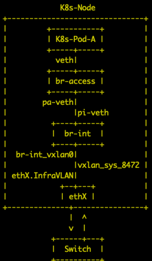
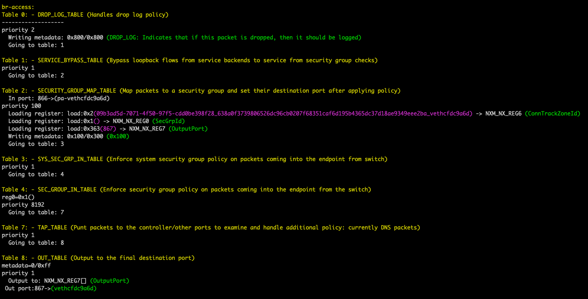
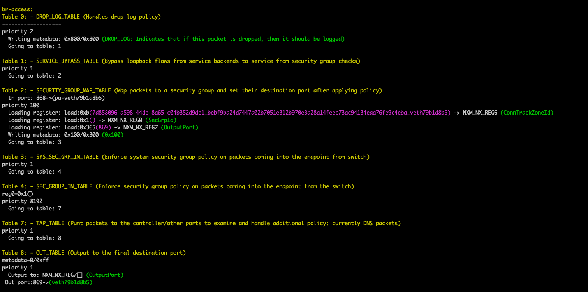
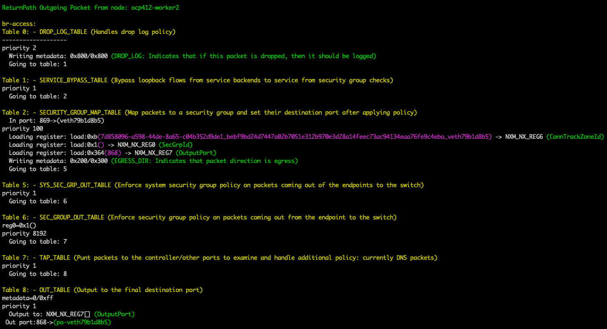
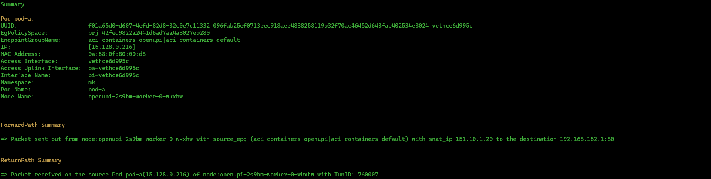
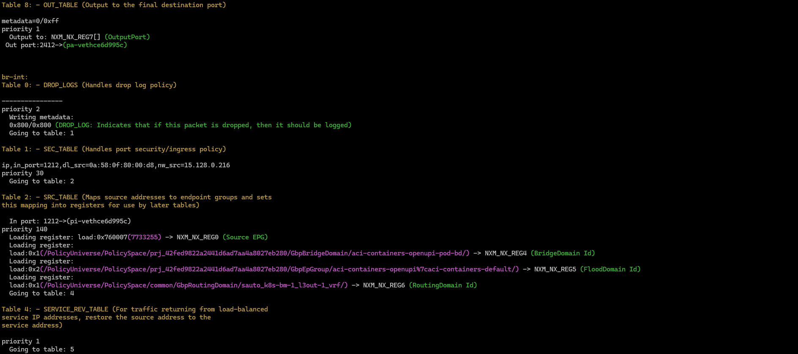
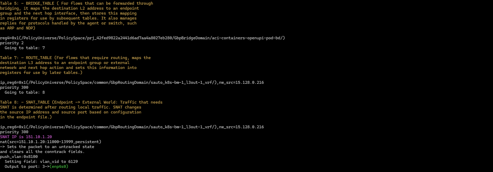
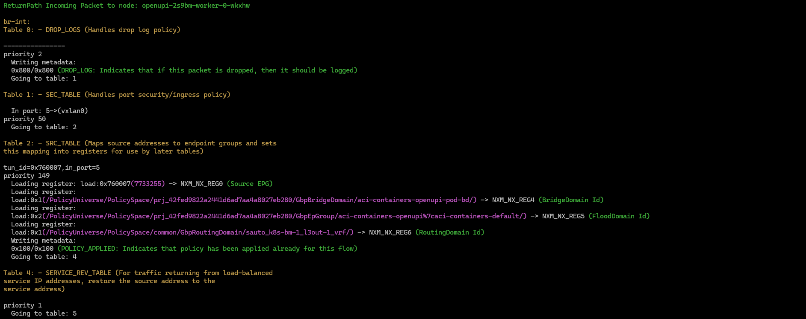
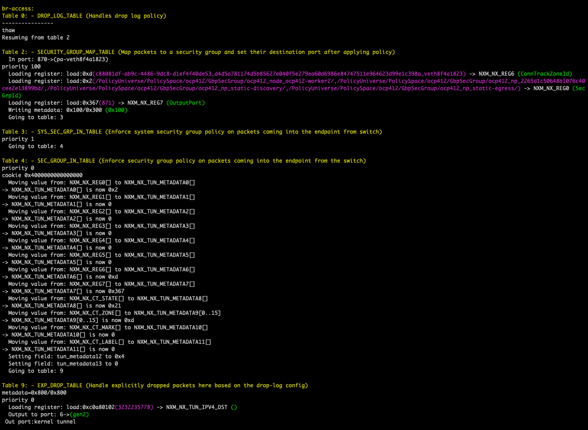

# Datapath tracing with acikubectl


- [Overview](#overview)
- [Objective](#objective)
- [Prerequisites](#prerequisites)
- [Usage](#usage)
- [acikubectl trace_pod_to_pod](#acikubectl-trace_pod_to_pod)
- [acikubectl trace_pod_to_svc](#acikubectl-trace_pod_to_svc)
- [acikubectl trace_pod_to_ext](#acikubectl-trace_pod_to_ext)
- [Tracing Packet Drops](#tracing-packet-drops)
  - [Network Policy: Blocking Traffic](#network-policy-blocking-traffic)
    - [NetworkPolicy – Deny Ingress](#networkpolicy--deny-ingress)
    - [NetworkPolicy – Deny Egress](#networkpolicy--deny-egress)
  - [Contracts](#contracts)


# Overview

The document covers the acikubectl trace command features of tracking and analyzing packet flows within OVS (Open vSwitch) Datapath
<p align="center">
  
</p>

# Objective
- Automate Packet Trace Generation: Simplify network debugging by automating the generation of packet traces from OVS flow tables.
- Enhance Readability of OVS Flows: Convert raw flow data into a structured, human-readable format for easier analysis.
- Hex/Code Conversion: Correlates the hex coded values in raw flow data with workload/ACI specific constructs.
- Support Multiple Bridge Types: Provide comprehensive tracing for both br-access and br-int bridges.
- Summarize Key Packet Information: Quickly identify critical packet attributes like in-port, out-port, tunnel ID, and packet forward/drop status.

# Prerequisites

The required prerequisites are:
- Cluster admin access to kubernetes cluster


# Usage
This tool provides a simple way to manage Kubernetes objects and
annotations for the ACI Containers Controller.  This offers a simple
way to manage the ACI policy for your containers.
```
Usage:
  acikubectl [command]

Available Commands:
  completion       Generate the autocompletion script for the specified shell
  debug            Commands to help diagnose problems with ACI containers
  get              Get a value
  help             Help about any command
  policy           output the gbp_inspect policies into a file for all the host-agent pods
  set              Set a value
  trace_pod_to_ext Trace ip packet's flow in ovs from pod to outside cluster communication
  trace_pod_to_pod Trace ip packet's flow in ovs for pod to pod communication
  trace_pod_to_svc Trace ip packet's flow in ovs from pod to service communication
  version          Print the client and server versions for the current context acikubectl version

Flags:
      --context string      Kubernetes context to use for CLI requests.
  -h, --help                help for acikubectl
      --kubeconfig string   Path to the kubeconfig file to use for CLI requests. (default "/home/noiro/.kube/config")

Use "acikubectl [command] --help" for more information about a command.
```

**Note:** The `trace_pod_to_ext`, `trace_pod_to_pod`, and `trace_pod_to_svc` are the commands for tracing IP packet flows.


# acikubectl trace_pod_to_pod
Trace ip packet's flow in ovs for pod to pod communication

```
Usage:
acikubectl trace_pod_to_pod [src_ns:src_pod] [dest_ns:dest_pod] [flags]
Examples:
acikubectl trace_pod_to_pod src_ns:src_pod dest_ns:dest_pod --tcp --tcp_src <source_port> --tcp_dst <destination_port>
Flags:
  -h, --help          help for trace_pod_to_pod
      --tcp           Specify if the protocol is TCP
      --tcp_dst int   Specify the destination TCP port
      --tcp_src int   Specify the source TCP port
  -v, --verbose       Enable verbose output

Args:
src_ns: Source Namespace
dest_ns: Destination Namespace 
src_pod: Source Pod
dest_pod: Destination Pod
```

- Tracking source and destination by Pod Ips

   ```acikubectl trace_pod_to_pod default:pod-a  default:pod-b –verbose```

- Tracking source and destination by Pod IPs and TCP Port

   ```acikubectl trace_pod_to_pod default:pod-a  default:pod-b --tcp --tcp_dst=8080 –verbose```

- Use verbose flag for ovs-flows output.

## Example


```
acikubectl trace_pod_to_pod default:pod-a  default:pod-b --tcp --tcp_dst=8080  --verbose
```

```
oc get pods -o wide
NAME    READY   STATUS    RESTARTS   AGE   IP           NODE             NOMINATED NODE   READINESS GATES
pod-a   1/1     Running   0          12m   10.2.3.74    ocp412-worker1   <none>           <none>
pod-b   1/1     Running   0          12m   10.2.0.232   ocp412-worker2   <none>           <none>
```





# acikubectl trace_pod_to_svc

Trace ip packet's flow in ovs from pod to service communication

```
Usage:
acikubectl trace_pod_to_svc [src_ns:src_pod] [dest_ns:dest_svc] [flags]
Examples:
acikubectl trace_pod_to_svc src_ns:src_pod dest_ns:dest_svc --tcp --tcp_src <source_port> --tcp_dst <destination_port>
Flags:
  -h, --help          help for trace_pod_to_svc
      --tcp           Specify if the protocol is TCP
      --tcp_dst int   Specify the destination TCP port
      --tcp_src int   Specify the source TCP port
  -v, --verbose       Enable verbose output

Global Flags:
      --context string      Kubernetes context to use for CLI requests.
      --kubeconfig string   Path to the kubeconfig file to use for CLI requests. (default "/home/noiro/.kube/config")
```

```
oc get pods -o wide
NAME    READY   STATUS    RESTARTS   AGE   IP           NODE             NOMINATED NODE   READINESS GATES
pod-a   1/1     Running   0          55m   10.2.3.74    ocp412-worker1   <none>           <none>
pod-b   1/1     Running   0          55m   10.2.0.232   ocp412-worker2   <none>           <none>
```
```
oc get pods -o wide -n testns
NAME        READY   STATUS    RESTARTS   AGE   IP           NODE             NOMINATED NODE   READINESS GATES
nginx-pod   1/1     Running   0          11s   10.2.0.237   ocp412-worker2   <none>           <none>
```
```
oc get svc -o wide -n testns
NAME            TYPE        CLUSTER-IP      EXTERNAL-IP   PORT(S)   AGE   SELECTOR
nginx-service   ClusterIP   172.30.105.10   <none>        80/TCP    21s   app=nginx
```

```
acikubectl trace_pod_to_svc default:pod-a testns:nginx-service --tcp --tcp_dst=80  --verbose
```






# acikubectl trace_pod_to_ext

Trace ip packet's flow in ovs from pod to outside cluster communication
```
Usage:
acikubectl trace_pod_to_ext [src_ns:src_pod] [dest_ip] [flags]
Examples:
acikubectl trace_pod_to_ext src_ns:src_pod dest_ip --tcp --tcp_src <source_port> --tcp_dst <destination_port>
Flags:
  -h, --help          help for trace_pod_to_ext
      --tcp           Specify if the protocol is TCP
      --tcp_dst int   Specify the destination TCP port
      --tcp_src int   Specify the source TCP port
  -v, --verbose       Enable verbose output

Global Flags:
      --context string      Kubernetes context to use for CLI requests.
      --kubeconfig string   Path to the kubeconfig file to use for CLI requests. (default "/home/noiro/.kube/config")
```

```
oc get pods -o wide
NAME    READY   STATUS    RESTARTS   AGE   IP           NODE             NOMINATED NODE   READINESS GATES
pod-a   1/1     Running   0          55m   10.2.3.74    ocp412-worker1   <none>           <none>
pod-b   1/1     Running   0          55m   10.2.0.232   ocp412-worker2   <none>           <none>
```
```
acikubectl trace_pod_to_ext default:pod-a 192.168.152.1 --tcp --tcp_dst=80 --verbose
```







# Tracing Packet Drops

Examples include tracing scenarios where packets are dropped because of:
- Network Policies
- Contracts: Tracing for pods running on the same node.

**Note:** Packet drops can be confirmed by checking the following table numbers in the respective OVS bridge output:
- br-access:
TABLE 9: EXP_DROP_TABLE (Handles explicitly dropped packets based on the drop-log config)
- br-int:
TABLE 15: EXP_DROP_TABLE (Handles explicitly dropped packets based on the drop-log config)


## Network Policy: Blocking Traffic

- Inbound Traffic Restrictions (Deny Ingress)
- Outbound Traffic Restrictions (Deny Egress)


### NetworkPolicy – Deny Ingress
**Example** 
- Running 2 pods on different node : pod-a & pod-b respectively. 
- pod-b have 2 nginx containers running on port 8080 & 80 respectively
- Apply networkpolicy to only allow ingress traffic on 8080. 
- Traffic coming on port 80 of destination pod is denied.

**allow-ingress-port-8080.yaml**
```
apiVersion: networking.k8s.io/v1
kind: NetworkPolicy
metadata:
  name: allow-ingress-port-8080
  namespace: default
spec:
  podSelector: {}  # Applies to all pods in the namespace
  policyTypes:
  - Ingress
  ingress:
  - ports:
    - protocol: TCP
      port: 8080
```

**pods.yaml**
```
apiVersion: v1
kind: Pod
metadata:
  name: pod-a
spec:
  nodeName: ocp412-worker1
  containers:
  - name: container-a
    image: quay.io/openshift-scale/nginx
    ports:
    - containerPort: 8080
---
apiVersion: v1
kind: Pod
metadata:
  name: pod-b
spec:
  nodeName: ocp412-worker2
  containers:
  - name: container-b1
    image: quay.io/openshift-scale/nginx
    ports:
    - containerPort: 8080
  - name: container-b2
    image: quay.io/jitesoft/lighttpd
    ports:
    - containerPort: 80
```

```
acikubectl trace_pod_to_pod default:pod-a  default:pod-b --tcp --tcp_dst=80 --verbose
```






### NetworkPolicy – Deny Egress
**Example**
- Running 2 pods on different node : pod-a & pod-b respectively. 
- pod-b have 2 containers running on port 8080 & 80 respectively
- Apply networkpolicy to only allow egress traffic on 8080. 
- Traffic going out on port 80 of destination pod is denied 


**allow-egress-port-8080.yaml**
```
apiVersion: networking.k8s.io/v1
kind: NetworkPolicy
metadata:
  name: allow-egress
spec:
  podSelector: {}
  policyTypes:
  - Egress
  egress:
  - ports:
    - protocol: TCP
      port: 8080
```

**pods.yaml**
```
apiVersion: v1
kind: Pod
metadata:
  name: pod-a
spec:
  nodeName: ocp412-worker1
  containers:
  - name: container-a
    image: quay.io/openshift-scale/nginx
    ports:
    - containerPort: 8080
---
apiVersion: v1
kind: Pod
metadata:
  name: pod-b
spec:
  nodeName: ocp412-worker2
  containers:
  - name: container-b1
    image: quay.io/openshift-scale/nginx
    ports:
    - containerPort: 8080
  - name: container-b2
    image: quay.io/jitesoft/lighttpd
    ports:
    - containerPort: 80
```

```
acikubectl trace_pod_to_pod default:pod-a  default:pod-b --tcp --tcp_dst=80 --verbose
```


## Contracts
**Example**
- Running 2 pods on the same node : pod-a in default namespace & pod-c in openshift-monitoring namespace respectively.
- Pod-a belongs to aci-containers-default epg
- Pod-c belongs to aci-containers-system epg 
- Pod-c running nginx on port 5000
- Traffic coming on port 5000 of pod-c is denied since there is no contract
- Create contract for port 5000 to allow traffic . 
- Traffic coming on port 5000 of pod-c is allowed as contract is present 

**pods.yaml**
```
apiVersion: v1
kind: Pod
metadata:
  name: pod-a
spec:
  nodeName: ocp412-worker1
  containers:
  - name: container-a
    image: quay.io/openshift-scale/nginx
    ports:
    - containerPort: 8080
---
apiVersion: v1
kind: Pod
metadata:
  name: pod-c
  labels:
    app: my-app
  namespace: openshift-monitoring
spec:
  nodeName: ocp412-worker1
  containers:
  - name: my-app-container
    image: quay.io/jitesoft/nginx:latest
    ports:
    - containerPort: 5000
    env:
    - name: NGINX_PORT
      value: "5000"
    command: ["/bin/sh"]
    args:
    - "-c"
    - |
      echo 'server {
          listen 5000;
          location / {
              root /usr/share/nginx/html;
              index index.html index.htm;
          }
      }' > /etc/nginx/conf.d/default.conf && nginx -g 'daemon off;'
```

```
$ oc get pods -o wide pod-a
NAME    READY   STATUS    RESTARTS   AGE   IP          NODE             NOMINATED NODE   READINESS GATES
pod-a   1/1     Running   0          51m   10.2.3.83   ocp412-worker1   <none>           <none>

$ oc get pods -n openshift-monitoring -o wide pod-c
NAME    READY   STATUS    RESTARTS   AGE     IP         NODE             NOMINATED NODE   READINESS GATES
pod-c   1/1     Running   0          2m28s   10.2.1.6   ocp412-worker1   <none>           <none>
```

```
acikubectl trace_pod_to_pod default:pod-a  openshift-monitoring:pod-c --tcp --tcp_dst=5000 --verbose
```


**Create Contract**
- After applying contract traffic is allowed


```
acikubectl trace_pod_to_pod default:pod-a  openshift-monitoring:pod-c --tcp --tcp_dst=5000 --verbose
```


