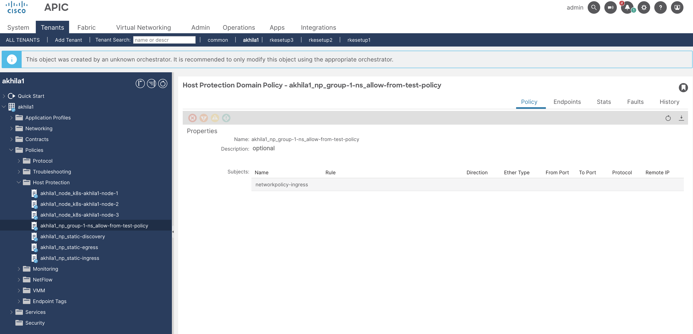
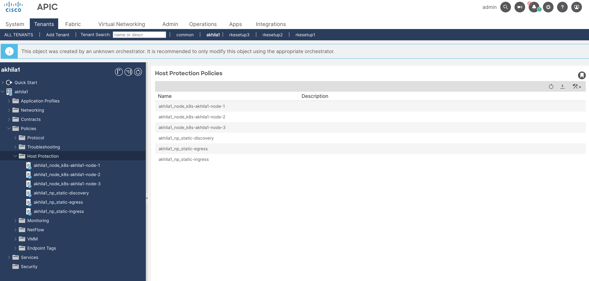

# Disable Host Protection Policy(HPP) Rendering

## Table of contents

* [Overview](#overview)
* [Mechanism](#mechanism)
* [Examples](#examples)

## Overview

When using the ACI-CNI, a Kubernetes Network Policy is mapped to an ACI Host Protection Policy (HPP) and rendered on the host. The HPP object is created in APIC with name `<policyTenantName>_np_<namespace>_<network-policy-name>` in `<Tenant> -> Policies -> Host Protection` tab. If the Network Policy is expected to be rendered by a different mechanism, [such as another CNI like Cilium](aci-and-cilium-integration.md), the HPP mapping and rendering can be disabled through configuration in the acc-provision input file as described below.

## Mechanism

Add following configuration in the acc provision input file:
```yaml
kube_config:
  disable_hpp_rendering: True  # default is False
```

Run `acc-provision` tool on updated acc provision input file to generate new `aci_deployment.yaml`
```sh
acc-provision -c <acc_provision_input_file> -f <flavor> -u <apic_username> -p <apic_password> -o aci_deployment.yaml
```

Delete old aci_deployment.yaml and wait till all the pods in the `aci-containers-system` namespace are deleted
```sh
$ oc delete -f aci_deployment.yaml
$ oc get pods -n aci-containers-system
```

Apply newly generated aci_deployment.yaml and wait till all pods in `aci-containers-system` namespace are running
```sh
$ oc apply -f aci_deployment.yaml
$ oc get pods -n aci-containers-system
```

Verify the flag is set in aci-containers-config config map:

```sh
$ oc get cm -n aci-containers-system aci-containers-config -oyaml | less
apiVersion: v1
data:
  ...
  controller-config: |-
    {
        ...
        "disable-hpp-rendering": true,
        ...
    }
  host-agent-config: |-
    {
        ...
        "disable-hpp-rendering": true,
        ...
    }
```

## Examples

Suppose we have following network policy in the cluster:

```yaml
apiVersion: networking.k8s.io/v1
kind: NetworkPolicy
metadata:
  name: allow-from-test-policy
  namespace: group-1-ns
spec:
  ingress:
  - from:
    - namespaceSelector:
        matchLabels:
          test: policy
  podSelector: {}
  policyTypes:
  - Ingress
```

```sh
$ kubectl get networkpolicy -n group-1-ns
NAME                     POD-SELECTOR   AGE
allow-from-test-policy   <none>         34s
```

By default HPP object is created




When HPP rendering is disabled, HPP object is not created (deleted the already created one in this case)


