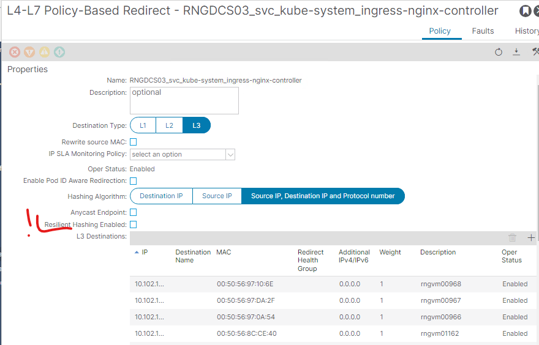

# Disable Resilient Hashing in Redirect Policy

## Table of contents

* [Overview](#overview)
* [Mechanism](#mechanism)

## Overview

To support hitless upgrades and dynamic scaling of applications, it is essential to improve the behavior of services exposed externally using the Kubernetes LoadBalancer service type. When such services are exposed, the Application Centric Infrastructure (ACI) fabric programs a Policy-Based Redirect (PBR) construct. As part of the PBR configuration, an L4-L7 redirection policy is applied. By default, changes to the pool of L3 destinations (e.g., when a destination is added or removed) may cause the ACI fabric to re-hash all active flows. This behavior can lead to connection disruptions and degraded service performance during scale events or rolling updates. To ensure seamless scaling and minimize service disruption during upgrades, the L4-L7 redirection policy should be configured with Resilient Hashing enabled (Refer the screenshot below):




## Mechanism

This introduces a new parameter `disable_resilient_hashing` to control whether Resilient Hashing is enabled in the L4-L7 Redirect Policy created by the controller when a LoadBalancer service is exposed. By default, Resilient Hashing is enabled. To disable it, add the following to acc provision input file

```yaml
kube_config:
  disable_resilient_hashing: true # default is false (enabled)
```

Run `acc-provision` tool on updated acc provision input file to generate new `aci_deployment.yaml`
```sh
acc-provision -c <acc_provision_input_file> -f <flavor> -u <apic_username> -p <apic_password> -o aci_deployment.yaml
```

Delete old aci_deployment.yaml and wait till all the pods in the `aci-containers-system` namespace are deleted
```sh
$ oc delete -f aci_deployment.yaml
$ oc get pods -n aci-containers-system
```

Apply newly generated aci_deployment.yaml and wait till all pods in `aci-containers-system` namespace are running
```sh
$ oc apply -f aci_deployment.yaml
$ oc get pods -n aci-containers-system
```

Verify the flag is set in aci-containers-config config map:
```sh
$ oc get cm -n aci-containers-system aci-containers-config -oyaml | less
apiVersion: v1
data:
  ...
  controller-config: |-
    {
        ...
        "disable-resilient-hashing": true
        ...
    }
```
