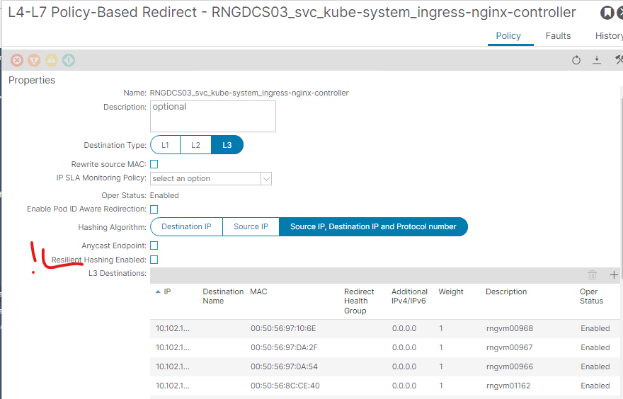

# Disable Resilient Hashing in Redirect Policy

## Table of contents

* [Overview](#overview)
* [Mechanism](#mechanism)

## Overview
In the effort of the hitless upgrades / applications scale up and down in Bosch, we need one improvement for the services that are exposed outside as type load balancer (ingress controller as an example). When a service is exposed as type load balancer, the PBR construct gets programmed in ACI. As part of PBR, the L4-L7 Redirection Policy is programmed (see the screenshot below):



The L4-L7 redirect should be programmed with Resilient Hashing Enabled. When this option is enabled, ACI fabric wont be re-hashing existing flows when a L3 Destination will be deleted / added. Only the flows that were redirected to deleted L3 Destination will be re-hashed.


## Mechanism

This introduces a new parameter `disable_resilient_hashing` to control whether Resilient Hashing is enabled in the L4-L7 Redirect Policy created by the controller when a LoadBalancer service is exposed. By default, Resilient Hashing is enabled. To disable it, add the following to acc provision input file

```yaml
kube_config:
  disable_resilient_hashing: true # default is false (enabled)
```

Run `acc-provision` tool on updated acc provision input file to generate new `aci_deployment.yaml`
```sh
acc-provision -c <acc_provision_input_file> -f <flavor> -u <apic_username> -p <apic_password> -o aci_deployment.yaml
```

Delete old aci_deployment.yaml and wait till all the pods in the `aci-containers-system` namespace are deleted
```sh
$ oc delete -f aci_deployment.yaml
$ oc get pods -n aci-containers-system
```

Apply newly generated aci_deployment.yaml and wait till all pods in `aci-containers-system` namespace are running
```sh
$ oc apply -f aci_deployment.yaml
$ oc get pods -n aci-containers-system
```

Verify the flag is set in aci-containers-config config map:
```sh
$ oc get cm -n aci-containers-system aci-containers-config -oyaml | less
apiVersion: v1
data:
  ...
  controller-config: |-
    {
        ...
        "disable-resilient-hashing": true
        ...
    }
```
