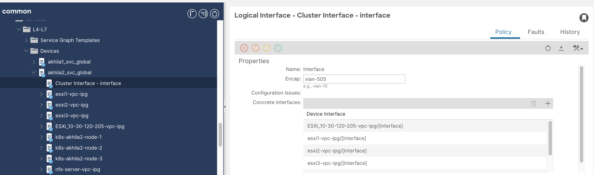
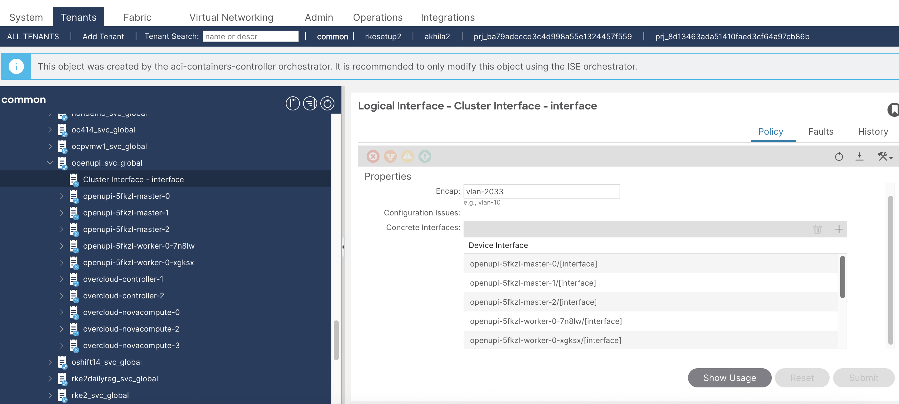

# Disable Service Vlan Preprovisioning

# Table of contents

* [Overview](#overview)
* [Mechanism](#mechanism)  


## Overview
Previously, service VLAN provisioning was performed only on hosts that contained cluster nodes. As a result, when multiple VM migrations occurred in parallel across different clusters connected to the same APIC, the APIC could become overloaded. This caused delays in provisioning the service VLAN on destination hosts that did not previously have cluster nodes.

To address this issue, service VLAN pre-provisioning has been introduced. Service VLAN pre-provisioning is now enabled by default. This ensures that service VLANs are available on all hosts in advance, avoiding delays during VM migrations.

If required, this feature can be disabled by setting disable_service_vlan_preprovisioning in the input file.

## Mechanism

Add following configuration in the acc provision input file:
```yaml
kube_config:
  disable_service_vlan_preprovisioning: True  # default is False
```

Run `acc-provision` tool on updated acc provision input file to generate new `aci_deployment.yaml`
```sh
acc-provision -c <acc_provision_input_file> -f <flavor> -u <apic_username> -p <apic_password> -o aci_deployment.yaml
```

Delete old aci_deployment.yaml and wait till all the pods in the `aci-containers-system` namespace are deleted
```sh
$ oc delete -f aci_deployment.yaml
$ oc get pods -n aci-containers-system
```

Apply newly generated aci_deployment.yaml and wait till all pods in `aci-containers-system` namespace are running
```sh
$ oc apply -f aci_deployment.yaml
$ oc get pods -n aci-containers-system
```

Verify Disable Service Vlan Preprovisioning is reflected in aci-containers-config config map:

```sh
noiro@k8s-scale-extrtr:~$ oc get cm -n aci-containers-system aci-containers-config -oyaml | less
apiVersion: v1
data:
  controller-config: |-
    {
        "flavor": "openshift-4.15-openstack",
        "log-level": "debug",
        "apic-hosts": [
            "172.28.184.130",
            "172.28.184.131",
            "172.28.184.132"
        ],
        "enable-opflex-agent-reconnect": true,
        "apic-username": "openupi",
        "apic-private-key-path": "/usr/local/etc/aci-cert/user.key",
        "aci-prefix": "openupi",
        "aci-vmm-type": "OpenShift",
        "aci-vmm-domain": "openupi",
        "aci-vmm-controller": "openupi",
        "aci-policy-tenant": "prj_ba79adeccd3c4d998a55e1324457f559",
        "hpp-optimization": true,
        "disable-service-vlan-preprovisioning": true,
        "proactive-conf": true,
        ...
```

Verify Disable Service Vlan Preprovisioning is reflected in acc-provision-config config map:

```sh
noiro@k8s-scale-extrtr:~$ oc get cm -n aci-containers-system acc-provision-config -oyaml | less
apiVersion: v1
data:
  spec: "{
    ...
    \"disable_service_vlan_preprovisioning\": true,
    ...
```

When Service VLAN Pre-provisioning is enabled (default), L4-L7 devices will display interfaces for all associated OpenStack/ESXi hosts as shown below:






If the feature is disabled, only the interfaces of hosts that contain cluster nodes will be listed.
