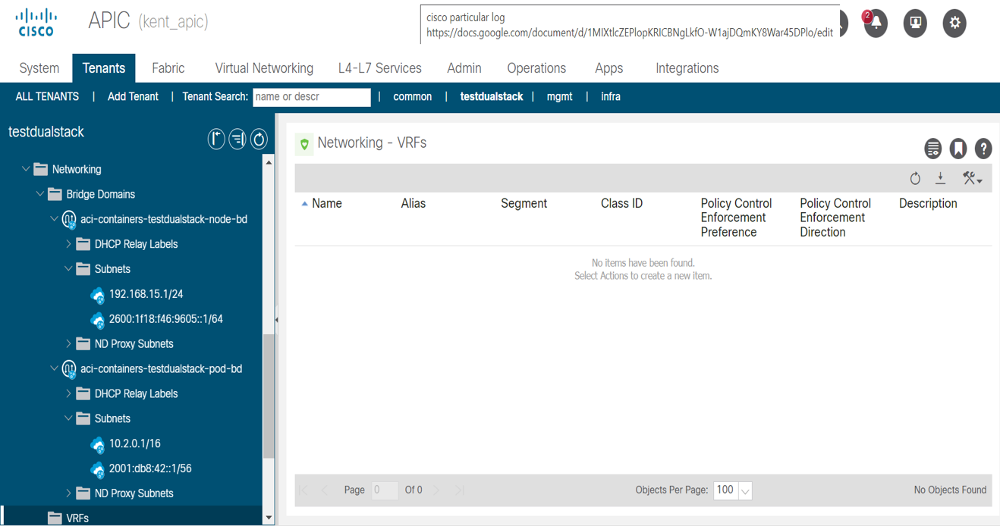

# Dual-Stack Support for Kubernetes/OpenShift with ACI CNI

# Table of Contents

- [1. Overview](#1-overview)
- [2. Motivation](#2-motivation)
- [3. Mechanism](#3-mechanism)
- [4. Configurations](#4-configurations)
- [5. Validation](#5-validation)
- [6. Assumptions](#6-assumptions)
- [7. Troubleshooting](#7-troubleshooting)
- [8. Reference](#8-reference)

## 1. Overview

Dual-stack networking within Kubernetes enables the concurrent allocation and utilization of IPv4 and IPv6 addresses for pods and services within the cluster infrastructure.This feature facilitates the coexistence of IPv4 and IPv6 protocols, thereby addressing scalability concerns related to address exhaustion and promoting the adoption of IPv6. Cisco ACI supports IPv4/IPv6 dual-stack networking on baremetal with kubeadm installed upstream Kubernetes, or OCP based clusters for Kubernetes v1.21 or later.

## 2. Motivation

Dual-stack networking in Kubernetes/OpenShift environments serves several technical imperatives including addressing IPv4 exhaustion with virtually limitless IPv6 addresses, facilitating IPv6 adoption through dual-stack support, enabling IPv6-only environments while maintaining IPv4 compatibility, supporting seamless communication for IPv6-native applications, and ensuring compatibility with both IPv4 and IPv6 to accommodate diverse networking requirements  in Kubernetes/OpenShift environments.

## 3. Mechanism

Dual stack support can be enabled by specifying both IPv4 and IPv6 subnets in the acc-provision input file. The node_subnet, pod_subnet, extern_dynamic and extern_static fields should be appropriately configured. Once enabled, the pods, nodes would possess both IPv4 and IPv6 addresses and services can be configured with dual stack.

## 4. Configurations

Dual stack can be configured for OpenShift and Kubernetes clusters in the manner described in this section.

### acc-provision configuration

Under net-config section in acc-provision file, provide IPv4/IPv6 ranges as list for node_subnet/pod_subnet/extern_dynamic/extern_static fields.

Example:

```yaml
net_config:
  node_subnet:
  - 192.168.51.1/24                            # Subnet to use for nodes
  - 2600:1d18:f46:9605::1/64
  pod_subnet:
  - 10.2.0.1/16                                # Subnets to use for Kubernetes
  - 2001:0fb8:0042:0000:0000:0000:0000:0001/56 # Pods/CloudFoundry containers
  extern_dynamic:
  - 10.3.0.1/24                               # Subnets to use for dynamic external IPs
  - 2001:4fb8:0043:0000:0000:0000:0000:0001/56
  extern_static:
  - 10.4.0.1/24                                # Subnet to use for static external IPs
  - 2001:5ab8:0043:0000:0000:0000:0000:0001/56
```

### Node configuration

In addition to the configuration done for a single stack cluster, IPv6 interfaces and routes should be configured on the nodes. This can be done using tools like nmcli or netplan.

nmcli:
```sh
$ nmcli con
# Rename connection name 
$ nmcli con mod "Wired connection 1" con-name ens192
$ nmcli con mod "Wired connection 2" con-name ens224
$ nmcli con mod ens192 ifname ens192 ip6 2600:1d18:f46:9605::8/64 gw6 2600:1d18:f46:9605::1
# Apply changes:
$ nmcli con up ens192 ifname ens192
# Verify it will show ipv6 ip $ ifconfig ens192
# Add vlan subinterface on ens224.3901
$ nmcli con add type vlan con-name ens224.3901 ifname ens224.3901 dev ens224 id 3901
$ nmcli con mod ens224.3901 +ipv4.routes "224.0.0.0/4"
$ nmcli con up ens224.3901 ifname ens224.3901
# Verify route using ip r, new route should appear 
$ ip r
``` 

netplan:


### OpenShift Installation

* Add the respective IPv6 IPs in clusterNetwork, machineNetwork and serviceNetwork in the install-config.yaml file. 
    Note: Take care to specify IPv4 and IPv6 addresses in the same order for all network configuration parameters. In the given example configuration IPv4 addresses are listed before IPv6 addresses.

Example:
```yaml
networking:
  clusterNetwork:
  - cidr: 10.2.0.0/16
    hostPrefix: 23
  - cidr: 2001:fb8:42::/56
    hostPrefix: 64
  networkType: CiscoACI
  machineNetwork:
  - cidr: 192.168.51.0/24
  - cidr: 2600:1d18:f46:9605::/64
  serviceNetwork:
  - 172.30.0.0/16
  - 2001:2db4:42::/112
```

Proceed with cluster installation.

```sh
# Install ign image(Bootstrap Node: bootstrap.ign, Master Node : master.ign, Worker Node : worker.ign) 
$ sudo coreos-installer install --copy-network --ignition-url=http://192.168.51.2:8080/ignition/master.ign /dev/sda --insecure-ignition
```

### Kubernetes Installation

In the kubeadm config, specify the IPv6 addresses for pod subnet, service subnet and the node-ip extra args for kubelet.

Example master config:
```yaml
---
apiVersion: kubeadm.k8s.io/v1beta3
kind: ClusterConfiguration
imageRepository: registry.k8s.io
networking:
  podSubnet: 10.2.0.1/16,2001:0db8:0042:0000:0000:0000:0000:0001/56
  serviceSubnet: 10.6.0.1/16,2001:1db8:0042:0000:0000:0000:0000:0001/112
---
apiVersion: kubeadm.k8s.io/v1beta3
kind: InitConfiguration
localAPIEndpoint:
  advertiseAddress: "192.168.15.2"
  bindPort: 6443
nodeRegistration:
  kubeletExtraArgs:
    node-ip: 192.168.15.2,2600:1f18:f46:9605::11
```

Example worker config:
```yaml
apiVersion: kubeadm.k8s.io/v1beta3
kind: JoinConfiguration
discovery:
  bootstrapToken:
    apiServerEndpoint: 192.168.15.2:6443
    token: "u94oim.llzdypypzecj9soz"
    caCertHashes:
    - "sha256:e9cc06e680ed4f29791ddb18d0fe9ee853021c83ddb5e3b8e273464f626bcbbb"
nodeRegistration:
  kubeletExtraArgs:
    node-ip: 192.168.15.5,2600:1f18:f46:9605::14
```

### Configuring Services

Services can use IPv4, IPv6, or both. Refer [official Kuberenets documentation](https://kubernetes.io/docs/concepts/services-networking/dual-stack/#services) for more details.

## 5. Validation

You can verify the dual stack configuration as described in this section.

IPv4 and IPv6 IPs would be present in the aci-containers-config config map in the aci-containers-system namespace in controller and hostagent config.


Both IPv4 and IPv6 subnets would be visible in the APIC


Node addressing can be verified using:

```sh
oc describe network # verify network details
oc get node <node-name> -oyaml | grep "pod-network-ranges" # verify node IP
```

for OpenShift and

```sh
kubectl get nodes <node-name> -o go-template --template='{{range .spec.podCIDRs}}{{printf "%s\n" .}}{{end}}' # verify pod subnet
kubectl get nodes <node-name> -o go-template --template='{{range .status.addresses}}{{printf "%s: %s\n" .type .address}}{{end}}' # verify node IP
kubectl get pods <pod-name> -o go-template --template='{{range .status.podIPs}}{{printf "%s\n" .ip}}{{end}}' # verify Pod IP
kubectl exec -it pod01 -- cat /etc/hosts # another way to verify pod IP
```

for Kubernetes.

Both IPv4 and IPv6 addresses would be present.

## 6. Assumptions

The following assumptions have been made about the setup:

* The operating system of the nodes of the cluster is either of the below:
  * Ubuntu
  * RedHat
* ACI CNI version 5.2.7.1 or later release version
* Kubernetes version 1.21 or later release version
* OpenShift version 4.12.5 or later

## 7. Troubleshooting

#### 1. Ensure the following:
* Both IP families must use the same network interface for the default gateway. 
* Both IP families must have the default gateway.
* Pod and node gateway should be reachable from each compute node.
* IPv6 forwarding should be enabled.

#### 2. Check End Point files

If a pod wasn't assigned an IPv6 address, check whether pod EP files get created or not using pod UUID on the node where pod is scheduled.

  * Check for pod details and get pod UUID and pod scheduled host
    
    

  * Check for pod ep files at this path - `/var/lib/opflex-agent-ovs/endpoints/` with filename prefixed with pod UUID and extension `.ep`.

    ```sh
    [core@worker1 ~]$ cd /var/lib/opflex-agent-ovs/endpoints/
    [core@worker1 endpoints]$ ls | grep "9286a043-6026-4050-a601-f7e30344738f"
    9286a043-6026-4050-a601-f7e30344738f_d27d6043706f97e6a90560ec20021b16c1473c9281d62010e40275c63a2c1379_vetha91b0923.ep
    ```

  * Check for two pod IPs ( IPv4/IPv6) present in pod EP file.

    

Similarly if a service did not get configured with both IPs check the service EP file at path `/var/lib/opflex-agent-ovs/services/`.

  

  ```sh
  core@worker1 ~]$ cd /var/lib/opflex-agent-ovs/services/
  [core@worker1 endpoints]$ ls | grep "c8633ccd-8250-4286-9dcd-00691fae009c"
  c8633ccd-8250-4286-9dcd-00691fae009c.service
  ```

Under the `service-mapping` field, verify IPv4 and/or IPv6 `service-ip`, as per configuration.

  

#### 3. Check logs and events

* Describe nodes to see what IP ranges are assigned.

  ```sh
  kubectl describe node <node-name> 
  ```

* Describe pod and look for events, failuers.
  ```sh
  kubectl describe pod <pod_name>
  ```  

* Check aci-containers-controller pod logs for any error/warning in case IPs have not been assigned.
  ```sh
  kubectl logs -n aci-containers-system <controller-pod name>
  ```

* If IP has been assigned, but the EP file doesn't show that IP, check host agent logs.
  ```sh
  kubectl logs -n aci-containers-system <hostagent-pod name> -c aci-containers-host
  ```

## 8. Reference

1. [Kubernetes Concepts Documentation](https://kubernetes.io/docs/concepts/)
2. [Kubernetes Service Documentation](https://kubernetes.io/docs/concepts/services-networking/service/)
3. [Validating Dual-Stack Networking in Kubernetes](https://kubernetes.io/docs/tasks/network/validate-dual-stack/)
4. [Dual-Stack Networking in Kubernetes](https://kubernetes.io/docs/concepts/services-networking/dual-stack/)
5. [OpenShift Bare Metal Installation Customizations](https://docs.openshift.com/container-platform/4.11/installing/installing_bare_metal/installing-bare-metal-network-customizations.html#installationconfiguration-parameters_installing-bare-metal-network-customizations)
6. [Kubeadm Configuration](https://kubernetes.io/docs/reference/config-api/kubeadm-config.v1beta3/)
