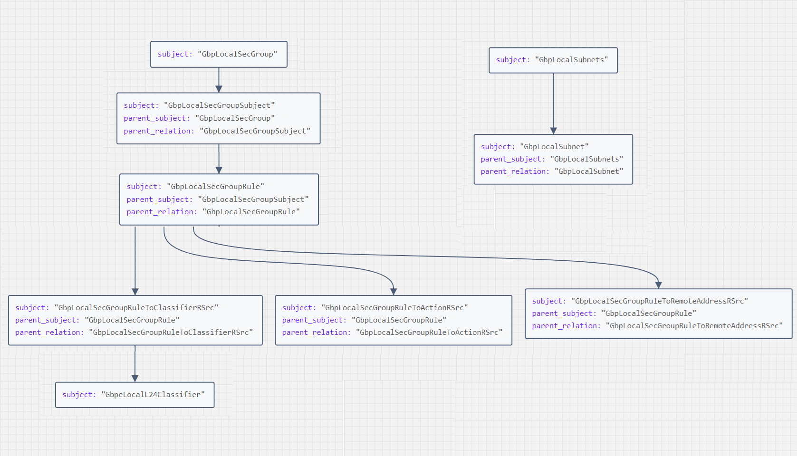

# Host Protection Policies Distribution Optimization

# Table of contents
* [Overview](#overview)
* [Motivation](#motivation)
* [Mechanism](#mechanism)  
* [Example](#example)
* [Troubleshooting](#troubleshooting)
    

## Overview

This feature is introduced to distribute HPP via Kubernetes control plane for faster convergence and reduce load on fabric. When this feature is enabled, the hostprotPol MOs will not be created in the APIC but we will make use of Custom Resources which are extensions of kubernetes API to distribute the HPP to opflex agent.

## Motivation

Lot of HPP objects had to be sent and pulled from the leaf which causes burden on the fabric and lead to slow recovery times. So, to reduce the burden on the fabric we use kubernetes control plane to distribute the HPP to opflex agent, thus bypassing sending and pulling the HPPs objects from the leaf.

## Mechanism

HPP Distribution Optimization feature can be enabled by providing the following configuration in the acc-provision input file:

```yaml
kube_config:
  enable_hpp_direct: True
```

When this feature is enabled, below two Custom Resource Definitions(CRD) are used to distribute the HPP from controller to opflex agent.
- hostprotPol
- hostprotRemoteIpContainer

The CRs for above two CRDs are created in aci-containers-system namespace.

hostprotRemoteIpContainer Custom Resource(CR) is created for every namespace, which holds the IP address, key and value of the labels of the Pods in the namespace. The structure of hostprotRemoteIpContainer CR is as shown below,

```yaml
apiVersion: aci.hpp/v1
kind: HostprotRemoteIpContainer
metadata:
  name: <namespace_name>
  namespace: aci-containers-system
spec:
  name: <namespace_name>
  hostprotRemoteIp 
  - addr: <ip_address> 
    hppEpLabel: 
    - key: <key_of_the_label> 
      value: <value_of_the_label>
```
hostprotPol CR is created when a network policy is created. The CR follows the same structure as the hostprotPol MO, the structure is as shown below,
```yaml
apiVersion: aci.hpp/v1
kind: HostprotPol
metadata:
  name: <policyTenantName>_np_<hash_of_networkpolicy_spec>
  namespace: aci-containers-system
spec:
  name: <policyTenantName>_np_<hash_of_networkpolicy_spec> 
  networkPolicies: 
    - <netpol_namespace><netpol_name_1> 
    - <netpol_namespace><netpol_name_2> 
    . . . 
  hostprotSubj: 
    name: <name> 
    - hostprotRule: 
      - name: <name> 
        connTrack: <connTrack> 
        direction: <ingress/egress> 
        ethertype: <ipv4/ipv6> 
        fromPort: <port> 
        toPort: <port> 
        protocol: <protocol> 
        rsRemoteIpContainer: 
        - <remIPCont_name1> 
        . . .
        hostprotFilterContainer: 
          hostprotPodFilter: 
          - key: <key_of_the_match_expression> 
            operator: <operator_of_the_match_expression> 
            values: <values_of_the_match_expression>
```
When these CRs are created by the controller and the hostagent is informed, it takes this info in the CRs and creates a file with .netpol extension at /var/lib/opflex-agent-ovs/netpols/ location on the node where hostagent is running with the local hpp MO tree if a pod exists on the node which is selected by the network policy. Whenever this file is created/updated/deleted the opflex agent adds/deletes the flows accordingly as per the secgrp tree. By default, the controller will create hostprotPol CRs for every node, static-discovery, static-egress and static-ingress.


## Example

Let's create a network policy and see the CRs and the Local MO tree which will be created.

```yaml
apiVersion: networking.k8s.io/v1
kind: NetworkPolicy
metadata:
  name: taatfan-np
  labels:
    test: test-taatfan
spec:
  ingress:
    - from:
        - namespaceSelector:
            matchLabels:
              purpose: production
  podSelector:
    matchLabels:
      app: web
  policyTypes:
    - Ingress
```
This network policy allows the traffic from the pods in the namespace which match the label ‘purpose=production’ to the pods in the current namespace with label ‘app=web’.

```sh
$ kubectl -n aci-containers-system get hostprotpol
NAME                                               AGE
demo-xyz1-node-k8s20-node-1.local.lan           6m11s
demo-xyz1-node-k8s20-node-2.local.lan           6m10s
demo-xyz1-node-k8s20-node-4.local.lan           6m9s
demo-xyz1-node-k8s20-node-5.local.lan           6m8s
demo-xyz1-np-54f6fbaeb1e26d3bbcd23109158b9bb3   4m53s
demo-xyz1-np-static-discovery                   6m12s
demo-xyz1-np-static-egress                      6m12s
demo-xyz1-np-static-ingress                     6m12s
```

We have the object `demo-xyz1-np-54f6fbaeb1e26d3bbcd23109158b9bb3` for newly created policy along with objects for each node, and static ingress, egress and discovery objects. The contents of this CR will be as below,

```yaml
apiVersion: aci.hpp/v1
kind: HostprotPol
metadata:
  creationTimestamp: "2024-08-01T12:13:56Z"
  generation: 1
  name: demo-xyz1-np-54f6fbaeb1e26d3bbcd23109158b9bb3
  namespace: aci-containers-system
  resourceVersion: "45880591"
  uid: 92c71599-c82a-4b54-a54f-d64bb4bf36f2
spec:
  hostprotSubj:
  - name: networkpolicy-ingress
  name: demo_xyz1_np_54f6fbaeb1e26d3bbcd23109158b9bb3
  networkPolicies:
  - default/taatfan-np
```
As there is no namespace with the label ‘purpose=production’ with pods in it we don’t have hostprotRule created yet. The netpol file will be created with only the GbpLocalSecGroup and GbpLocalSecGroupSubject in it. 

Let us create the required namespace with a pod in it.

*Namespace:*
```yaml
apiVersion: v1
kind: Namespace
metadata:
  labels:
    purpose: production
  name: prod
```
*Pod:*
```yaml
apiVersion: v1
kind: Pod
metadata:
  name: prod-ns-pod
  namespace: prod
spec:
  containers:
    - command: ["/bin/sh", "-c", "sleep 60m"]      
      image: 'alpine:latest'
      imagePullPolicy: IfNotPresent
      name: alpine
  restartPolicy: Always
```

When we create the namespace and the pod, the hostprotPol and hostprotRemoteIpContainer CRs will be as below.

*hostprotPol(Spec):*
```yaml
spec:
  hostprotSubj:
  - hostprotRule:
    - connTrack: reflexive
      direction: ingress
      ethertype: ipv4
      fromPort: unspecified
      hostprotFilterContainer: {}
      name: 0-ipv4
      protocol: unspecified
      rsRemoteIpContainer:
      - prod
      toPort: unspecified
    name: networkpolicy-ingress
  name: demo_xyz1_np_54f6fbaeb1e26d3bbcd23109158b9bb3
  networkPolicies:
  - default/taatfan-np
```
*hostprotRemoteIpContainer:*
```yaml
apiVersion: aci.hpp/v1
kind: HostprotRemoteIpContainer
metadata:
  creationTimestamp: "2024-08-01T12:36:10Z"
  generation: 1
  name: prod
  namespace: aci-containers-system
  resourceVersion: "45882738"
  uid: dadf7d28-aae6-45b8-8722-402efb4033b9
spec:
  hostprotRemoteIp:
  - addr: 10.2.64.1
  name: prod
```
The hostprotRemoteIpContainer will be created for the created namespace with the IPs, labels of the pods in it and the hostprotPol has now the hostprotRule with rsRemoteIpContainer pointing to all the hostprotRemoteIpContainer from whose pods the traffic is allowed.

As there are no podselectors in ingress, all the pods in the namespace matching the namespace selector label will be selected, else there would be hostprotFilter items in hostprotFilterContainer with the key, operator and values to match the pod as shown below,               
```yaml   
hostprotFilter:
  - key: app
    operator: Equals
    values:
    - browser
```
If the pod we created had the labels then hostprotRemoteIpContainer would have those labels along with the IP of the pod like below and the filter will be applied to select the pods.
```yaml
- addr: 10.2.64.1
  hppEpLabel:
  - key: app
  value: browser
```
As soon as the CRs are updated hostagent updates the netpol file previously created. The file will have the following MO tree now in the JSON format.



Below is the format of the netpol file created by hostagent:

```json
[
  {
    "subject": "GbpLocalSecGroup",
    "uri": "/PolicyUniverse/PolicySpace/akhila2/GbpLocalSecGroup/akhila2_np_028f36d954650a5fde7ea6addc3a6295/",
    "properties": [
      …
    ],
    "children": [
      "/PolicyUniverse/PolicySpace/akhila2/GbpLocalSecGroup/akhila2_np_028f36d954650a5fde7ea6addc3a6295/GbpLocalSecGroupSubject/networkpolicy-ingress/"
    ]
  },
  {
    "subject": "GbpLocalSecGroupSubject",
    "uri": "/PolicyUniverse/PolicySpace/akhila2/GbpLocalSecGroup/akhila2_np_028f36d954650a5fde7ea6addc3a6295/GbpLocalSecGroupSubject/networkpolicy-ingress/",
    "properties": [
      …
    ],
    "children": [
      "/PolicyUniverse/PolicySpace/akhila2/GbpLocalSecGroup/akhila2_np_028f36d954650a5fde7ea6addc3a6295/GbpLocalSecGroupSubject/networkpolicy-ingress/GbpLocalSecGroupRule/0-ipv4/"
    ],
    …
  },
  {
    "subject": "GbpLocalSecGroupRule",
    "uri": "/PolicyUniverse/PolicySpace/akhila2/GbpLocalSecGroup/akhila2_np_028f36d954650a5fde7ea6addc3a6295/GbpLocalSecGroupSubject/networkpolicy-ingress/GbpLocalSecGroupRule/0-ipv4/",
    "properties": [
      …
    ],
    "children": [
      "/PolicyUniverse/PolicySpace/akhila2/GbpLocalSecGroup/akhila2_np_028f36d954650a5fde7ea6addc3a6295/GbpLocalSecGroupSubject/networkpolicy-ingress/GbpLocalSecGroupRule/0-ipv4/GbpLocalSecGroupRuleToClassifierRSrc/GbpeLocalL24Classifier/akhila2_np_028f36d954650a5fde7ea6addc3a6295%7cnetworkpolicy-ingress%7c0-ipv4",
      "/PolicyUniverse/PolicySpace/akhila2/GbpLocalSecGroup/akhila2_np_028f36d954650a5fde7ea6addc3a6295/GbpLocalSecGroupSubject/networkpolicy-ingress/GbpLocalSecGroupRule/0-ipv4/GbpLocalSecGroupRuleToActionRSrc/GbpLocalAllowDenyAction/allow/",
      "/PolicyUniverse/PolicySpace/akhila2/GbpLocalSecGroup/akhila2_np_028f36d954650a5fde7ea6addc3a6295/GbpLocalSecGroupSubject/networkpolicy-ingress/GbpLocalSecGroupRule/0-ipv4/GbpLocalSecGroupRuleToRemoteAddressRSrc/GbpLocalSubnets/akhila2_np_028f36d954650a5fde7ea6addc3a6295%7cnetworkpolicy-ingress%7c0-ipv4/"
    ],
    …
  },
  {
    "subject": "GbpLocalSecGroupRuleToClassifierRSrc",
    "uri": "/PolicyUniverse/PolicySpace/akhila2/GbpLocalSecGroup/akhila2_np_028f36d954650a5fde7ea6addc3a6295/GbpLocalSecGroupSubject/networkpolicy-ingress/GbpLocalSecGroupRule/0-ipv4/GbpLocalSecGroupRuleToClassifierRSrc/GbpeLocalL24Classifier/akhila2_np_028f36d954650a5fde7ea6addc3a6295%7cnetworkpolicy-ingress%7c0-ipv4",
    "properties": [
      …
    ],
    …
  },
  {
    "subject": "GbpLocalSecGroupRuleToActionRSrc",
    "uri": "/PolicyUniverse/PolicySpace/akhila2/GbpLocalSecGroup/akhila2_np_028f36d954650a5fde7ea6addc3a6295/GbpLocalSecGroupSubject/networkpolicy-ingress/GbpLocalSecGroupRule/0-ipv4/GbpLocalSecGroupRuleToActionRSrc/GbpLocalAllowDenyAction/allow/",
    "properties": [
      …
    ],
    …
  },
  {
    "subject": "GbpLocalSecGroupRuleToRemoteAddressRSrc",
    "uri": "/PolicyUniverse/PolicySpace/akhila2/GbpLocalSecGroup/akhila2_np_028f36d954650a5fde7ea6addc3a6295/GbpLocalSecGroupSubject/networkpolicy-ingress/GbpLocalSecGroupRule/0-ipv4/GbpLocalSecGroupRuleToRemoteAddressRSrc/GbpLocalSubnets/akhila2_np_028f36d954650a5fde7ea6addc3a6295%7cnetworkpolicy-ingress%7c0-ipv4/",
    "properties": [
      …
    ],
    …
  },
  {
    "subject": "GbpeLocalL24Classifier",
    "uri": "/PolicyUniverse/PolicySpace/akhila2/GbpeLocalL24Classifier/akhila2_np_028f36d954650a5fde7ea6addc3a6295%7cnetworkpolicy-ingress%7c0-ipv4/",
    "properties": [
      …
    ]
  },
  {
    "subject": "GbpLocalSubnets",
    "uri": "/PolicyUniverse/PolicySpace/akhila2/GbpLocalSubnets/akhila2_np_028f36d954650a5fde7ea6addc3a6295%7cnetworkpolicy-ingress%7c0-ipv4/",
    "properties": [
      …
    ],
    "children": [
      "/PolicyUniverse/PolicySpace/akhila2/GbpLocalSubnets/akhila2_np_028f36d954650a5fde7ea6addc3a6295%7cnetworkpolicy-ingress%7c0-ipv4/GbpLocalSubnet/10.2.0.182/"
    ]
  },
  {
    "subject": "GbpLocalSubnet",
    "uri": "/PolicyUniverse/PolicySpace/akhila2/GbpLocalSubnets/akhila2_np_028f36d954650a5fde7ea6addc3a6295%7cnetworkpolicy-ingress%7c0-ipv4/GbpLocalSubnet/10.2.0.182/",
    "properties": [
      …
    ],
    …
  }
]
```

The network policy functionality should work as expected once the netpol file is updated.

As in the hpp optimization here also for multiple networkpolicies that has same spec, only one HPP CR will be created. To get the count/list of networkpolicies that are linked to the HPP object, execute the following command from the node where the controller pod is launched:

```sh
$ curl http://127.0.0.1:8091/hpp
```

The output of the curl command is of below format:

```
{
"<network-poicy-hash>" : {
		"ref-count": <number of networkpolicies referring to it>,
		"npkeys": [<namespace/network-policy-name>],
		"hpp-cr": <HPP CR that is sent to APIC>
	}
}
```

For example,

```sh
$ curl http://127.0.0.1:8091/hpp
{"demo_xyz1_np_17e2291c8b072058a791d3b7534c8f4a":{"ref-count":1,"npkeys":["database/database-policy"],"hpp-cr":{"metadata":{"name":"demo-xyz1-np-17e2291c8b072058a791d3b7534c8f4a","namespace":"aci-containers-system","creationTimestamp":null},"spec":{"name":"demo_xyz1_np_17e2291c8b072058a791d3b7534c8f4a","hostprotSubj":[{"name":"networkpolicy-ingress"}],"networkPolicies":["database/database-policy"]}}},"demo_xyz1_np_b30c63a38d0cfe317bc447ce03eca182":{"ref-count":1,"npkeys":["frontend/frontend-policy"],"hpp-cr":{"metadata":{"name":"demo-xyz1-np-b30c63a38d0cfe317bc447ce03eca182","namespace":"aci-containers-system","creationTimestamp":null},"spec":{"name":"demo_xyz1_np_b30c63a38d0cfe317bc447ce03eca182","hostprotSubj":[{"name":"networkpolicy-ingress","hostprotRule":[{"name":"0_0-ipv4","direction":"ingress","ethertype":"ipv4","connTrack":"reflexive","protocol":"tcp","toPort":"80","fromPort":"unspecified","hostprotFilterContainer":{}}]},{"name":"networkpolicy-egress"}],"networkPolicies":["frontend/frontend-policy"]}}},"demo_xyz1_np_e8b55b9a0caf02c8b901d5341866b3ab":{"ref-count":1,"npkeys":["backend/backend-policy"],"hpp-cr":{"metadata":{"name":"demo-xyz1-np-e8b55b9a0caf02c8b901d5341866b3ab","namespace":"aci-containers-system","creationTimestamp":null},"spec":{"name":"demo_xyz1_np_e8b55b9a0caf02c8b901d5341866b3ab","hostprotSubj":[{"name":"networkpolicy-ingress"},{"name":"networkpolicy-egress"}],"networkPolicies":["backend/backend-policy"]}}}}
```


## Troubleshooting

- To make sure the feature is enabled:
  - Check if the aci-containers-config configmap is updated with the correct configuration.
    - controller-config and host-agent-config should have
      `"enable-hpp-direct": true`
    - opflex-agent-config should have
      `"enable-local-netpol": true `
  - Check if the hostprotPol and hostprotRemoteIpContainer CRDs are created.
  - Check if the hostprotPol CRs for the node and static ingress, egress and discovery are created.
  - Check if the hostprotRemoteIpContainer CRs for all the present namespaces are created.
  - If any network policy is configured already before enabling the enable-hpp-direct, then the hostProtPol CRs for those policies should be created.
  - “local network policy is enabled” log should appear during the start of opflex-agent.

- If the traffic is not working as expected:
  - Check if any conflicting policy is present.
  - There should not be any stale hostProtPol CRs.
  - There should not be any HPP coming from the leaf.
  - Check if the hostProtPol for the applied network policy is created and content is as expected.
  - Check if the hostProtRemoteIpContainer referenced by the hostProtPol is present and is having pod informations as expected.
  - The hostProtPol CR follows the same model HPP MOs follow, we can cross check if the content in the hostProtPol CR is equivalent to the hostProtPol MO tree data when this feature is turned off.
  - Check if the netpol file for this policy with the same name as of the hostProtPol CR for that policy is created in the /var/lib/opflex-agent-ovs/netpols/ directory if any pod which is selected by this policy is present on the node.
  - Check the content of the file the local MOs JSON should contain the MOs as per the previous example MO tree.
  - In the netpol file GbpLocalSecGroup should be the first MO in the list.
  - The netpol file should have correct pod IPs as per the selectors in the network policy.
  - When the policy is created/updated/deleted monitor opflex-agent logs to see the flows are changed accordingly.

- If any issue after disabling the feature
  - The /var/lib/opflex-agent-ovs/netpols/ directory should be empty.
  - aci-containers-config configmap should not have the values mentioned earlier.
  - Verify HPP objects from APIC.
