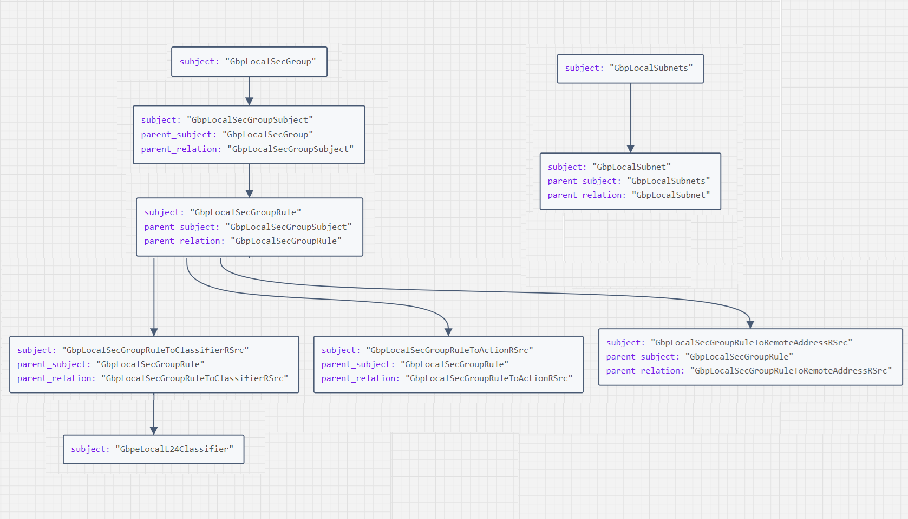

# Host Protection Policies Distribution Optimization

# Table of contents
* [Overview](#overview)
* [Motivation](#motivation)
* [Mechanism](#mechanism)  
* [Example](#example)
* [Troubleshooting](#troubleshooting)
    

## Overview

This feature is introduced to distribute HPP via Kubernetes control plane for faster convergence and reduce load on fabric. When this feature is enabled, the hostprotPol MOs will not be created in the APIC but we will make use of Custom Resources which are extensions of kubernetes API to distribute the HPP to opflex agent.

## Motivation

Lot of HPP objects had to be sent and pulled from the leaf which causes burden on the fabric and lead to slow recovery times. So, to reduce the burden on the fabric we use kubernetes control plane to distribute the HPP to opflex agent, thus bypassing sending and pulling the HPPs objects from the leaf.

## Mechanism

HPP Distribution Optimization feature can be enabled by providing the following configuration in the acc-provision input file:

```yaml
kube_config:
  enable_hpp_direct: True
```

When this feature is enabled, below two Custom Resource Definitions(CRD) are used to distribute the HPP from controller to opflex agent.
- hostprotPol
- hostprotRemoteIpContainer

The CRs for above two CRDs are created in aci-containers-system namespace.

A hostprotRemoteIpContainer Custom Resource (CR) is created for the NetworkPolicy peers used by a hostprotPol rule, with separate CRs for IPv4 and IPv6. It holds the pre-resolved IP addresses or CIDRs allowed by that rule. The structure of a hostprotRemoteIpContainer CR is shown below:

```yaml
apiVersion: aci.hpp/v1
kind: HostprotRemoteIpContainer
metadata:
  name: <generated_peer_set_id>-<ipv4/ipv6>
  namespace: aci-containers-system
spec:
  hostprotRemoteIps:
  - <ip_address>
  . . .
```
hostprotPol CR is created when a network policy is created. The CR follows the same structure as the hostprotPol MO, the structure is as shown below,
```yaml
apiVersion: aci.hpp/v1
kind: HostprotPol
metadata:
  name: <policyTenantName>_np_<hash_of_networkpolicy_spec>
  namespace: aci-containers-system
spec:
  name: <policyTenantName>_np_<hash_of_networkpolicy_spec>
  networkPolicies:
    - <netpol_namespace>/<netpol_name_1>
    - <netpol_namespace>/<netpol_name_2>
    . . .
  hostprotSubj:
  - name: <name>
    hostprotRule:
    - name: <name>
      direction: <ingress/egress>
      ethertype: <ipv4/ipv6>
      connTrack: <connTrack>
      protocol: <protocol>
      fromPort: <port>
      toPort: <port>
      rsRemoteIpContainer: <remIpCont_name>
      hostprotRemoteIps:
      - <ip_address>
      . . .
      hostprotServiceRemoteIps:
      - <service_ip_address>
      . . .
```
A peer-restricted hostprotRule references at most one hostprotRemoteIpContainer via `rsRemoteIpContainer`; the referenced CR holds the pre-resolved IP addresses or CIDRs for that rule. Service-augmentation rules instead carry resolved Kubernetes Service IPs in `hostprotServiceRemoteIps`. The controller resolves selectors to IP addresses before writing the CRs, and the agent only consumes the resolved lists.

When these CRs are created by the controller and the hostagent is informed, it takes this info in the CRs and creates a file with .netpol extension at /var/lib/opflex-agent-ovs/netpols/ location on the node where hostagent is running with the local hpp MO tree if a pod exists on the node which is selected by the network policy. Whenever this file is created/updated/deleted the opflex agent adds/deletes the flows accordingly as per the secgrp tree. By default, the controller will create hostprotPol CRs for every node, static-discovery, static-egress and static-ingress.


## Example

Let's create a network policy and see the CRs and the Local MO tree which will be created.

```yaml
apiVersion: networking.k8s.io/v1
kind: NetworkPolicy
metadata:
  name: taatfan-np
  labels:
    test: test-taatfan
spec:
  ingress:
    - from:
        - namespaceSelector:
            matchLabels:
              purpose: production
  podSelector:
    matchLabels:
      app: web
  policyTypes:
    - Ingress
```
This network policy allows the traffic from the pods in the namespace which match the label ‘purpose=production’ to the pods in the current namespace with label ‘app=web’.

```sh
$ kubectl -n aci-containers-system get hostprotpol
NAME                                               AGE
demo-xyz1-node-k8s20-node-1.local.lan           6m11s
demo-xyz1-node-k8s20-node-2.local.lan           6m10s
demo-xyz1-node-k8s20-node-4.local.lan           6m9s
demo-xyz1-node-k8s20-node-5.local.lan           6m8s
demo-xyz1-np-be2e7febca8adf3a926be42281af0ae6   4m53s
demo-xyz1-np-static-discovery                   6m12s
demo-xyz1-np-static-egress                      6m12s
demo-xyz1-np-static-ingress                     6m12s
```

We have the object `demo-xyz1-np-be2e7febca8adf3a926be42281af0ae6` for newly created policy along with objects for each node, and static ingress, egress and discovery objects. The contents of this CR will be as below,

```yaml
apiVersion: aci.hpp/v1
kind: HostprotPol
metadata:
  creationTimestamp: "2024-08-01T12:13:56Z"
  generation: 1
  name: demo-xyz1-np-be2e7febca8adf3a926be42281af0ae6
  namespace: aci-containers-system
  resourceVersion: "45880591"
  uid: 92c71599-c82a-4b54-a54f-d64bb4bf36f2
spec:
  hostprotSubj:
  - name: networkpolicy-ingress
  name: demo_xyz1_np_be2e7febca8adf3a926be42281af0ae6
  networkPolicies:
  - default/taatfan-np
```
As there is no namespace with the label ‘purpose=production’ with pods in it we don’t have hostprotRule created yet. The netpol file will be created with only the GbpLocalSecGroup and GbpLocalSecGroupSubject in it. 

Let us create the required namespace with a pod in it.

*Namespace:*
```yaml
apiVersion: v1
kind: Namespace
metadata:
  labels:
    purpose: production
  name: prod
```
*Pod:*
```yaml
apiVersion: v1
kind: Pod
metadata:
  name: prod-ns-pod
  namespace: prod
spec:
  containers:
    - command: ["/bin/sh", "-c", "sleep 60m"]      
      image: 'alpine:latest'
      imagePullPolicy: IfNotPresent
      name: alpine
  restartPolicy: Always
```

When we create the namespace and the pod, the hostprotPol and hostprotRemoteIpContainer CRs will be as below.

*hostprotPol(Spec):*
```yaml
spec:
  hostprotSubj:
  - hostprotRule:
    - connTrack: reflexive
      direction: ingress
      ethertype: ipv4
      fromPort: unspecified
      name: 4883db58d731eec6f703a4c43ccd8cb0-ipv4__unspecified
      protocol: unspecified
      rsRemoteIpContainer: 4883db58d731eec6f703a4c43ccd8cb0-ipv4
      toPort: unspecified
    name: networkpolicy-ingress
  name: demo_xyz1_np_be2e7febca8adf3a926be42281af0ae6
  networkPolicies:
  - default/taatfan-np
```
*hostprotRemoteIpContainer:*
```yaml
apiVersion: aci.hpp/v1
kind: HostprotRemoteIpContainer
metadata:
  creationTimestamp: "2024-08-01T12:36:10Z"
  generation: 1
  name: 4883db58d731eec6f703a4c43ccd8cb0-ipv4
  namespace: aci-containers-system
  resourceVersion: "45882738"
  uid: dadf7d28-aae6-45b8-8722-402efb4033b9
spec:
  hostprotRemoteIps:
  - 10.2.64.1
```

The hostprotRemoteIpContainer is created for the peers matched by this rule—here, the pods in the `prod` namespace matched by the ingress rule's namespaceSelector—and holds their pre-resolved IP addresses. Its generated name is suffixed with `-ipv4` or `-ipv6` for the IP family. The hostprotPol's hostprotRule references it by name through `rsRemoteIpContainer`.

If the ingress rule's `from` entry also specified a podSelector (e.g. matching pods with label `app: browser`), the controller resolves the podSelector together with the namespaceSelector when computing peer IPs - only the IP addresses of the matching pods end up in the hostprotRemoteIpContainer. No separate label or filter data is carried in the CR; the agent only ever needs the final resolved IP list.
As soon as the CRs are updated hostagent updates the netpol file previously created. The file will have the following MO tree now in the JSON format.



Below is the format of the netpol file created by hostagent:

```json
[
  {
    "subject": "GbpLocalSecGroup",
    "uri": "/PolicyUniverse/PolicySpace/demo_xyz1/GbpLocalSecGroup/demo_xyz1_np_be2e7febca8adf3a926be42281af0ae6/",
    "properties": [
      …
    ],
    "children": [
      "/PolicyUniverse/PolicySpace/demo_xyz1/GbpLocalSecGroup/demo_xyz1_np_be2e7febca8adf3a926be42281af0ae6/GbpLocalSecGroupSubject/networkpolicy-ingress/"
    ]
  },
  {
    "subject": "GbpLocalSecGroupSubject",
    "uri": "/PolicyUniverse/PolicySpace/demo_xyz1/GbpLocalSecGroup/demo_xyz1_np_be2e7febca8adf3a926be42281af0ae6/GbpLocalSecGroupSubject/networkpolicy-ingress/",
    "properties": [
      …
    ],
    "children": [
      "/PolicyUniverse/PolicySpace/demo_xyz1/GbpLocalSecGroup/demo_xyz1_np_be2e7febca8adf3a926be42281af0ae6/GbpLocalSecGroupSubject/networkpolicy-ingress/GbpLocalSecGroupRule/4883db58d731eec6f703a4c43ccd8cb0-ipv4__unspecified/"
    ],
    …
  },
  {
    "subject": "GbpLocalSecGroupRule",
    "uri": "/PolicyUniverse/PolicySpace/demo_xyz1/GbpLocalSecGroup/demo_xyz1_np_be2e7febca8adf3a926be42281af0ae6/GbpLocalSecGroupSubject/networkpolicy-ingress/GbpLocalSecGroupRule/4883db58d731eec6f703a4c43ccd8cb0-ipv4__unspecified/",
    "properties": [
      …
    ],
    "children": [
      "/PolicyUniverse/PolicySpace/demo_xyz1/GbpLocalSecGroup/demo_xyz1_np_be2e7febca8adf3a926be42281af0ae6/GbpLocalSecGroupSubject/networkpolicy-ingress/GbpLocalSecGroupRule/4883db58d731eec6f703a4c43ccd8cb0-ipv4__unspecified/GbpLocalSecGroupRuleToClassifierRSrc/GbpeLocalL24Classifier/demo_xyz1_np_be2e7febca8adf3a926be42281af0ae6%7cnetworkpolicy-ingress%7c4883db58d731eec6f703a4c43ccd8cb0-ipv4__unspecified",
      "/PolicyUniverse/PolicySpace/demo_xyz1/GbpLocalSecGroup/demo_xyz1_np_be2e7febca8adf3a926be42281af0ae6/GbpLocalSecGroupSubject/networkpolicy-ingress/GbpLocalSecGroupRule/4883db58d731eec6f703a4c43ccd8cb0-ipv4__unspecified/GbpLocalSecGroupRuleToActionRSrc/GbpLocalAllowDenyAction/allow/",
      "/PolicyUniverse/PolicySpace/demo_xyz1/GbpLocalSecGroup/demo_xyz1_np_be2e7febca8adf3a926be42281af0ae6/GbpLocalSecGroupSubject/networkpolicy-ingress/GbpLocalSecGroupRule/4883db58d731eec6f703a4c43ccd8cb0-ipv4__unspecified/GbpLocalSecGroupRuleToRemoteAddressRSrc/GbpLocalSubnets/demo_xyz1_np_be2e7febca8adf3a926be42281af0ae6%7cnetworkpolicy-ingress%7c4883db58d731eec6f703a4c43ccd8cb0-ipv4__unspecified/"
    ],
    …
  },
  {
    "subject": "GbpLocalSecGroupRuleToClassifierRSrc",
    "uri": "/PolicyUniverse/PolicySpace/demo_xyz1/GbpLocalSecGroup/demo_xyz1_np_be2e7febca8adf3a926be42281af0ae6/GbpLocalSecGroupSubject/networkpolicy-ingress/GbpLocalSecGroupRule/4883db58d731eec6f703a4c43ccd8cb0-ipv4__unspecified/GbpLocalSecGroupRuleToClassifierRSrc/GbpeLocalL24Classifier/demo_xyz1_np_be2e7febca8adf3a926be42281af0ae6%7cnetworkpolicy-ingress%7c4883db58d731eec6f703a4c43ccd8cb0-ipv4__unspecified",
    "properties": [
      …
    ],
    …
  },
  {
    "subject": "GbpLocalSecGroupRuleToActionRSrc",
    "uri": "/PolicyUniverse/PolicySpace/demo_xyz1/GbpLocalSecGroup/demo_xyz1_np_be2e7febca8adf3a926be42281af0ae6/GbpLocalSecGroupSubject/networkpolicy-ingress/GbpLocalSecGroupRule/4883db58d731eec6f703a4c43ccd8cb0-ipv4__unspecified/GbpLocalSecGroupRuleToActionRSrc/GbpLocalAllowDenyAction/allow/",
    "properties": [
      …
    ],
    …
  },
  {
    "subject": "GbpLocalSecGroupRuleToRemoteAddressRSrc",
    "uri": "/PolicyUniverse/PolicySpace/demo_xyz1/GbpLocalSecGroup/demo_xyz1_np_be2e7febca8adf3a926be42281af0ae6/GbpLocalSecGroupSubject/networkpolicy-ingress/GbpLocalSecGroupRule/4883db58d731eec6f703a4c43ccd8cb0-ipv4__unspecified/GbpLocalSecGroupRuleToRemoteAddressRSrc/GbpLocalSubnets/demo_xyz1_np_be2e7febca8adf3a926be42281af0ae6%7cnetworkpolicy-ingress%7c4883db58d731eec6f703a4c43ccd8cb0-ipv4__unspecified/",
    "properties": [
      …
    ],
    …
  },
  {
    "subject": "GbpeLocalL24Classifier",
    "uri": "/PolicyUniverse/PolicySpace/demo_xyz1/GbpeLocalL24Classifier/demo_xyz1_np_be2e7febca8adf3a926be42281af0ae6%7cnetworkpolicy-ingress%7c4883db58d731eec6f703a4c43ccd8cb0-ipv4__unspecified/",
    "properties": [
      …
    ]
  },
  {
    "subject": "GbpLocalSubnets",
    "uri": "/PolicyUniverse/PolicySpace/demo_xyz1/GbpLocalSubnets/demo_xyz1_np_be2e7febca8adf3a926be42281af0ae6%7cnetworkpolicy-ingress%7c4883db58d731eec6f703a4c43ccd8cb0-ipv4__unspecified/",
    "properties": [
      …
    ],
    "children": [
      "/PolicyUniverse/PolicySpace/demo_xyz1/GbpLocalSubnets/demo_xyz1_np_be2e7febca8adf3a926be42281af0ae6%7cnetworkpolicy-ingress%7c4883db58d731eec6f703a4c43ccd8cb0-ipv4__unspecified/GbpLocalSubnet/10.2.64.1/"
    ]
  },
  {
    "subject": "GbpLocalSubnet",
    "uri": "/PolicyUniverse/PolicySpace/demo_xyz1/GbpLocalSubnets/demo_xyz1_np_be2e7febca8adf3a926be42281af0ae6%7cnetworkpolicy-ingress%7c4883db58d731eec6f703a4c43ccd8cb0-ipv4__unspecified/GbpLocalSubnet/10.2.64.1/",
    "properties": [
      …
    ],
    …
  }
]
```

The network policy functionality should work as expected once the netpol file is updated.

As with [HPP optimization](hpp-optimization.md), multiple network policies with the same spec are backed by only one HPP CR here as well. To get the count and list of network policies linked to an HPP object, query the `/hpp` endpoint of the aci-containers-controller pod's status server (`status-port`, default `8091`) from the node where that pod is running:

```sh
$ curl http://127.0.0.1:8091/hpp
```

The output of the curl command is of below format:

```
{
"<network-poicy-hash>" : {
		"ref-count": <number of networkpolicies referring to it>,
		"npkeys": [<namespace/network-policy-name>],
		"hpp-cr": <the hostprotPol CR for this hash>
	}
}
```

For example,

```sh
$ curl http://127.0.0.1:8091/hpp
{"demo-xyz1-np-17e2291c8b072058a791d3b7534c8f4a":{"ref-count":1,"npkeys":["database/database-policy"],"hpp-cr":{"metadata":{"name":"demo-xyz1-np-17e2291c8b072058a791d3b7534c8f4a","namespace":"aci-containers-system","creationTimestamp":null},"spec":{"name":"demo_xyz1_np_17e2291c8b072058a791d3b7534c8f4a","hostprotSubj":[{"name":"networkpolicy-ingress"}],"networkPolicies":["database/database-policy"]}}},"demo-xyz1-np-b30c63a38d0cfe317bc447ce03eca182":{"ref-count":1,"npkeys":["frontend/frontend-policy"],"hpp-cr":{"metadata":{"name":"demo-xyz1-np-b30c63a38d0cfe317bc447ce03eca182","namespace":"aci-containers-system","creationTimestamp":null},"spec":{"name":"demo_xyz1_np_b30c63a38d0cfe317bc447ce03eca182","hostprotSubj":[{"name":"networkpolicy-ingress","hostprotRule":[{"name":"ipv4__tcp-80","direction":"ingress","ethertype":"ipv4","connTrack":"reflexive","protocol":"tcp","fromPort":"80","toPort":"unspecified"}]},{"name":"networkpolicy-egress"}],"networkPolicies":["frontend/frontend-policy"]}}},"demo-xyz1-np-e8b55b9a0caf02c8b901d5341866b3ab":{"ref-count":1,"npkeys":["backend/backend-policy"],"hpp-cr":{"metadata":{"name":"demo-xyz1-np-e8b55b9a0caf02c8b901d5341866b3ab","namespace":"aci-containers-system","creationTimestamp":null},"spec":{"name":"demo_xyz1_np_e8b55b9a0caf02c8b901d5341866b3ab","hostprotSubj":[{"name":"networkpolicy-ingress"},{"name":"networkpolicy-egress"}],"networkPolicies":["backend/backend-policy"]}}}}
```

The raw JSON above carries the full hostprotPol CR per hash; for just a quick, greppable NetworkPolicy-to-hostprotPol name mapping, pipe it through `jq` instead:
```sh
$ curl -s http://127.0.0.1:8091/hpp | jq -r 'to_entries[] | .key as $h | .value.npkeys[] | "\(.) -> \($h)"' | sort
backend/backend-policy -> demo-xyz1-np-e8b55b9a0caf02c8b901d5341866b3ab
database/database-policy -> demo-xyz1-np-17e2291c8b072058a791d3b7534c8f4a
frontend/frontend-policy -> demo-xyz1-np-b30c63a38d0cfe317bc447ce03eca182
```


## Troubleshooting


- To make sure the feature is enabled:
  - Check if the aci-containers-config configmap is updated with the correct configuration.
    - controller-config and host-agent-config should have
      `"enable-hpp-direct": true`
    - opflex-agent-config should have
      `"enable-local-netpol": true `
  - Check if the hostprotPol and hostprotRemoteIpContainer CRDs are created.
> **Note:** hostprotPol and hostprotRemoteIpContainer are namespaced custom resources (apiGroup `aci.hpp`, resources `hostprotpols` and `hostprotremoteipcontainers`) in `aci-containers-system`. A non-admin user will typically need a Role/RoleBinding granting at least `get`/`list`/`watch` on these resources before they can run the checks below, for example:
> ```yaml
> apiVersion: rbac.authorization.k8s.io/v1
> kind: Role
> metadata:
>   name: hpp-reader
>   namespace: aci-containers-system
> rules:
>   - apiGroups: ["aci.hpp"]
>     resources: ["hostprotpols", "hostprotremoteipcontainers"]
>     verbs: ["get", "list", "watch"]
> ---
> apiVersion: rbac.authorization.k8s.io/v1
> kind: RoleBinding
> metadata:
>   name: hpp-reader
>   namespace: aci-containers-system
> subjects:
>   - kind: User
>     name: <user-name>
>     apiGroup: rbac.authorization.k8s.io
> roleRef:
>   kind: Role
>   name: hpp-reader
>   apiGroup: rbac.authorization.k8s.io
> ```
> The exact subject to bind depends on your cluster's authentication setup; refer to the Kubernetes RBAC documentation to configure this for your environment.
  - Check if the hostprotPol CRs for the node and static ingress, egress and discovery are created.
  - Check that each hostprotRemoteIpContainer named by a hostprotPol rule exists. Rules that allow all peers, and Service-augmentation rules that carry Service IPs directly, leave `rsRemoteIpContainer` unset.

> **Note:** To trace a NetworkPolicy's effective state through the CRs, follow the dependency chain: a NetworkPolicy maps to one hostprotPol CR (its `networkPolicies` field lists every NetworkPolicy sharing that CR), and rules that use a hostprotRemoteIpContainer reference it by name via `rsRemoteIpContainer` (many rules can reference the same RIC).
>
> The hostprotPol -> hostprotRemoteIpContainer direction is a direct lookup, since the rule already carries the RIC's name:
> ```sh
> $ kubectl -n aci-containers-system get hostprotpol demo-xyz1-np-be2e7febca8adf3a926be42281af0ae6 \
>     -o jsonpath='{.spec.hostprotSubj[*].hostprotRule[*].rsRemoteIpContainer}'
> 4883db58d731eec6f703a4c43ccd8cb0-ipv4
>
> $ kubectl -n aci-containers-system get hostprotremoteipcontainer 4883db58d731eec6f703a4c43ccd8cb0-ipv4 -o yaml
> ```
> The NetworkPolicy -> hostprotPol direction is reversed: there is no field on the NetworkPolicy pointing at its hostprotPol, so it must be found by searching hostprotPol CRs for one whose `networkPolicies` list contains `<namespace>/<name>`. A single kubectl one-liner can list this mapping for every NetworkPolicy at once, so you can just grep it for the one you care about:
> ```sh
> $ kubectl -n aci-containers-system get hostprotpol -o json | jq -r '.items[] | .metadata.name as $h | (.spec.networkPolicies // [])[] | "\(.) -> \($h)"' | sort
> default/taatfan-np -> demo-xyz1-np-be2e7febca8adf3a926be42281af0ae6
> ```
> The `/hpp` status server endpoint shown earlier in this doc gives the same mapping (keyed by `npkeys`) without needing `kubectl` access to the CRs, if you can reach the controller pod directly.
  - If any network policy is configured already before enabling the enable-hpp-direct, then the hostProtPol CRs for those policies should be visible at this point.
  - “local network policy is enabled” log should appear during the start of opflex-agent.

- If the traffic is not working as expected:
  - Check if any conflicting policy is present.
  - There should not be any stale hostProtPol CRs.
  - There should not be any HPP coming from the leaf.
  - Check if the hostProtPol for the applied network policy is created and content is as expected.
  - Check if the hostProtRemoteIpContainer referenced by the hostProtPol is present and is having pod informations as expected.
  - The hostProtPol CR's hostprotRule entries should reflect the network policy's allowed remote IPs, ports and protocols as expected from the NetworkPolicy spec.
  - Check if the netpol file for this policy with the same name as of the hostProtPol CR for that policy is created in the /var/lib/opflex-agent-ovs/netpols/ directory if any pod which is selected by this policy is present on the node.
  - Check the content of the file the local MOs JSON should contain the MOs as per the previous example MO tree.
  - In the netpol file GbpLocalSecGroup should be the first MO in the list.
  - The netpol file should have correct pod IPs as per the selectors in the network policy.
  - When the policy is created/updated/deleted monitor opflex-agent logs to see the flows are changed accordingly.

- If any issue after disabling the feature
  - The /var/lib/opflex-agent-ovs/netpols/ directory should be empty.
  - aci-containers-config configmap should not have the values mentioned earlier.
  - Verify HPP objects from APIC.
