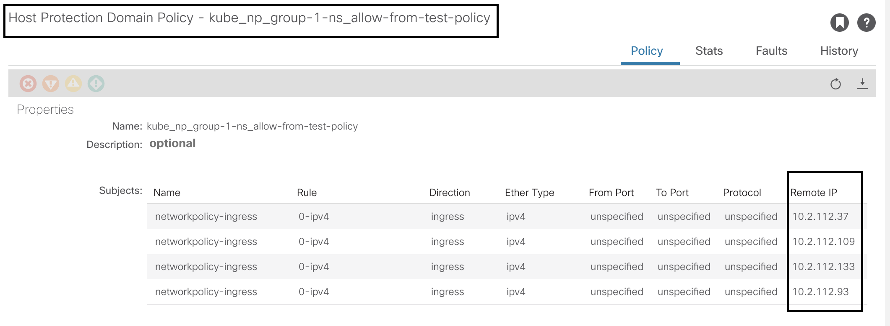

# Host Protection Policies Optimization

# Table of contents
* [Overview](#overview)
* [Motivation](#motivation)
* [Mechanism](#mechanism)  
* [Example](#example)
* [Troubleshooting](#troubleshooting)
    

## Overview

Whenever a network policy is created in the cluster, a corresponding Host Protection Policy(HPP) is created in APIC. Suppose we have following network policy in the cluster:  

```sh
$ kubectl get networkpolicy -n group-1-ns
NAME                     POD-SELECTOR   AGE
allow-from-test-policy   <none>         34s
```

A HPP object will be created in APIC with name `<policyTenantName>_np_<namespace>_<network-policy-name>` in Policies `->` Host Protection tab. If the networkpolicy created is with namespaceSelector, like below:

```yaml
apiVersion: networking.k8s.io/v1
kind: NetworkPolicy
metadata:
  name: allow-from-test-policy
  namespace: group-1-ns
spec:
  ingress:
  - from:
    - namespaceSelector:
        matchLabels:
          test: policy
  podSelector: {}
  policyTypes:
  - Ingress
```

then, for every pod created in the namespace with label test: policy, a Remote IP(hostprotRemoteIp) object will be created which has the ip of the pod. Suppose we have a namespace created test-ns with label test: policy like below:

```yaml
apiVersion: v1
kind: Namespace
metadata:
  labels:
    test: policy
  name: test-ns
```
and there are 4 pods in the namespace.

```sh
$kubectl get po -n test-ns -owide
NAME                                READY   STATUS    RESTARTS   AGE    IP             NODE              NOMINATED NODE   READINESS GATES
nginx-deployment-764fd7db4b-94hcr   1/1     Running   0          167m   10.2.112.133   fab14-compute-4   <none>           <none>
nginx-deployment-764fd7db4b-ffthh   1/1     Running   0          167m   10.2.112.109   fab14-compute-5   <none>           <none>
nginx-deployment-764fd7db4b-ljb55   1/1     Running   0          167m   10.2.112.37    fab14-compute-2   <none>           <none>
nginx-deployment-764fd7db4b-qkvbt   1/1     Running   0          167m   10.2.112.93    fab14-compute-3   <none>           <none>
```

then, 4 entries of Remote IPs will be created for the HPP. (Shown in below image)



## Motivation

If n networkpolicies are created with similar spec which has namespaceSelector that matches a namespace, then for each pod in that namespace n hostprotRemoteIp objects will be created. If one pod in that namespace is deleted and a new one is created, then `2*n` requests will be sent to APIC (n to delete IP of old pod and n to add IP of new pod). If value of n is large, then it takes a long time to propogate between various components on the APIC and eventually to all the leaf nodes. The HPP Optimization feature is introduced to overcome this limitation.​

## Mechanism

HPP Optimization feature can be enabled by providing the following configuration in the acc-provision input file:

```yaml
kube_config:
  hpp_optimization: True
```

If this feature is enabled, for multiple networkpolicies that has same spec, only one HPP object will be created in APIC with name `<policyTenantName>_np_<hash of networkpolicy spec>`. So, if n networkpolicies are created with same spec as of above example, then only one HPP object will be created and if a pod inside test-ns is deleted and a new one is created, only 2 requests will be sent to APIC - one to delete the old pod IP and another to add the IP of new pod. 

## Example

Let's create 3 networkpolicies with below spec in 3 different namespaces, say group-1-ns, group-2-ns, group-3-ns.

```yaml
apiVersion: networking.k8s.io/v1
kind: NetworkPolicy
metadata:
  name: allow-from-test-policy
  namespace: <namespace>
spec:
  ingress:
  - from:
    - namespaceSelector:
        matchLabels:
          test: policy
  podSelector: {}
  policyTypes:
  - Ingress
```

```sh
$ kubectl get networkpolicy -A
NAMESPACE    NAME                     POD-SELECTOR   AGE
group-1-ns   allow-from-test-policy   <none>         2d18h
group-2-ns   allow-from-test-policy   <none>         2d18h
group-3-ns   allow-from-test-policy   <none>         2d18h
```

One HPP object with name `kube_np_3d7f37a704d0abba8e6be1d1f4068843` is created in APIC where kube is the tenant name and 3d7f37a704d0abba8e6be1d1f4068843 is the hash of the spec of networkpolicy.


To get the count/list of networkpolicies that are linked to the HPP object, execute the following command from the node where the controller pod is launched:

```sh
$ curl http://127.0.0.1:8091/hpp
{"kube_np_3d7f37a704d0abba8e6be1d1f4068843":{"ref-count":3,"npkeys":["group-1-ns/allow-from-test-policy","group-2-ns/allow-from-test-policy","group-3-ns/allow-from-test-policy"],"hpp-obj":[{"hostprotPol":{"attributes":{"annotation":"orchestrator:aci-containers-controller","dn":"uni/tn-kube/pol-kube_np_3d7f37a704d0abba8e6be1d1f4068843","name":"kube_np_3d7f37a704d0abba8e6be1d1f4068843"},"children":[{"tagAnnotation":{"attributes":{"dn":"uni/tn-kube/pol-kube_np_3d7f37a704d0abba8e6be1d1f4068843/annotationKey-[aci-containers-controller-tag]","key":"aci-containers-controller-tag","value":"kube-92f8060fb9a85ffcd136ee29ca5394ce"}}},{"hostprotSubj":{"attributes":{"annotation":"orchestrator:aci-containers-controller","dn":"uni/tn-kube/pol-kube_np_3d7f37a704d0abba8e6be1d1f4068843/subj-networkpolicy-ingress","name":"networkpolicy-ingress"},"children":[{"tagAnnotation":{"attributes":{"dn":"uni/tn-kube/pol-kube_np_3d7f37a704d0abba8e6be1d1f4068843/subj-networkpolicy-ingress/annotationKey-[aci-containers-controller-tag]","key":"aci-containers-controller-tag","value":"kube-92f8060fb9a85ffcd136ee29ca5394ce"}}},{"hostprotRule":{"attributes":{"annotation":"orchestrator:aci-containers-controller","connTrack":"reflexive","direction":"ingress","dn":"uni/tn-kube/pol-kube_np_3d7f37a704d0abba8e6be1d1f4068843/subj-networkpolicy-ingress/rule-0-ipv4","ethertype":"ipv4","fromPort":"unspecified","name":"0-ipv4","protocol":"unspecified","toPort":"unspecified"},"children":[{"tagAnnotation":{"attributes":{"dn":"uni/tn-kube/pol-kube_np_3d7f37a704d0abba8e6be1d1f4068843/subj-networkpolicy-ingress/rule-0-ipv4/annotationKey-[aci-containers-controller-tag]","key":"aci-containers-controller-tag","value":"kube-92f8060fb9a85ffcd136ee29ca5394ce"}}},{"hostprotRemoteIp":{"attributes":{"addr":"10.2.112.109","annotation":"orchestrator:aci-containers-controller","dn":"uni/tn-kube/pol-kube_np_3d7f37a704d0abba8e6be1d1f4068843/subj-networkpolicy-ingress/rule-0-ipv4/ip-[10.2.112.109]"},"children":[{"tagAnnotation":{"attributes":{"dn":"uni/tn-kube/pol-kube_np_3d7f37a704d0abba8e6be1d1f4068843/subj-networkpolicy-ingress/rule-0-ipv4/ip-[10.2.112.109]/annotationKey-[aci-containers-controller-tag]","key":"aci-containers-controller-tag","value":"kube-92f8060fb9a85ffcd136ee29ca5394ce"}}}]}},{"hostprotRemoteIp":{"attributes":{"addr":"10.2.112.133","annotation":"orchestrator:aci-containers-controller","dn":"uni/tn-kube/pol-kube_np_3d7f37a704d0abba8e6be1d1f4068843/subj-networkpolicy-ingress/rule-0-ipv4/ip-[10.2.112.133]"},"children":[{"tagAnnotation":{"attributes":{"dn":"uni/tn-kube/pol-kube_np_3d7f37a704d0abba8e6be1d1f4068843/subj-networkpolicy-ingress/rule-0-ipv4/ip-[10.2.112.133]/annotationKey-[aci-containers-controller-tag]","key":"aci-containers-controller-tag","value":"kube-92f8060fb9a85ffcd136ee29ca5394ce"}}}]}},{"hostprotRemoteIp":{"attributes":{"addr":"10.2.112.37","annotation":"orchestrator:aci-containers-controller","dn":"uni/tn-kube/pol-kube_np_3d7f37a704d0abba8e6be1d1f4068843/subj-networkpolicy-ingress/rule-0-ipv4/ip-[10.2.112.37]"},"children":[{"tagAnnotation":{"attributes":{"dn":"uni/tn-kube/pol-kube_np_3d7f37a704d0abba8e6be1d1f4068843/subj-networkpolicy-ingress/rule-0-ipv4/ip-[10.2.112.37]/annotationKey-[aci-containers-controller-tag]","key":"aci-containers-controller-tag","value":"kube-92f8060fb9a85ffcd136ee29ca5394ce"}}}]}},{"hostprotRemoteIp":{"attributes":{"addr":"10.2.112.93","annotation":"orchestrator:aci-containers-controller","dn":"uni/tn-kube/pol-kube_np_3d7f37a704d0abba8e6be1d1f4068843/subj-networkpolicy-ingress/rule-0-ipv4/ip-[10.2.112.93]"},"children":[{"tagAnnotation":{"attributes":{"dn":"uni/tn-kube/pol-kube_np_3d7f37a704d0abba8e6be1d1f4068843/subj-networkpolicy-ingress/rule-0-ipv4/ip-[10.2.112.93]/annotationKey-[aci-containers-controller-tag]","key":"aci-containers-controller-tag","value":"kube-92f8060fb9a85ffcd136ee29ca5394ce"}}}]}}]}}]}}]}}]}}
```

The output of the curl command is of below format:

```
{
"<network-poicy-hash>" : {
		"ref-count": <number of networkpolicies referring to it>,
		"npkeys": [<namespace/network-policy-name>],
		"hpp-obj": <HPP object that is sent to APIC>
	}
}
```

Create a deployment in each of the namespaces with below spec:

```yaml
apiVersion: apps/v1
kind: Deployment
metadata:
  labels:
    app: httpd-tools-app-1
  name: httpd-tools-app-1
  namespace: <namespace>
spec:
  replicas: 2
  selector:
    matchLabels:
      app: httpd-tools-app-1
  strategy:
    rollingUpdate:
      maxSurge: 25%
      maxUnavailable: 25%
    type: RollingUpdate
  template:
    metadata:
      labels:
        app: httpd-tools-app-1
    spec:
      containers:
      - image: quay.io/netbull/httpd-tools:3
        imagePullPolicy: IfNotPresent
        name: httpd-tools-app-1
        ports:
        - containerPort: 8080
          protocol: TCP
        resources: {}
        terminationMessagePath: /dev/termination-log
        terminationMessagePolicy: File
      dnsPolicy: ClusterFirst
      restartPolicy: Always
```

Two pods will be created in each namespace. The corresonding endpoint file of the pods will have the networkpolicy applied.

```sh
$ kubectl get po -n group-1-ns
NAME                                 READY   STATUS    RESTARTS   AGE
httpd-tools-app-1-598d787455-j8z5l   1/1     Running   0          2d22h
httpd-tools-app-1-598d787455-z9nmj   1/1     Running   0          2d22h
```

```sh
$ kubectl get po -n group-1-ns httpd-tools-app-1-598d787455-j8z5l -ojsonpath={.metadata.uid}
93634906-a21a-43e1-bf56-8369fa1ea613
```

Login to the node where the pod is launched and check the endpoint file starting with above uid in /var/lib/opflex-agent-ovs/endpoints folder to see if the HPP object name(`kube_np_3d7f37a704d0abba8e6be1d1f4068843`) is listed in security-group.
```
$ cat 93634906-a21a-43e1-bf56-8369fa1ea613_5ae05c6fa35e6fd8f2313464dba113fcc386774c663913b6c4ba7c4fc0ada920_veth071b0386.ep
{                                                                                                                                             
  "uuid": "93634906-a21a-43e1-bf56-8369fa1ea613_5ae05c6fa35e6fd8f2313464dba113fcc386774c663913b6c4ba7c4fc0ada920_veth071b0386",               
  ...

  "security-group": [
    {
      "policy-space": "kube",
      "name": "kube_np_3d7f37a704d0abba8e6be1d1f4068843"
    },
    ...
  ],
  ...
}
```


## Troubleshooting

1. Check configuration is applied properly
      Once newly generated aci deployment yaml is applied, `hpp_optimization` configuration should be reflected in the controller-config and host-agent-config data of aci-containers-config configmap:


```
$ kubectl get cm -n aci-containers-system aci-containers-config -oyaml
apiVersion: v1
data: 
  controller-config: |- 
    {                                                                                                                                         
	...
        "hpp-optimization": true,                                                                                                            	     ...
    }
  host-agent-config: |-
    {                                                                                                                                         
        ...
        "hpp-optimization": true,                                                                                                                    ...
    }
    ...
} 
```

2. Check controller log if it has following log and the name of HPP object is in the format `<tenant>_np_<hash of networkpolicy>`:

```
$ kubectl logs -n aci-containers-system aci-containers-controller-5946c7f695-db9xn | grep -i hostprotpol | grep "Object updated on APIC"
time="2024-02-26T05:21:35Z" level=debug msg="Object updated on APIC" dn=uni/tn-kube/pol-kube_np_3d7f37a704d0abba8e6be1d1f4068843 mod=APICAPI obj="{\"hostprotPol\":{\"attributes\":{\"annotation\":\"orchestrator:aci-containers-controller\",\"childAction\":\"\",\"descr\":\"\",\"dn\":\"uni/tn-kube/pol-kube_np_3d7f37a704d0abba8e6be1d1f4068843\",\"extMngdBy\":\"\",\"lcOwn\":\"local\",\"modTs\":\"2024-02-26T05:11:30.841+00:00\",\"monPolDn\":\"uni/tn-common/monepg-default\",\"name\":\"kube_np_3d7f37a704d0abba8e6be1d1f4068843\",\"nameAlias\":\"\",\"ownerKey\":\"\",\"ownerTag\":\"\",\"status\":\"\",\"uid\":\"12785\"},\"children\":[{\"tagAnnotation\":{\"attributes\":{\"childAction\":\"\",\"key\":\"aci-containers-controller-tag\",\"lcOwn\":\"local\",\"modTs\":\"2024-02-26T05:11:30.841+00:00\",\"rn\":\"annotationKey-[aci-containers-controller-tag]\",\"status\":\"\",\"uid\":\"12785\",\"value\":\"kube-92f8060fb9a85ffcd136ee29ca5394ce\"}}},{\"hostprotSubj\":{\"attributes\":{\"annotation\":\"orchestrator:aci-containers-controller\",\"childAction\":\"\",\"descr\":\"\",\"extMngdBy\":\"\",\"lcOwn\":\"local\",\"modTs\":\"2024-02-26T05:11:30.841+00:00\",\"monPolDn\":\"uni/tn-common/monepg-default\",\"name\":\"networkpolicy-ingress\",\"nameAlias\":\"\",\"ownerKey\":\"\",\"ownerTag\":\"\",\"rn\":\"subj-networkpolicy-ingress\",\"status\":\"\",\"uid\":\"12785\"},\"children\":[{\"tagAnnotation\":{\"attributes\":{\"childAction\":\"\",\"key\":\"aci-containers-controller-tag\",\"lcOwn\":\"local\",\"modTs\":\"2024-02-26T05:11:30.841+00:00\",\"rn\":\"annotationKey-[aci-containers-controller-tag]\",\"status\":\"\",\"uid\":\"12785\",\"value\":\"kube-92f8060fb9a85ffcd136ee29ca5394ce\"}}},{\"hostprotRule\":{\"attributes\":{\"annotation\":\"orchestrator:aci-containers-controller\",\"childAction\":\"\",\"connTrack\":\"reflexive\",\"descr\":\"\",\"direction\":\"ingress\",\"ethertype\":\"ipv4\",\"extMngdBy\":\"\",\"fromPort\":\"unspecified\",\"icmpCode\":\"unspecified\",\"icmpType\":\"unspecified\",\"lcOwn\":\"local\",\"modTs\":\"2024-02-26T05:11:30.841+00:00\",\"monPolDn\":\"uni/tn-common/monepg-default\",\"name\":\"0-ipv4\",\"nameAlias\":\"\",\"ownerKey\":\"\",\"ownerTag\":\"\",\"protocol\":\"unspecified\",\"rn\":\"rule-0-ipv4\",\"status\":\"\",\"toPort\":\"unspecified\",\"uid\":\"12785\"},\"children\":[{\"tagAnnotation\":{\"attributes\":{\"childAction\":\"\",\"key\":\"aci-containers-controller-tag\",\"lcOwn\":\"local\",\"modTs\":\"2024-02-26T05:11:30.841+00:00\",\"rn\":\"annotationKey-[aci-containers-controller-tag]\",\"status\":\"\",\"uid\":\"12785\",\"value\":\"kube-92f8060fb9a85ffcd136ee29ca5394ce\"}}},{\"hostprotRemoteIp\":{\"attributes\":{\"addr\":\"10.2.112.93\",\"annotation\":\"orchestrator:aci-containers-controller\",\"childAction\":\"\",\"descr\":\"\",\"extMngdBy\":\"\",\"lcOwn\":\"local\",\"modTs\":\"2024-02-26T05:11:30.841+00:00\",\"monPolDn\":\"uni/tn-common/monepg-default\",\"name\":\"\",\"nameAlias\":\"\",\"ownerKey\":\"\",\"ownerTag\":\"\",\"rn\":\"ip-[10.2.112.93]\",\"status\":\"\",\"uid\":\"12785\"},\"children\":[{\"tagAnnotation\":{\"attributes\":{\"childAction\":\"\",\"key\":\"aci-containers-controller-tag\",\"lcOwn\":\"local\",\"modTs\":\"2024-02-26T05:11:30.841+00:00\",\"rn\":\"annotationKey-[aci-containers-controller-tag]\",\"status\":\"\",\"uid\":\"12785\",\"value\":\"kube-92f8060fb9a85ffcd136ee29ca5394ce\"}}}]}},{\"hostprotRemoteIp\":{\"attributes\":{\"addr\":\"10.2.112.37\",\"annotation\":\"orchestrator:aci-containers-controller\",\"childAction\":\"\",\"descr\":\"\",\"extMngdBy\":\"\",\"lcOwn\":\"local\",\"modTs\":\"2024-02-26T05:11:30.841+00:00\",\"monPolDn\":\"uni/tn-common/monepg-default\",\"name\":\"\",\"nameAlias\":\"\",\"ownerKey\":\"\",\"ownerTag\":\"\",\"rn\":\"ip-[10.2.112.37]\",\"status\":\"\",\"uid\":\"12785\"},\"children\":[{\"tagAnnotation\":{\"attributes\":{\"childAction\":\"\",\"key\":\"aci-containers-controller-tag\",\"lcOwn\":\"local\",\"modTs\":\"2024-02-26T05:11:30.841+00:00\",\"rn\":\"annotationKey-[aci-containers-controller-tag]\",\"status\":\"\",\"uid\":\"12785\",\"value\":\"kube-92f8060fb9a85ffcd136ee29ca5394ce\"}}}]}},{\"hostprotRemoteIp\":{\"attributes\":{\"addr\":\"10.2.112.109\",\"annotation\":\"orchestrator:aci-containers-controller\",\"childAction\":\"\",\"descr\":\"\",\"extMngdBy\":\"\",\"lcOwn\":\"local\",\"modTs\":\"2024-02-26T05:11:30.841+00:00\",\"monPolDn\":\"uni/tn-common/monepg-default\",\"name\":\"\",\"nameAlias\":\"\",\"ownerKey\":\"\",\"ownerTag\":\"\",\"rn\":\"ip-[10.2.112.109]\",\"status\":\"\",\"uid\":\"12785\"},\"children\":[{\"tagAnnotation\":{\"attributes\":{\"childAction\":\"\",\"key\":\"aci-containers-controller-tag\",\"lcOwn\":\"local\",\"modTs\":\"2024-02-26T05:11:30.841+00:00\",\"rn\":\"annotationKey-[aci-containers-controller-tag]\",\"status\":\"\",\"uid\":\"12785\",\"value\":\"kube-92f8060fb9a85ffcd136ee29ca5394ce\"}}}]}},{\"hostprotRemoteIp\":{\"attributes\":{\"addr\":\"10.2.112.133\",\"annotation\":\"orchestrator:aci-containers-controller\",\"childAction\":\"\",\"descr\":\"\",\"extMngdBy\":\"\",\"lcOwn\":\"local\",\"modTs\":\"2024-02-26T05:11:30.841+00:00\",\"monPolDn\":\"uni/tn-common/monepg-default\",\"name\":\"\",\"nameAlias\":\"\",\"ownerKey\":\"\",\"ownerTag\":\"\",\"rn\":\"ip-[10.2.112.133]\",\"status\":\"\",\"uid\":\"12785\"},\"children\":[{\"tagAnnotation\":{\"attributes\":{\"childAction\":\"\",\"key\":\"aci-containers-controller-tag\",\"lcOwn\":\"local\",\"modTs\":\"2024-02-26T05:11:30.841+00:00\",\"rn\":\"annotationKey-[aci-containers-controller-tag]\",\"status\":\"\",\"uid\":\"12785\",\"value\":\"kube-92f8060fb9a85ffcd136ee29ca5394ce\"}}}]}}]}}]}}]}}"
```
