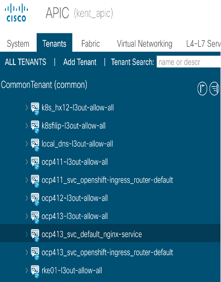
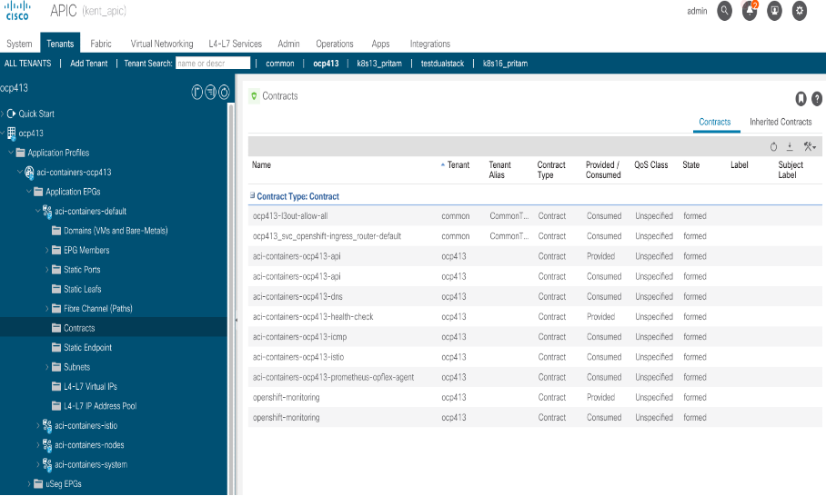
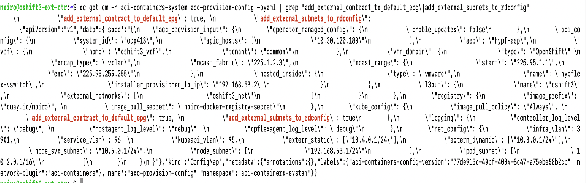
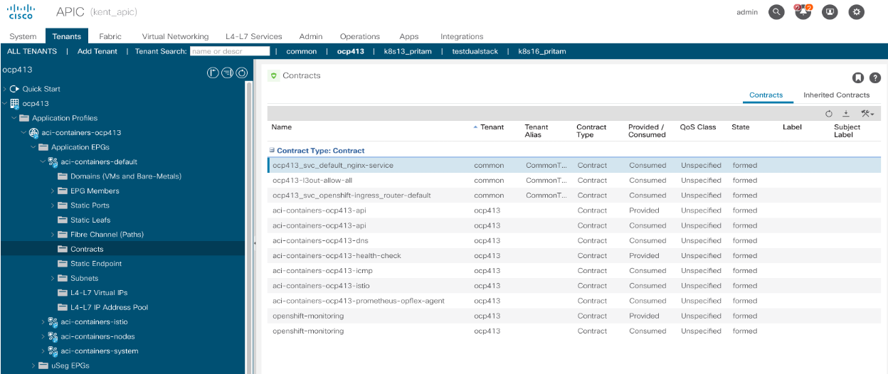
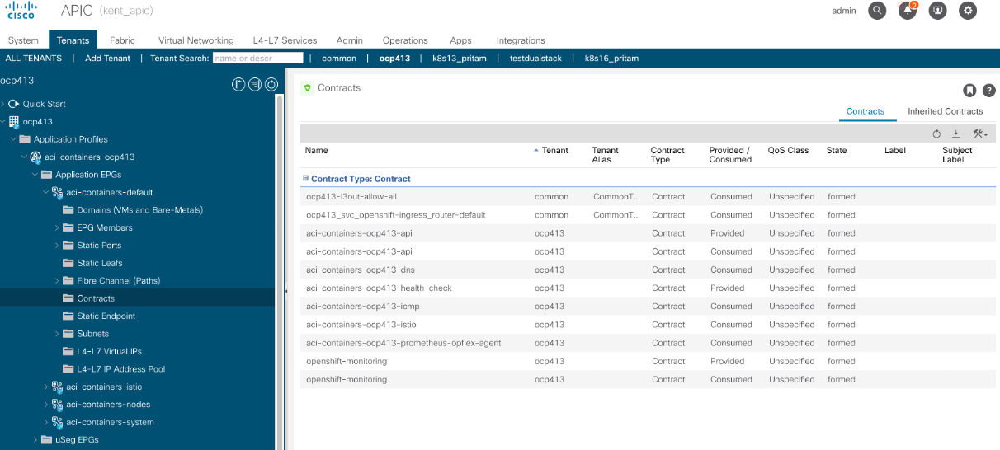

# Automatic ingress contract assignment for service type LoadBalancer

# Table of contents
* [Overview](#overview)
* [Motivation](#motivation)
* [Mechanism](#mechanism)  
* [Example](#example)
* [Troubleshooting](#troubleshooting)
    

## Overview

The ingress contract created by ACI CNI plugin every time a service is exposed outside as type LoadBalancer needs to be consumed under `aci-containers-default` EPG to allow PBR redirect for E/W communication towards external IP. The assignment of the contract is currently a manual step and needs to be done by networking team. The whole process is time consuming.

**Here we are introducing an option in acc provision input file to consume ingress contract automatically under `aci-containers-default` EPG.**
 

## Motivation

Automate this ingress contract consumtion under `aci-containers-default` EPG by providing a configurable paramter `add_external_contract_to_default_epg` in acc provision input file. 


## Mechanism

As per old design whenever a service of type LoadBalancer is created, new ingress contract is created under `common` tenant with name format `<tenant-name>_svc_<namespace-name>_<service-name>`. This ingress contract is consumed by external EPG under `common -> networking -> l3out` but it is not consumed under `aci-containers-default` EPG of the tenant which is required to allow PBR redirect E/W communication towards external IP.

But if `add_external_contract_to_default_epg: True` is configured in acc provision input file as given below then it is automatically consumed under aci-containers-default EPG of the tenant.

```yaml
kube_config:
  add_external_contract_to_default_epg: True
```

## Example

#### Prerequisites
1. Flag `add_external_subnets_to_rdconfig: True` should be cofigured in acc provision input file e.g

    ```yaml
    kube_config:
        add_external_subnets_to_rdconfig: True
    ```

2. SnatPolicy should be created e.g

    ```yaml
    apiVersion: aci.snat/v1
    kind: SnatPolicy
    metadata:
      name: pktest-snat
    spec:
      selector:
        namespace: pktest
      snatIp:
      - 22.1.153.133
    ```

#### Create Service of type LoadBalancer

1. Create a Pod(nginx) and a service of LoadBalancer type(nginx-service) in `default`` namespace and attach this service to the Pod

    ```yaml
    apiVersion: v1
    kind: Pod
    metadata:
      name: nginx
      labels:
        app.kubernetes.io/name: proxy
    spec:
      containers:
      - name: nginx
        image: nginx:stable
        ports:
        - containerPort: 80
          name: http-web-svc
    ```

    ```yaml
    apiVersion: v1
    kind: Service
    metadata:
      name: nginx-service
    spec:
      selector:
        app.kubernetes.io/name: proxy
      ports:
      - name: name-of-service-port
        protocol: TCP
        port: 80
        targetPort: http-web-svc
      type: LoadBalancer
    ```

2. Create another namespace `pktest` and create Pod(pktest-test) in this namespace

    `$ oc create ns pktest`
    
    ```yaml
    apiVersion: v1
    kind: Pod
    metadata:
      name: pktest-test
      namespace: pktest
    spec:
      containers:
      - name: pktest-test
        image: nginx:stable
        ports:
        - containerPort: 80
          name: http-web-svc
    ```

3. Verify resource created

    ```sh
    noiro@oshift3-ext-rtr:~$ oc get svc
    NAME            TYPE           CLUSTER-IP       EXTERNAL-IP                            PORT(S)        AGE
    kubernetes      ClusterIP      172.30.0.1       <none>                                 443/TCP        15d
    nginx-service   LoadBalancer   172.30.132.186   10.3.0.5                               80:32310/TCP   15s
    openshift       ExternalName   <none>           kubernetes.default.svc.cluster.local   <none>         15d

    noiro@oshift3-ext-rtr:~$ oc get pods
    NAME    READY   STATUS    RESTARTS   AGE
    nginx   1/1     Running   0          87m


    noiro@oshift3-ext-rtr:~$ oc get pods -n pktest
    NAME          READY   STATUS    RESTARTS   AGE
    pktest-test   1/1     Running   0          14s
    ```

    As per old design ingress contract `ocp413_svc_default_nginx-service` is created but not consumed under `aci-containers-default` epg as we have not enabled feature `add_external_contract_to_default_epg: True` at this point
   
    
     

4. Testing E/W traffic

    At this point since we have not set `add_external_contract_to_default_epg: True` so E/W traffic from pod `pktest-test` of namespace `pktest` to pod `nginx` of namespace `default` will not succeed using nginx-service EXTERNAL-IP

    ```sh
    noiro@oshift3-ext-rtr:~$ oc exec -it pktest-test –n pktest -- curl  10.3.0.5 -v
    *   Trying 10.3.0.5:80...
    * connect to 10.3.0.5 port 80 failed: Connection timed out
    * Failed to connect to 10.3.0.5 port 80: Connection timed out
    * Closing connection 0
    curl: (28) Failed to connect to 10.3.0.5 port 80: Connection timed out
    command terminated with exit code 28
    ```

5. Enable the flag / feature `add_contract_to_default_epg: True`

    -   Set flag `add_contract_to_default_epg: True` in the acc provision input file
        ```yaml
        kube_config:
            add_external_contract_to_default_epg: True
        ```

    -   Run `acc-provision` tool on updated acc provision input file to generate new `aci_deployment.yaml`
        ```sh
        $ acc-provision -c <acc_provision_input_file> -f <flavor> -u <apic_username> -p <apic_password> -o aci_deployment.yaml
        ```

    -   Delete old aci_deployment.yaml and wait till all the pods in the `aci-containers-system` namespace are deleted
        ```sh
        $ oc delete -f aci_deployment.yaml
        $ oc get pods -n aci-containers-system
        ```

    -   Apply newly generated aci_deployment.yaml and wait till all pods in `aci-containers-system` namespace are running
        ```sh
        $ oc apply -f aci_deployment.yaml
        $ oc get pods -n aci-containers-system
        ```
6. Verify create resources after enabling the feature

    -   Verify create resources after enabling the feature

        ```sh
        $ oc get cm -n aci-containers-system acc-provision-config -oyaml | grep "add_external_contract_to_default_epg\|add_external_subnets_to_rdconfig”
        ```
         

    -   On APIC verify ingress contract `ocp413_svc_default_nginx-service` is consumed under `aci-containers-default` epg. 

         

7. Testing E/W traffic again after enabling the feature

    At this point since we enabled `add_external_contract_to_default_epg: True`, the ingress contract is automatically consumed by `aci-containers-default` EPG. Now E/W traffic from pod `pktest-test` of namespace `pktest` to pod `nginx` of namespace `default` should succeed using nginx-service EXTERNAL-IP

    ```sh
    noiro@oshift3-ext-rtr:~$ oc exec -it pktest-test -n pktest -- curl 10.3.0.5
    <!DOCTYPE html>
    <html>
    <head>
    <title>Welcome to nginx!</title>
    <style>
    html { color-scheme: light dark; }
    body { width: 35em; margin: 0 auto;
    font-family: Tahoma, Verdana, Arial, sans-serif; }
    </style>
    </head>
    <body>
    <h1>Welcome to nginx!</h1>
    <p>If you see this page, the nginx web server is successfully installed and
    working. Further configuration is required.</p>
    <p>For online documentation and support please refer to
    <a href="http://nginx.org/">nginx.org</a>.<br/>
    Commercial support is available at
    <a href="http://nginx.com/">nginx.com</a>.</p>
    <p><em>Thank you for using nginx.</em></p>
    </body>
    </html>
    ```

#### Delete LB Service

1.  Delete LB service
    ```sh
    noiro@oshift3-ext-rtr:~$ oc delete svc nginx-service
    service "nginx-service" deleted
    ```

2. On APIC verify ingress contract `ocp413_svc_default_nginx-service` is deleted from common tenant and removed from `aci-containers-default` epg

     


## Troubleshooting

1. Create Service

    Look for any error in aci-containers-controller pod logs.
    For create service logs grep with ingress contract name (pattern `<tenant-name>_svc_<namespace-name>_<service-name>`)
    ```sh
    noiro@oshift3-ext-rtr:~$ oc logs -n aci-containers-system aci-containers-controller-d994d58b9-hmskq | grep "ocp413_svc_default_nginx-service"
    time="2024-02-09T05:43:25Z" level=debug msg="Processing queue for:uni/tn-common/out-oshift3/instP-oshift3_net/rscons-ocp413_svc_default_nginx-service" mod=APICAPI

    time="2024-02-09T05:43:25Z" level=debug msg="Posting Dn" dn=uni/tn-common/out-oshift3/instP-oshift3_net/rscons-ocp413_svc_default_nginx-service mod=APICAPI obj="{\"fvRsCons\":{\"attributes\":{\"annotation\":\"orchestrator:aci-containers-controller\",\"dn\":\"uni/tn-common/out-oshift3/instP-oshift3_net/rscons-ocp413_svc_default_nginx-service\",\"tnVzBrCPName\":\"ocp413_svc_default_nginx-service\"},\"children\":[{\"tagAnnotation\":{\"attributes\":{\"dn\":\"uni/tn-common/out-oshift3/instP-oshift3_net/rscons-ocp413_svc_default_nginx-service/annotationKey-[aci-containers-controller-tag]\",\"key\":\"aci-containers-controller-tag\",\"value\":\"ocp413-97d5d5b7dd50d6c8354e636fae8cbcaf\"}}}]}}"

    time="2024-02-09T05:43:28Z" level=debug msg="Processing queue for:uni/tn-ocp413/ap-aci-containers-ocp413/epg-aci-containers-default/rscons-ocp413_svc_default_nginx-service" mod=APICAPI

    time="2024-02-09T05:43:28Z" level=debug msg="Posting Dn" dn=uni/tn-ocp413/ap-aci-containers-ocp413/epg-aci-containers-default/rscons-ocp413_svc_default_nginx-service mod=APICAPI obj="{\"fvRsCons\":{\"attributes\":{\"annotation\":\"orchestrator:aci-containers-controller\",\"dn\":\"uni/tn-ocp413/ap-aci-containers-ocp413/epg-aci-containers-default/rscons-ocp413_svc_default_nginx-service\",\"tnVzBrCPName\":\"ocp413_svc_default_nginx-service\"},\"children\":[{\"tagAnnotation\":{\"attributes\":{\"dn\":\"uni/tn-ocp413/ap-aci-containers-ocp413/epg-aci-containers-default/rscons-ocp413_svc_default_nginx-service/annotationKey-[aci-containers-controller-tag]\",\"key\":\"aci-containers-controller-tag\",\"value\":\"ocp413-97d5d5b7dd50d6c8354e636fae8cbcaf\"}}}]}}"
    ```

2. Delete Service

    Look for any error in aci-containers-controller pod logs. For delete service logs grep with ingress contract name (pattern `<tenant-name>_svc_<namespace-name>_<service-name>`).
    Delete Service Logs

    ```sh
    noiro@oshift3-ext-rtr:~$ oc logs -n aci-containers-system aci-containers-controller-d994d58b9-hmskq | grep "ocp413_svc_default_nginx-service"

    time="2024-02-09T07:29:32Z" level=debug msg="Removing child dn :uni/tn-common/out-oshift3/instP-oshift3_net/rscons-ocp413_svc_default_nginx-service/annotationKey-[aci-containers-controller-tag]" mod=APICAPI
    time="2024-02-09T07:29:32Z" level=debug msg="Applying APIC object delete" DN=uni/tn-common/out-oshift3/instP-oshift3_net/rscons-ocp413_svc_default_nginx-service context=write mod=APICAPI
    time="2024-02-09T07:29:32Z" level=debug msg="Processing queue for:uni/tn-common/out-oshift3/instP-oshift3_net/rscons-ocp413_svc_default_nginx-service" mod=APICAPI
    time="2024-02-09T07:29:32Z" level=debug msg="Deleting Dn" dn=uni/tn-common/out-oshift3/instP-oshift3_net/rscons-ocp413_svc_default_nginx-service mod=APICAPI
    ```
