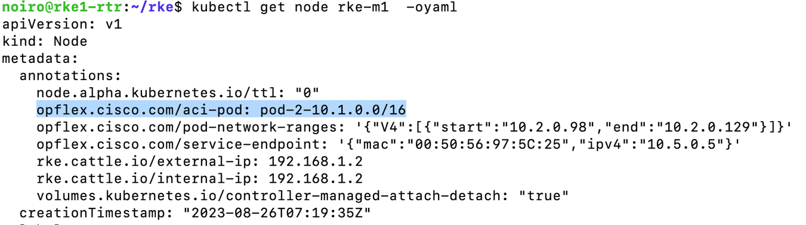
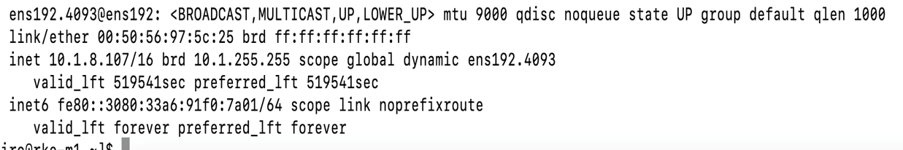
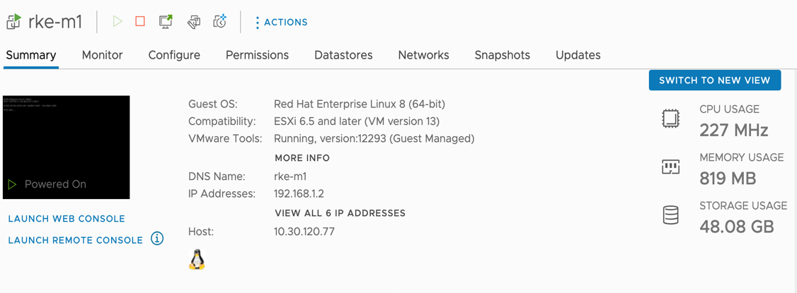
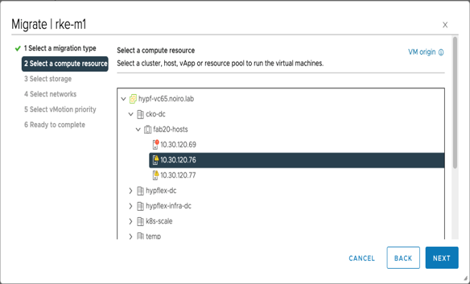
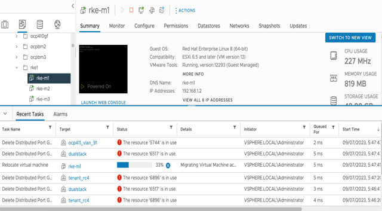
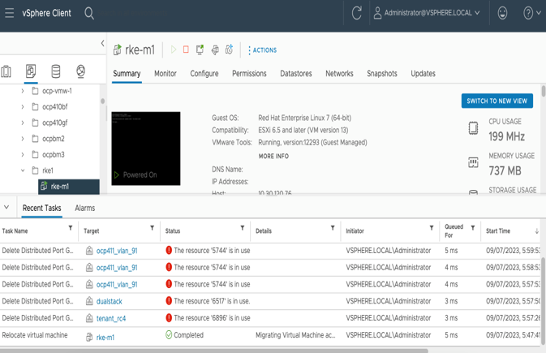
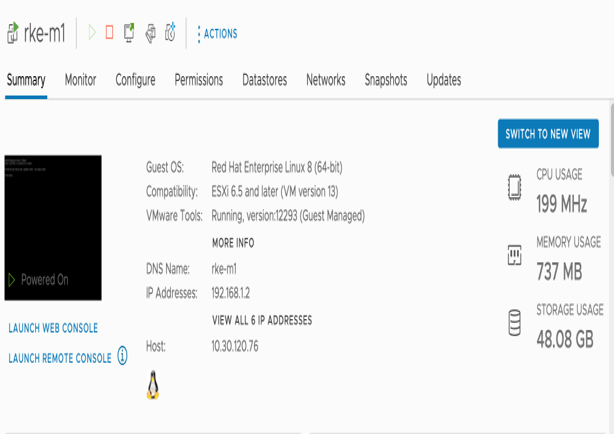
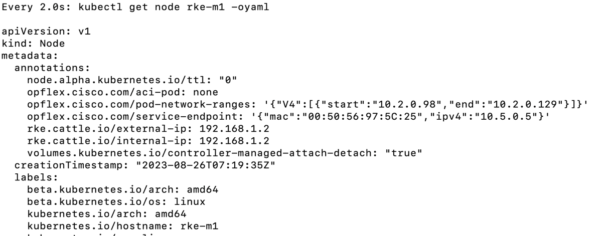
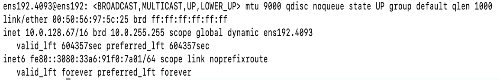
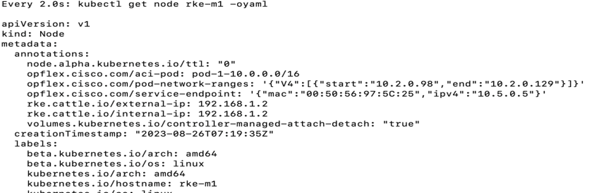

# Multipod VM Migration

# Table of Contents
- [1. Overview](#1-overview)
- [2. Motivation](#2-motivation)
- [3. Mechanism](#3-mechanism)
- [4. Configurations](#4-configurations)
- [5. Example](#5-example)
- [6. Assumptions](#6-assumptions)
  - [6.1 Workarounds with other DHCP clients](#61-workarounds-with-other-dhcp-clients)
- [7. Troubleshooting](#7-troubleshooting)
- [8. Known Issues](#8-known-issues)

## 1. Overview

This feature is introduced to support VM migrations across ACI pods on a multi pod setup. When a node VM is migrated from one ACI pod to another, the IP address on infra VLAN subinterface, the anycast IP addresses used by the opflex agent pod, should be updated with the IP addresses from the destination ACI Pod and communication should be reestablished. This feature enables this and is supported for the nodes with OS Ubuntu and RedHat.

## 2. Motivation

When VMs are migrated across ACI pods on a multi pod ACI setup, the IP address allocated from the source pod subnet for the VLAN subinterface and the anycast IP addresses used by OpFlex agent-ovs should be renewed with corresponding ones from the destination pod subnet. By default, these IP addresses are not properly renewed and communication between opflex agent and leaves would be broken. Enabling the aci-multipod feature would trigger dhcp release and renew upon migration, causing updation of these IP addresses. 

## 3. Mechanism

If the setup is a multipod ACI setup, the following configuration should be set in acc_provision_input yaml file:

```yaml
kube_config: 
    aci_multipod: True 
```

If aci_multipod is set, each Kubernetes node on the cluster will have an annotation in the node in below format

```yaml
opflex.cisco.com/aci-pod: pod-<id>-<subnet>
```
where id is the id of the pod in which the node is present and subnet is the subnet of the pod.

When a VM is migrated from pod-1 to pod-2, the opflexOdev (It represents details of opflex device connected to leaf. Details include hostName, opflex connection status, interface etc.) of the node gets disconnected. After waiting for `opflex_device_reconnect_wait_timeout` amount of time, controller will update the annotation on that node to none

```yaml
opflex.cisco.com/aci-pod: none
```

When hostagent detects a change in annotation (i.e. change from `opflex.cisco.com/aci-pod: pod-<id>-<subnet>` to `opflex.cisco.com/aci-pod: none`), it triggers a dhcp release and then a dhcp renew of the vlan interface. 

When the infra-vlan subinterface IP is changed, hostagent updates anycast ip in the `/usr/local/etc/opflex-agent-ovs/base-conf.d/01-base.conf` and `/usr/local/etc/opflex-agent-ovs/base-conf.d/10-renderer.conf` files in hostagent pod. This change in the configuration file causes the Opflex-agent container of hostagent pod to restart and use these IPs. 

Thus all the IP addresses are updated with corresponding ones from pod-2 and communication is reestablished. 

## 4. Configurations

Below are the configuration options associated with aci-multipod feature.
* aci_multipod: \<True/False>
    * This parameter should be set as True if it is expected that cluster nodes will migrate between pods in a multipod setup. 
    * Default value is false
* opflex_device_reconnect_wait_timeout: \<timeout in seconds>
    * Timeout in seconds to wait for reconnect when opflexOdev is disconnected for a node before triggering a dhcp release and renew of VLAN interface
* dhcp_renew_max_retry_count: \<count>
    * Max number of times dhcp renew should be executed before giving up
    * Default is 5
* dhcp_delay: <delay in seconds>
    * Delay between dhcp release and dhcp renew in seconds
    * Default is 5 seconds
* aci_multipod_ubuntu: \<True/False>
    * This parameter is used only for RKE 1.x
    * Set as True when the operating system of the cluster nodes is Ubuntu
    * Default value is False (i.e., Redhat)

## 5. Example

Let’s consider a node rke-m1 which is on pod-2 which has subnet 10.1.0.0/16.



The VLAN interface would have an IP from pod-2 subnet.



Currently rke-m1 is running on host 10.30.120.77 on Pod2 and we migrate the VM to host 10.30.120.76 on Pod1 which has subnet 10.0.0.0/16. 

You can see a sample migration process walk through in the below screenshots: 











As can be seen above, the VM is now on host 10.30.120.76.

Within 10 minutes, the annotation of the node rke-m1 will be changed to none.



When hostagent detects this change in annotation, it will trigger dhcp release and renew which will assign a new IP to the VLAN sub-interface. The new IP will be assigned from the Pod pool that the VM is moved to. Here it gets IP from pod1 subnet (10.0.0.0/16).



When the VLAN sub-interface gets new IP, hostagent updates the anycast IP in `/usr/local/etc/opflex-agent-ovs/base-conf.d/01-base.conf` and `/usr/local/etc/opflex-agent-ovs/base-conf.d/10-renderer.conf` in the hostagent pod and opflex-agent detects it. The opflexOdev in the new pod gets connected to the node. When controller detects that an opflexOdev is connected to the node, it changes the node annotation with the new pod information.



## 6. Assumptions

The following assumptions have been made about the nodes of the cluster and are required for the feature to work as expected.

* The operating system of the nodes of the cluster is either of the below:
    * Ubuntu
    * RedHat
* If the nodes are RedHat, dhclient is installed on the nodes and the lease file is in the path `/var/lib/dhclient`.
* If nodes are Ubuntu, dhclient is installed on the nodes and the lease file is in the path `/var/lib/dhcp`.

### 6.1 Workarounds with other DHCP clients

When the default DHCP client on your node is not dhclient, i.e. when the IP address on infra VLAN subinterface is managed by systemd-networkd on Ubuntu or Network Manager on RHEL, the lease file would not be present in the expected location. In this case, the following steps need to be performed on the node before migration.

1. Add the following line to /etc/dhcp/dhclient.conf

      send dhcp-client-identifier = hardware;

2. Do dhclient <infra-interface-name>
    eg:
    ```sh
        dhclient ens160.4090
    ```

3. Verify lease file got created in /var/lib/dhclient if RHEL or /var/lib/dhcp if Ubuntu.

    ```sh
    cat /var/lib/dhcp/dhclient.leases
        lease {
        interface "ens160.4090";
        fixed-address 11.0.160.64;
        option subnet-mask 255.255.0.0;
        option dhcp-lease-time 604800;
        option dhcp-message-type 5;
        option dhcp-server-identifier 10.0.0.1;
        renew 0 2025/09/07 10:03:50;
        rebind 3 2025/09/10 13:39:35;
        expire 4 2025/09/11 10:39:35;
        }
    ```

## 7. Troubleshooting

### 1. Check if configuration is applied properly

Following field should be present in controller-config and host-agent-config data of aci-containers-config configmap in aci-containers-system namespace if aci_multipod is set as True in the acc_provision_input.yaml.

```yaml
data:
  controller-config: |-
    {
        …
        "aci-multipod": true,
        …
     }
  host-agent-config: |-
    {
        …
        "aci-multipod": true,
        …
    } 
```

### 2. Verify volumes are correctly configured

Following volume should be present in aci-containers-host daemonset in aci-containers-system namespace:

If nodes are RedHat:

```yaml
volumes:
     …
      - hostPath:
          path: /var/lib/dhclient
          type: ""
        name: dhclient
      ….
```

If nodes are Ubuntu:

```yaml
volumes:
     …
      - hostPath:
          path: /var/lib/dhcp
          type: ""
        name: dhclient
      ….
```

Following volume mount should be present in aci-containers-host container of aci-containers-host daemonset in aci-containers-system namespace.

```yaml
volumeMounts:
      …
        - mountPath: /var/lib/dhclient
          name: dhclient
     …
```

### 3. Verify that the VLAN IP was updated

If a VM is migrated from pod1 (subnet 10.1.0.0/16) to pod2 (subnet 10.0.0.0/16), the VLAN interface should have an ip from pod2 subnet.

```sh
ens192.4093@ens192: <BROADCAST,MULTICAST,UP,LOWER_UP> mtu 9000 qdisc noqueue state UP group default qlen 1000
    link/ether 00:50:56:97:da:24 brd ff:ff:ff:ff:ff:ff
    inet 10.0.128.64/16 brd 10.0.255.255 scope global dynamic noprefixroute ens192.4093
       valid_lft 339126sec preferred_lft 339126sec
    inet6 fe80::d92:6880:f29f:be81/64 scope link noprefixroute 
       valid_lft forever preferred_lft forever
```

If the vlan interface doesn't have any ip or having wrong ip (due to some error during dhcp release or renew) we can work around it by manually trying dhcp release and renew of vlan interface on the node after SSHing to the node, using:

```sh
dhclient –r <interface name>
dhclient <interface name>
```

### 4. Verify that the anycast IPs were updated

/usr/local/etc/opflex-agent-ovs/base-conf.d/01-base.conf file in hostagent pod should have the updated peer ip (ip from new pod subnet).

```yaml
{
    "opflex": {
        …
        "peers": [
            {"hostname": "10.0.0.30", "port": "8009"}
        ]
    } ,
  …
 }
```

/usr/local/etc/opflex-agent-ovs/base-conf.d/10-renderer.conf file in hostagent pod should have the updated remote ip (ip from new pod subnet).

```yaml
{
    "renderers": {
        "stitched-mode": {
            …
            "encap": {
                "vxlan" : {
                    …
                    "remote-ip": "10.0.0.32"                }
            },
           …
}
```

### 5. Verify node annotation was updated

Check opflex.cisco.com/aci-pod annotation in node yaml. It should contain the pod and its subnet to which the node VM is connected.

Example:

```yaml
opflex.cisco.com/aci-pod: pod-1-10.0.0.0/16
```

### 6. Check host agent and controller logs

* Check if any errors or warnings are present in the host agent or controller containers.

    Commands: (use `kubectl` or `oc` as applicable)
    
    ```sh
    kubectl logs -n aci-containers-system <controller-pod name>
    kubectl logs -n aci-containers-system <hostagent-pod name> -c aci-containers-host
    ```

* When vm migration is completed (let's consider a case where a vm is migrated from pod2 to pod1), we can see below notifications in controller log – please note that there is around 4-7 minutes time gap between delete of one Odev and disconnect of other – When controller gets both these logs it means that no opflexOdev is connected to that VM and then controller updates annotation on the node.
   
    ```sh
    time="2023-09-25T09:47:41Z" level=debug msg="Processing websocket notification for:" dn="topology/pod-2/node-402/sys/br-[eth1/1/1]/odev-167882823" mod=APICAPI obj="{\"opflexODev\":{\"attributes\":{\"childAction\":\"\",\"dn\":\"topology/pod-2/node-402/sys/br-[eth1/1/1]/odev-167882823\",\"rn\":\"\",\"status\":\"deleted\"}}}"
    ```

    ```sh
    time="2023-09-25T09:51:52Z" level=debug msg="Processing websocket notification for:" dn="topology/pod-2/node-401/sys/br-[eth1/1/1]/odev-167882823" mod=APICAPI obj="{\"opflexODev\":{\"attributes\":{\"childAction\":\"\",\"dn\":\"topology/pod-2/node-401/sys/br-[eth1/1/1]/odev-167882823\",\"modTs\":\"2023-09-25T09:43:34.682+00:00\",\"rn\":\"\",\"state\":\"disconnected\",\"status\":\"modified\"}}}"
    ```

* To know which node is migrated: in between the delete and disconnect log above, a log as given below will be present and will have the devId and the hostName information.

    ```sh
    obj="{\"opflexODev\":{\"attributes\":{\"annotation\":\"\",\"childAction\":\"\",\"compHvDn\":\"comp/prov-Kubernetes/ctrlr-[rke1]-rke1/hv-rke-w2\",\"ctrlrName\":\"rke1\",\"devId\":\"167882823\",\"devOperIssues\":\"\",\"devType\":\"k8s\",\"dn\":\"topology/pod-2/node-402/sys/br-[eth1/1/1]/odev-167882823\",\"domName\":\"rke1\",\"encap\":\"unknown\",\"epStatsBulkAckStatus\":\"processed\",\"extMngdBy\":\"\",\"fabricPathDn\":\"topology/pod-2/protpaths-401-402/pathep-[esx-3-HX_vC-vpc]\",\"features\":\"0\",\"handle\":\"0\",\"hbPeriod\":\"0\",\"hbStatus\":\"valid-dvs\",\"hostName\":\"rke-w2\",\"id\":\"167882823\",\"ip\":\"10.1.176.71\",\"ipAddr\":\"\",\"isSecondary\":\"true\",\"lNodeDn\":\"comp/prov-Kubernetes/ctrlr-[rke1]-rke1/sw-InsiemeLSOid\",\"lastHandshakeTime\":\"1970-01-01T00:00:00.000+00:00\",\"lastNumHB\":\"0\",\"lcOwn\":\"local\",\"mac\":\"00:50:56:97:12:A8\",\"maxMissHb\":\"0\",\"modTs\":\"2023-09-25T06:01:13.667+00:00\",\"monPolDn\":\"uni/fabric/monfab-default\",\"name\":\"\",\"nameAlias\":\"\",\"numHB\":\"0\",\"operSt\":\"online\",\"pcIfId\":\"369098754\",\"portId\":\"0\",\"prevState\":\"connected\",\"state\":\"connected\",\"status\":\"\",\"tType\":\"unknown\",\"transitionStatus\":\"attached\",\"uid\":\"0\",\"updateTs\":\"0\",\"userdom\":\"all\",\"uuid\":\"rke-w2\",\"version\":\"\",\"vmmCtrlrPKey\":\"uni/vmmp-Kubernetes/dom-rke1/ctrlr-rke1\"}}}"
    ```

* When the VLAN interface is updated, controller logs will have below logs (which will have new VLAN interface ip):

    ```sh
    time="2023-09-25T09:53:01Z" level=info msg="Processing fabric path for node when connected device state is found" fabricPath="topology/pod-1/protpaths-101-102/pathep-[esx-2-HX_vC-vpc]" mac="00:50:56:97:12:A8" node=rke-w2 obj="{\"opflexODev\":{\"attributes\":{\"annotation\":\"\",\"childAction\":\"\",\"compHvDn\":\"comp/prov-Kubernetes/ctrlr-[rke1]-rke1/hv-rke-w2\",\"ctrlrName\":\"rke1\",\"devId\":\"167829585\",\"devOperIssues\":\"\",\"devType\":\"k8s\",\"dn\":\"topology/pod-1/node-101/sys/br-[eth1/12]/odev-167829585\",\"domName\":\"rke1\",\"encap\":\"unknown\",\"epStatsBulkAckStatus\":\"processed\",\"extMngdBy\":\"\",\"fabricPathDn\":\"topology/pod-1/protpaths-101-102/pathep-[esx-2-HX_vC-vpc]\",\"features\":\"0\",\"handle\":\"0\",\"hbPeriod\":\"0\",\"hbStatus\":\"valid-dvs\",\"hostName\":\"rke-w2\",\"id\":\"167829585\",\"ip\":\"10.0.224.81\",\"ipAddr\":\"\",\"isSecondary\":\"false\",\"lNodeDn\":\"comp/prov-Kubernetes/ctrlr-[rke1]-rke1/sw-InsiemeLSOid\",\"lastHandshakeTime\":\"1970-01-01T00:00:00.000+00:00\",\"lastNumHB\":\"0\",\"lcOwn\":\"local\",\"mac\":\"00:50:56:97:12:A8\",\"maxMissHb\":\"0\",\"modTs\":\"2023-09-25T09:44:43.839+00:00\",\"monPolDn\":\"uni/fabric/monfab-default\",\"name\":\"\",\"nameAlias\":\"\",\"numHB\":\"0\",\"operSt\":\"online\",\"pcIfId\":\"369098769\",\"portId\":\"0\",\"state\":\"connected\",\"status\":\"\",\"tType\":\"unknown\",\"transitionStatus\":\"attached\",\"uid\":\"0\",\"updateTs\":\"0\",\"userdom\":\"all\",\"uuid\":\"rke-w2\",\"version\":\"\",\"vmmCtrlrPKey\":\"uni/vmmp-Kubernetes/dom-rke1/ctrlr-rke1\"}}}"
    ```


## 8. Known Issues

1. When a VM is migrated from pod-1 to pod-2, even after doing dhcp release and renew in the VLAN interface, the interface is getting ip from old pod subnet. As a workaround, a configurable parameter `dhcp_renew_max_retry_count` is provided in acc_provision_input file where user can provide the number of times dhcp release and renew should be tried.

2. When dhcp renew on the VLAN interface is done immediately after dhcp release, then dhcp server tries to assign an ip that is already assigned to the VLAN interface of a different node and client sends decline. As a workaround, a configurable parameter `dhcp_delay` is provided in acc_provision_input file, where user can configure the delay between dhcp release and dhcp renew.
