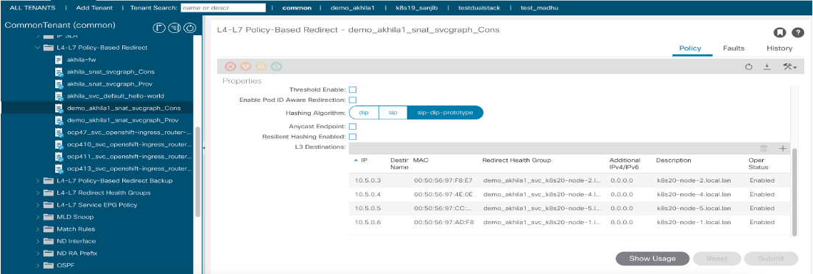
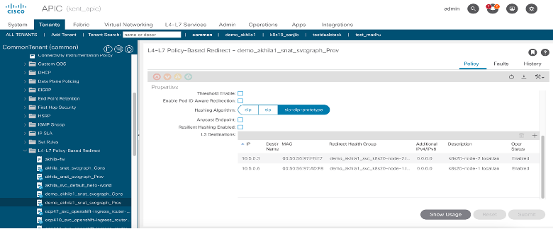
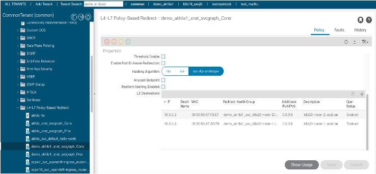
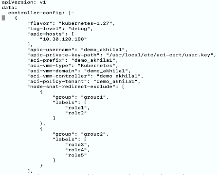

# Use system node critical priority class for ACI pods

# Table of contents
* [Overview](#overview)
* [Motivation](#motivation)
* [Mechanism](#mechanism)  
* [Examples](#examples)
* [Troubleshooting](#troubleshooting)
    

## Overview

When a SNAT policy is created and if a pod is associated with that SNAT policy, the SNAT redirect policy created in APIC has all the nodes in the cluster​. Suppose a cluster has following nodes:​

```sh
$ kubectl get nodes
NAME                     STATUS   ROLES                     AGE    VERSION
k8s20-node-1.local.lan   Ready    control-plane,master      158d   v1.27.3
k8s20-node-2.local.lan   Ready    worker                    158d   v1.27.3
k8s20-node-4.local.lan   Ready    role1,role2,worker        133d   v1.27.3
k8s20-node-5.local.lan   Ready    role3,role4,role5,worker  132d   v1.27.3
```

All the nodes are part of the consumer `<policyTenantName>_snat_svcgraph_Cons` and
provider `<policyTenantName>_snat_svcgraph_Prov` service redirect policy of SNAT which gets created in VRF tenant​.
(Shown in the following image)



Here we are introducing an option in acc provision input file so user can exclude a list of nodes from the SNAT redirect policy.
 

## Motivation

Provide a way for user to exclude a list of nodes from SNAT redirect policy​


## Mechanism

The nodes can be excluded from the SNAT redirect policy by providing the following configuration in the acc-provision input configuration file. 

```yaml
kube_config:
  node_snat_redirect_exclude:
  - group: <group-name>
    labels:
    - <label-name>
    - <label-name>
```

Note: `group` and `labels` are list. User can provider multiple group, multiple lables

The nodes which match all the labels in any group will be excluded from the SNAT redirect policy. i.e if all the labels in any of the mentioned groups is matched with the node labels then that node will be excluded from SNAT redirect policy.

## Example

Let’s consider an example with nodes in a cluster having below roles

```sh
$ kubectl get nodes
NAME                     STATUS   ROLES                     AGE    VERSION
k8s20-node-1.local.lan   Ready    control-plane,master      158d   v1.27.3
k8s20-node-2.local.lan   Ready    worker                    158d   v1.27.3
k8s20-node-4.local.lan   Ready    role1,role2,worker        133d   v1.27.3
k8s20-node-5.local.lan   Ready    role3,role4,role5,worker  132d   v1.27.3
```

Add following configuration in the acc provision input file and 
```yaml
kube_config:
  node_snat_redirect_exclude:
  - group: group1
    labels:
    - role1
    - role2
  - group: group2
    labels:
    - role3
    - role4
    - role5
```

Run `acc-provision` tool on updated acc provision input file to generate new `aci_deployment.yaml`

```sh
$ acc-provision -c <acc_provision_input_file> -f <flavor> -u <apic_username> -p <apic_password> -o aci_deployment.yaml
```

Delete old aci_deployment.yaml and wait till all the pods in the `aci-containers-system` namespace are deleted
```sh
$ oc delete -f aci_deployment.yaml
$ oc get pods -n aci-containers-system
```

Apply newly generated aci_deployment.yaml and wait till all pods in `aci-containers-system` namespace are running
```sh
$ oc apply -f aci_deployment.yaml
$ oc get pods -n aci-containers-system
```

Create a pod and snatpolicy with following spec, this will create a consumer and provider service redirect policy for SNAT 
```yaml
apiVersion: v1
kind: Pod
metadata:
  labels:
    test: sample-snatpolicy
  name: busybox
spec:
  containers:
  - command:
    - sleep
    - "3600"
    image: noiro-quay.cisco.com/noiro/busybox
    imagePullPolicy: IfNotPresent
    name: busybox
    resources: {}
```

```yaml
apiVersion: aci.snat/v1
kind: SnatPolicy
metadata:
  name: test-snatpolicysystem
spec:
  selector:
    labels:
      test: sample-snatpolicy
    namespace: default
  snatIp:
  - 151.20.1.50
```

Verify nodes `k8s20-node-4.local.lan` roles -> role1,role2) and `k8s20-node-5.local.lan` (roles -> role3,role4,role5) are excluded from the L3 destinations and only other two nodes `k8s20-node-1.local.lan` and `k8s20-node-2.local.lan` are listed as L3 destinations.

- Provider service redirect policy

    common tenant (VRF tenant) -> Policies -> Protocol -> L4-L7 Policy-Based Redirect -> akhila_demo1_snat_svcgraph_Prov
    

- Consumer service redirect policy

    common tenant (VRF tenant) -> Policies -> Protocol -> L4-L7 Policy-Based Redirect -> akhila_demo1_snat_svcgraph_Cons
    


## Troubleshooting

1. Check configuration is applied properly

    Once newly generated aci deployment yaml is applied, `node_snat_redirect_exclude` configuration should be reflected in the controller-config data of aci-containers-config configmap:

    `kubectl get cm -n aci-containers-system aci-containers-config -oyaml`

    

2. In controller pod log, we can see APIC object update logs for `vnsSvcRedirectPol` for which `vnsRedirectDest` Mos will be created only for the nodes that are not there in the exclude list

    ```sh
    kubectl logs -n aci-containers-system aci-containers-controller-77b78fddbf-jk4gj | grep -i "Apic object updates are" | grep -i "vnsSvcRedirectPol"

    time="2024-02-15T07:46:47Z" level=debug msg="Apic object updates are :[{\"vnsSvcRedirectPol\":{\"attributes\":{\"annotation\":\"orchestrator:aci-containers-controller\",\"dn\":\"uni/tn-common/svcCont/svcRedirectPol-demo_akhila1_snat_svcgraph_Cons\",\"name\":\"demo_akhila1_snat_svcgraph_Cons\",\"thresholdDownAction\":\"deny\"},\"children\":[{\"vnsRedirectDest\":{\"attributes\":{\"annotation\":\"orchestrator:aci-containers-controller\",\"descr\":\"k8s20-node-2.local.lan\",\"dn\":\"uni/tn-common/svcCont/svcRedirectPol-demo_akhila1_snat_svcgraph_Cons/RedirectDest_ip-[10.5.0.3]\",\"ip\":\"10.5.0.3\",\"mac\":\"00:50:56:97:F8:E7\"},\"children\":[{\"tagAnnotation\":{\"attributes\":{\"dn\":\"uni/tn-common/svcCont/svcRedirectPol-demo_akhila1_snat_svcgraph_Cons/RedirectDest_ip-[10.5.0.3]/annotationKey-[aci-containers-controller-tag]\",\"key\":\"aci-containers-controller-tag\",\"value\":\"demo_akhila1-faee871c9bb01cad8f07ed2fab7f0b42\"}}},{\"vnsRsRedirectHealthGroup\":{\"attributes\":{\"annotation\":\"orchestrator:aci-containers-controller\",\"dn\":\"uni/tn-common/svcCont/svcRedirectPol-demo_akhila1_snat_svcgraph_Cons/RedirectDest_ip-[10.5.0.3]/rsRedirectHealthGroup\",\"tDn\":\"uni/tn-common/svcCont/redirectHealthGroup-demo_akhila1_svc_k8s20-node-2.local.lan\"},\"children\":[{\"tagAnnotation\":{\"attributes\":{\"dn\":\"uni/tn-common/svcCont/svcRedirectPol-demo_akhila1_snat_svcgraph_Cons/RedirectDest_ip-[10.5.0.3]/rsRedirectHealthGroup/annotationKey-[aci-containers-controller-tag]\",\"key\":\"aci-containers-controller-tag\",\"value\":\"demo_akhila1-faee871c9bb01cad8f07ed2fab7f0b42\"}}}]}}]}},{\"vnsRedirectDest\":{\"attributes\":{\"annotation\":\"orchestrator:aci-containers-controller\",\"descr\":\"k8s20-node-1.local.lan\",\"dn\":\"uni/tn-common/svcCont/svcRedirectPol-demo_akhila1_snat_svcgraph_Cons/RedirectDest_ip-[10.5.0.6]\",\"ip\":\"10.5.0.6\",\"mac\":\"00:50:56:97:AD:F8\"},\"children\":[{\"tagAnnotation\":{\"attributes\":{\"dn\":\"uni/tn-common/svcCont/svcRedirectPol-demo_akhila1_snat_svcgraph_Cons/RedirectDest_ip-[10.5.0.6]/annotationKey-[aci-containers-controller-tag]\",\"key\":\"aci-containers-controller-tag\",\"value\":\"demo_akhila1-faee871c9bb01cad8f07ed2fab7f0b42\"}}},{\"vnsRsRedirectHealthGroup\":{\"attributes\":{\"annotation\":\"orchestrator:aci-containers-controller\",\"dn\":\"uni/tn-common/svcCont/svcRedirectPol-demo_akhila1_snat_svcgraph_Cons/RedirectDest_ip-[10.5.0.6]/rsRedirectHealthGroup\",\"tDn\":\"uni/tn-common/svcCont/redirectHealthGroup-demo_akhila1_svc_k8s20-node-1.local.lan\"},\"children\":[{\"tagAnnotation\":{\"attributes\":{\"dn\":\"uni/tn-common/svcCont/svcRedirectPol-demo_akhila1_snat_svcgraph_Cons/RedirectDest_ip-[10.5.0.6]/rsRedirectHealthGroup/annotationKey-[aci-containers-controller-tag]\",\"key\":\"aci-containers-controller-tag\",\"value\":\"demo_akhila1-faee871c9bb01cad8f07ed2fab7f0b42\"}}}]}}]}},{\"tagAnnotation\":{\"attributes\":{\"dn\":\"uni/tn-common/svcCont/svcRedirectPol-demo_akhila1_snat_svcgraph_Cons/annotationKey-[aci-containers-controller-tag]\",\"key\":\"aci-containers-controller-tag\",\"value\":\"demo_akhila1-faee871c9bb01cad8f07ed2fab7f0b42\"}}},{\"vnsRsIPSLAMonitoringPol\":{\"attributes\":{\"annotation\":\"orchestrator:aci-containers-controller\",\"dn\":\"uni/tn-common/svcCont/svcRedirectPol-demo_akhila1_snat_svcgraph_Cons/rsIPSLAMonitoringPol\",\"tDn\":\"uni/tn-common/ipslaMonitoringPol-demo_akhila1_monPol_kubernetes-service\"},\"children\":[{\"tagAnnotation\":{\"attributes\":{\"dn\":\"uni/tn-common/svcCont/svcRedirectPol-demo_akhila1_snat_svcgraph_Cons/rsIPSLAMonitoringPol/annotationKey-[aci-containers-controller-tag]\",\"key\":\"aci-containers-controller-tag\",\"value\":\"demo_akhila1-faee871c9bb01cad8f07ed2fab7f0b42\"}}}]}}]}} {\"vnsSvcRedirectPol\":{\"attributes\":{\"annotation\":\"orchestrator:aci-containers-controller\",\"dn\":\"uni/tn-common/svcCont/svcRedirectPol-demo_akhila1_snat_svcgraph_Prov\",\"name\":\"demo_akhila1_snat_svcgraph_Prov\",\"thresholdDownAction\":\"deny\"},\"children\":[{\"vnsRedirectDest\":{\"attributes\":{\"annotation\":\"orchestrator:aci-containers-controller\",\"descr\":\"k8s20-node-2.local.lan\",\"dn\":\"uni/tn-common/svcCont/svcRedirectPol-demo_akhila1_snat_svcgraph_Prov/RedirectDest_ip-[10.5.0.3]\",\"ip\":\"10.5.0.3\",\"mac\":\"00:50:56:97:F8:E7\"},\"children\":[{\"tagAnnotation\":{\"attributes\":{\"dn\":\"uni/tn-common/svcCont/svcRedirectPol-demo_akhila1_snat_svcgraph_Prov/RedirectDest_ip-[10.5.0.3]/annotationKey-[aci-containers-controller-tag]\",\"key\":\"aci-containers-controller-tag\",\"value\":\"demo_akhila1-faee871c9bb01cad8f07ed2fab7f0b42\"}}},{\"vnsRsRedirectHealthGroup\":{\"attributes\":{\"annotation\":\"orchestrator:aci-containers-controller\",\"dn\":\"uni/tn-common/svcCont/svcRedirectPol-demo_akhila1_snat_svcgraph_Prov/RedirectDest_ip-[10.5.0.3]/rsRedirectHealthGroup\",\"tDn\":\"uni/tn-common/svcCont/redirectHealthGroup-demo_akhila1_svc_k8s20-node-2.local.lan\"},\"children\":[{\"tagAnnotation\":{\"attributes\":{\"dn\":\"uni/tn-common/svcCont/svcRedirectPol-demo_akhila1_snat_svcgraph_Prov/RedirectDest_ip-[10.5.0.3]/rsRedirectHealthGroup/annotationKey-[aci-containers-controller-tag]\",\"key\":\"aci-containers-controller-tag\",\"value\":\"demo_akhila1-faee871c9bb01cad8f07ed2fab7f0b42\"}}}]}}]}},{\"vnsRedirectDest\":{\"attributes\":{\"annotation\":\"orchestrator:aci-containers-controller\",\"descr\":\"k8s20-node-1.local.lan\",\"dn\":\"uni/tn-common/svcCont/svcRedirectPol-demo_akhila1_snat_svcgraph_Prov/RedirectDest_ip-[10.5.0.6]\",\"ip\":\"10.5.0.6\",\"mac\":\"00:50:56:97:AD:F8\"},\"children\":[{\"tagAnnotation\":{\"attributes\":{\"dn\":\"uni/tn-common/svcCont/svcRedirectPol-demo_akhila1_snat_svcgraph_Prov/RedirectDest_ip-[10.5.0.6]/annotationKey-[aci-containers-controller-tag]\",\"key\":\"aci-containers-controller-tag\",\"value\":\"demo_akhila1-faee871c9bb01cad8f07ed2fab7f0b42\"}}},{\"vnsRsRedirectHealthGroup\":{\"attributes\":{\"annotation\":\"orchestrator:aci-containers-controller\",\"dn\":\"uni/tn-common/svcCont/svcRedirectPol-demo_akhila1_snat_svcgraph_Prov/RedirectDest_ip-[10.5.0.6]/rsRedirectHealthGroup\",\"tDn\":\"uni/tn-common/svcCont/redirectHealthGroup-demo_akhila1_svc_k8s20-node-1.local.lan\"},\"children\":[{\"tagAnnotation\":{\"attributes\":{\"dn\":\"uni/tn-common/svcCont/svcRedirectPol-demo_akhila1_snat_svcgraph_Prov/RedirectDest_ip-[10.5.0.6]/rsRedirectHealthGroup/annotationKey-[aci-containers-controller-tag]\",\"key\":\"aci-containers-controller-tag\",\"value\":\"demo_akhila1-faee871c9bb01cad8f07ed2fab7f0b42\"}}}]}}]}},{\"tagAnnotation\":{\"attributes\":{\"dn\":\"uni/tn-common/svcCont/svcRedirectPol-demo_akhila1_snat_svcgraph_Prov/annotationKey-[aci-containers-controller-tag]\",\"key\":\"aci-containers-controller-tag\",\"value\":\"demo_akhila1-faee871c9bb01cad8f07ed2fab7f0b42\"}}},{\"vnsRsIPSLAMonitoringPol\":{\"attributes\":{\"annotation\":\"orchestrator:aci-containers-controller\",\"dn\":\"uni/tn-common/svcCont/svcRedirectPol-demo_akhila1_snat_svcgraph_Prov/rsIPSLAMonitoringPol\",\"tDn\":\"uni/tn-common/ipslaMonitoringPol-demo_akhila1_monPol_kubernetes-service\"},\"children\":[{\"tagAnnotation\":{\"attributes\":{\"dn\":\"uni/tn-common/svcCont/svcRedirectPol-demo_akhila1_snat_svcgraph_Prov/rsIPSLAMonitoringPol/annotationKey-[aci-containers-controller-tag]\",\"key\":\"aci-containers-controller-tag\",\"value\":\"demo_akhila1-faee871c9bb01cad8f07ed2fab7f0b42\"}}}]}}]}}]" mod=APICAPI
    ```
