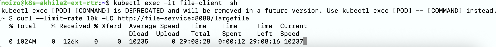
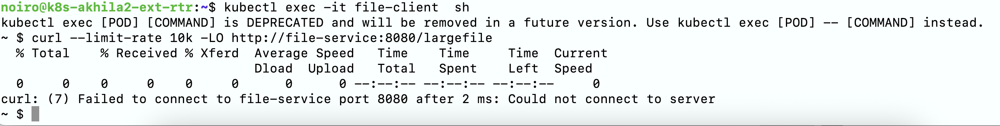

# Resilient Hashing Enhancements for k8s Services
  
## Table of contents

* [Overview](#overview)
* [Mechanism](#mechanism)
* [Examples](#examples)

## Overview

Resilient Hashing for Kubernetes Services addresses challenges in maintaining uninterrupted client sessions in multi-backend deployments. This feature is enabled only when the sessionAffinity field of a Service is set to ClientIP. The main improvements include:

1. Resilient Sessions:
Previously, ongoing client connections were disrupted whenever the number of backend pods changed, even if the pod serving the session remained active. Resilient hashing ensures that client sessions continue uninterrupted during scale-up or scale-down events.

2. Graceful Pod Termination:
When pods are terminated, ongoing connections were previously killed immediately. Now, connections continue until the pod completes its termination grace period, and new connections are routed only to healthy pods.

3. Connection Reset:
When no backend pods are available or all are in a terminating state, connections now reset immediately for both TCP and UDP traffic. This prevents hanging requests and improves service reliability.


## Mechanism

To enable these features, `sessionAffinity: ClientIP` should be configured in services. Host-agent enables `conntrack-nat = true` for such services in the service file.

1. Resilient Sessions:

* When a Service is created with sessionAffinity: ClientIP, the host-agent sets conntrack-nat = true in the service file.
* The sessionAffinityTimeout (default: 3 hours) field in the service file is applied through the field session-affinity.clientip.timeout.
* When this `conntrack-nat = true` flag is set in the service file in service mapping section, the service DNAT / SNAT for that mapping is done using Linux Connection Tracking. Thus established flows only depend on Packet 5 Tuple for lookup and no longer depend on the modulo of the hash that can change as number of backends change.
* New connections would use the hash value as before to figure out which next-hop to use.

2. Graceful Pod Termination:

* When a pod enters the Terminating state, the host-agent removes its IP from service-mapping.next-hop-ips and adds it to service-mapping.terminating-next-hop-ips
* While the pod remains in terminating state, its IP stays in the terminating-next-hop-ips list.
* The opflex-agent ensures ongoing connections continue with terminating pods while new connections are redirected to healthy ones.
* This functionality is enabled only if "conntrack-nat": true is set in the Service file, which occurs when sessionAffinity: ClientIP is configured

3. Connection Reset:

* If sessionAffinity: ClientIP is set and all backend pods are terminating, or there are no backend pods, the host-agent preserves the Service file. If sessionAffinity: None, the Service file is deleted in these cases.
* When there are no backend pods, next-hop-ips and terminating-next-hop-ips will be empty in the service file. When all are in terminating state, next-hop-ips will be empty and terminating-next-hop-ips will have all the IPs of the terminating pods.
* In both the cases, opflex-agent will send connection reset, RST for TCP and ICMP unreachable for UDP.

## Examples

1. Resilient Sessions:

* Create a service with sessionAffinity as ClientIP and deploy corresponding backend pods using the deployment.
 
```yaml
apiVersion: v1
kind: Service
metadata:
  name: file-service
spec:
  selector:
    app: file-server
  ports:
  - protocol: TCP
    port: 8080
    targetPort: 8080
  type: ClusterIP  
  sessionAffinity: ClientIP
---
apiVersion: apps/v1
kind: Deployment
metadata:
  name: file-backend
spec:
  replicas: 2
  selector:
    matchLabels:
      app: file-server
  template:
    metadata:
      labels:
        app: file-server
    spec:
      containers:
      - name: file-server
        image: quay.io/nginx/nginx-unprivileged:latest
        lifecycle:
          preStop:
            exec:
              command: ["/bin/sh", "-c", "echo preStop: waiting before shutdown...; sleep 120"]
        command: ["/bin/sh", "-c"]
        args:
          - |
            POD_NAME=$(hostname) && \
            mkdir -p /usr/share/nginx/html && \
            echo "Generating 1GB file..." && \
            echo "Serving from $POD_NAME" > /usr/share/nginx/html/largefile && \
            dd if=/dev/zero bs=1M count=1024 >> /usr/share/nginx/html/largefile && \
            nginx -g 'daemon off;'
        ports:
        - containerPort: 8080
        volumeMounts:
        - mountPath: /usr/share/nginx/html
          name: html-volume
      volumes:
      - name: html-volume
        emptyDir: {}
```

```sh
NAME                                    READY   STATUS    RESTARTS   AGE     IP          NODE
file-backend-7c49f456bb-5z7vg           1/1     Running   0          5m16s   10.2.0.77   k8s-akhila2-node-2
file-backend-7c49f456bb-sjpjk           1/1     Running   0          5m16s   10.2.0.53   k8s-akhila2-node-3
```

```sh
NAME           TYPE        CLUSTER-IP       EXTERNAL-IP   PORT(S)   AGE
file-service   ClusterIP   10.102.92.255    <none>        8080/TCP  5m43s
```

* If a client pod issues a curl request to this Service, the connection remains uninterrupted during scale-up or scale-down operations of the file-backend Deployment, as long as the backend pod currently serving the request is not deleted during the scale-down.



* Service file looks like below:

```json
{
  "uuid": "19936aff-0e96-4a9e-8a6c-7f6941047f68",
  "domain-policy-space": "common",
  "domain-name": "k8s-akhila2-vrf",
  "service-mode": "loadbalancer",
  "service-type": "clusterIp",
  "service-mapping": [
    {
      "service-ip": "10.102.92.255",
      "service-proto": "tcp",
      "service-port": 8080,
      "next-hop-ips": [
        "10.2.0.53",
        "10.2.0.77"
      ],
      "terminating-next-hop-ips": [],
      "next-hop-port": 8080,
      "conntrack-enabled": true,
      "conntrack-nat": true,
      "session-affinity": {
        "client-ip": {
          "timeout-seconds": 10800
        }
      }
    }
  ],
  "attributes": {
    "name": "file-service",
    "namespace": "default",
    "service-name": "default_file-service"
  }
}
```

2. Graceful Pod Termination:

* Create a Service with sessionAffinity: ClientIP and deploy corresponding backend pods with a defined terminationGracePeriodSeconds.

```yaml
apiVersion: v1
kind: Service
metadata:
  name: file-service
spec:
  selector:
    app: file-server
  ports:
  - protocol: TCP
    port: 8080
    targetPort: 8080
  type: ClusterIP  
  sessionAffinity: ClientIP
---
apiVersion: apps/v1
kind: Deployment
metadata:
  name: file-backend
spec:
  replicas: 2
  selector:
    matchLabels:
      app: file-server
  template:
    metadata:
      labels:
        app: file-server
    spec:
      terminationGracePeriodSeconds: 120
      containers:
      - name: file-server
        image: quay.io/nginx/nginx-unprivileged:latest
        lifecycle:
          preStop:
            exec:
              command: ["/bin/sh", "-c", "echo preStop: waiting before shutdown...; sleep 120"]
        command: ["/bin/sh", "-c"]
        args:
          - |
            POD_NAME=$(hostname) && \
            mkdir -p /usr/share/nginx/html && \
            echo "Generating 1GB file..." && \
            echo "Serving from $POD_NAME" > /usr/share/nginx/html/largefile && \
            dd if=/dev/zero bs=1M count=1024 >> /usr/share/nginx/html/largefile && \
            nginx -g 'daemon off;'
        ports:
        - containerPort: 8080
        volumeMounts:
        - mountPath: /usr/share/nginx/html
          name: html-volume
      volumes:
      - name: html-volume
        emptyDir: {}
```

```sh
NAME                                    READY   STATUS    RESTARTS   AGE     IP          NODE
file-backend-7c49f456bb-5z7vg           1/1     Running   0          5m16s   10.2.0.77   k8s-akhila2-node-2
file-backend-7c49f456bb-sjpjk           1/1     Running   0          5m16s   10.2.0.53   k8s-akhila2-node-3

NAME           TYPE        CLUSTER-IP       EXTERNAL-IP   PORT(S)   AGE
file-service   ClusterIP   10.102.92.255    <none>        8080/TCP  5m43s
```

* If a client pod issues a curl request to the Service and the serving backend pod is deleted, the connection will continue uninterrupted until the configured termination grace period expires.

```sh
$ kubectl get po
NAME                                    READY   STATUS        RESTARTS   AGE
file-backend-7c49f456bb-9w7bg           1/1     Running       0          11s
file-backend-7c49f456bb-h4frz           1/1     Terminating   0          30m
file-backend-7c49f456bb-sjpjk           1/1     Running       0          25h
```

* Also, a new request will be served by a healthy backend pod.

* The service file looks like below:

```json
{
  "uuid": "19936aff-0e96-4a9e-8a6c-7f6941047f68",
  "domain-policy-space": "common",
  "domain-name": "k8s-akhila2-vrf",
  "service-mode": "loadbalancer",
  "service-type": "clusterIp",
  "service-mapping": [
    {
      "service-ip": "10.102.92.255",
      "service-proto": "tcp",
      "service-port": 8080,
      "next-hop-ips": [
        "10.2.0.53",
        "10.2.0.78"
      ],
      "terminating-next-hop-ips": [
        "10.2.0.77"
      ],
      "next-hop-port": 8080,
      "conntrack-enabled": true,
      "conntrack-nat": true,
      "session-affinity": {
        "client-ip": {
          "timeout-seconds": 10800
        }
      }
    }
  ],
  "attributes": {
    "name": "file-service",
    "namespace": "default",
    "service-name": "default_file-service"
  }
}
```

3. Connection Reset:

* Create a Service with sessionAffinity: ClientIP and deploy corresponding backend pods with a defined terminationGracePeriodSeconds (The same yamls mentioned for Graceful Pod Termination can be used as reference)

* Scale down the Deployment to 0 so that all pods enter the Terminating state.
```sh
$ kubectl get po
NAME                                    READY   STATUS        RESTARTS   AGE
file-backend-7c49f456bb-h4frz           1/1     Terminating   0          30m
file-backend-7c49f456bb-sjpjk           1/1     Terminating       0          25h
```

* If a client pod issues a curl request to the Service while pods are terminating, the connection responds immediately.


* After the termination grace period (120 seconds), all pods are deleted. Any request sent after that time also will receive a reset response immediately.
