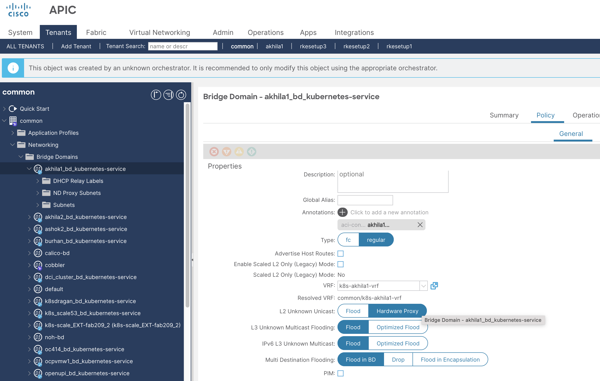
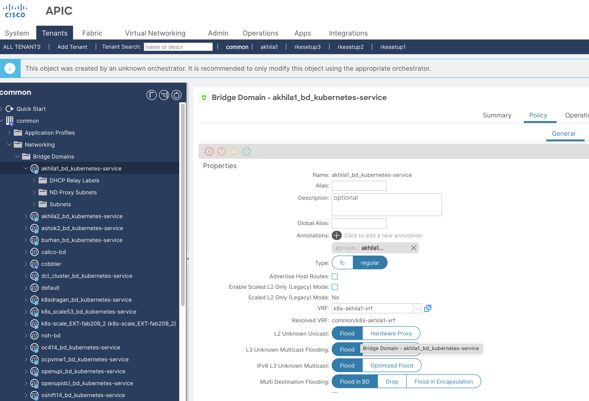

# Service BD - Unknown MAC unicast action

## Table of contents

* [Overview](#overview)
* [Mechanism](#mechanism)
* [Examples](#examples)

## Overview

The forwarding behavior for unknown unicast traffic within Service Bridge Domain (BD) used in Kubernetes Loadbalancer type services and SNAT feature is set to `proxy` mode by default to avoid flooding. It can be reverted to the earlier `flood` mode by setting parameter `unknown_mac_unicast_action` in the acc provision input file.


## Mechanism

Add following configuration in the acc provision input file:
```yaml
kube_config:
  unknown_mac_unicast_action: "flood"  # default is "proxy"
```

Run `acc-provision` tool on updated acc provision input file to generate new `aci_deployment.yaml`
```sh
acc-provision -c <acc_provision_input_file> -f <flavor> -u <apic_username> -p <apic_password> -o aci_deployment.yaml
```

Delete old aci_deployment.yaml and wait till all the pods in the `aci-containers-system` namespace are deleted
```sh
$ oc delete -f aci_deployment.yaml
$ oc get pods -n aci-containers-system
```

Apply newly generated aci_deployment.yaml and wait till all pods in `aci-containers-system` namespace are running
```sh
$ oc apply -f aci_deployment.yaml
$ oc get pods -n aci-containers-system
```

Verify the flag is set in aci-containers-config config map:

```sh
$ oc get cm -n aci-containers-system aci-containers-config -oyaml | less
apiVersion: v1
data:
  controller-config: |-
    {
        ...
        "unknown-mac-unicast-action": "flood",
        ...
    }
  ...
  ...
```

## Examples

#### 1. Service BD `L2 Unknown Unicast` action `proxy` (default)
  


#### 2. Service BD `L2 Unknown Unicast` action `flood`

  ```yaml
  kube_config:
    unknown_mac_unicast_action: "flood"
  ```

  

