# User Defined Service Graph

# Table of contents
* [Overview](#overview)
* [Motivation](#motivation)
* [Mechanism](#mechanism)  
* [Example](#example)
* [Troubleshooting](#troubleshooting)
    

## Overview
When a loadbalancer service and its endpoints are created, a service graph which is using template `<tenant-name>_svc_global` and a contract(`<tenant>_svc_<ns>_<svc-name>`) which uses `<tenant>_svc_global` service graph template are created in APIC by ACI CNI​. If user edits the contract to use a different service graph which is created by user, CNI was reverting it back to use `<tenant-name>_svc_global`​. So, users were restricted to use the default (`<tenant-name>_svc_global`) service graph template created by ACI CNI.

## Motivation

To give user an option to use their own service graph. For example, this feature can be used if user want to use firewall in the service graph.

## Mechanism

If users want to use their own service graph for a service, they can do it by adding the following annotation to the service (ACI CNI just check for key, value can be anything):​

```
   opflex.cisco.com/service-graph-name: <some value> ​
```

After annotating the service, if user change the service graph name in the contract to the one user created(user can create service graph template on any tenant), CNI will not revert it​. But, user need to create all the necessary resources for the service graph. ACI CNI will not be creating any extra resources. It will just prevent ACI CNI controller from reverting the service graph used by the contract to the global service graph.​

## Example

Let’s consider an example of using a service graph template which has firewall and loadbalancer for a loadbalancer service. User can have their own service graph design with one of the device as the loadbalancer where user need to reuse the loadbalancer device created by CNI​

### Prerequisites:
A firewall device is created and a BD is created for the firewall(in common tenant)​

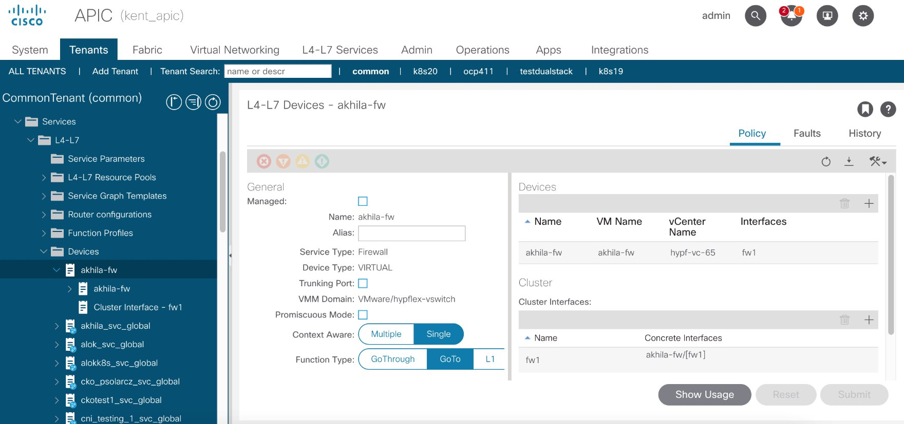

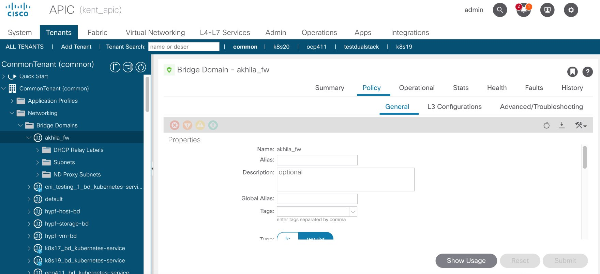

### Steps:

1. Create a service graph template(`k8s19_svc_custom`) with firewall(which uses the akhila-fw device that is already created) and loadbalancer(which reuses `k8s19_svc_global` created by ACI CNI when ACI CNI controller is up) in common tenant.​ In below image, N1 is firewall and N2 is loadbalancer.

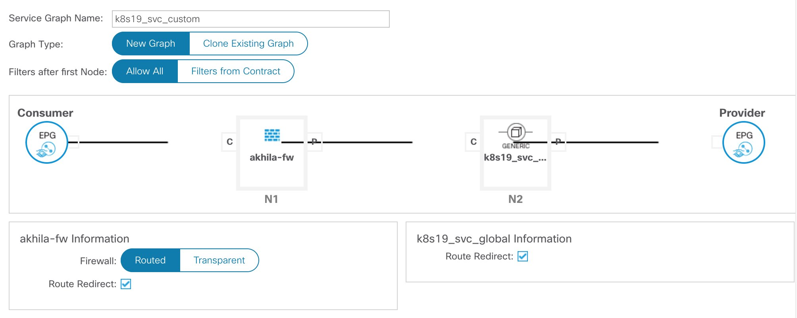

2. Create a namespace `test`​

```
	kubectl create ns test
```

3. Create a loadbalancer service `demo` in namespace `test`​

```
	apiVersion:
        kind: Service
        metadata:
          name: demo
          namespace: test
	spec:
  	  type: LoadBalancer
  	  selector:
    	    app: demo
  	  ports:
	  - port: 80
	    targetPort: 80
	    protocol: TCP
```

4. Create a deployment `demo` in namespace `test`

```
	apiVersion: apps/v1
	kind: Deployment
	metadata:
	  name: demo
  	  namespace: test
	spec:
	  replicas: 2
	  selector:
	    matchLabels:
	      app: demo
          template:
    	    metadata:
      	      labels:
                app: demo
    	    spec:
              containers:
      	      - name: demo
        	image: ngnix
        	ports:
        	- containerPort: 80
```

When the service is created and pods are in running state, `k8s19_svc_test_demo` contract will be created in common tenant in APIC, where `k8s19` is the tenant, `test` is the namespace and `demo` is the service name.

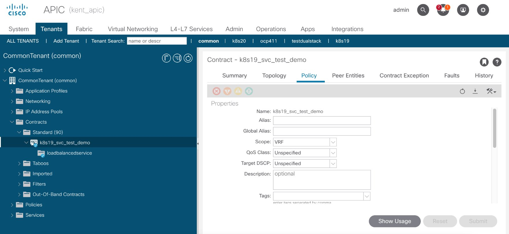

A service graph instance is also created which uses `k8s19_svc_global` service graph template.

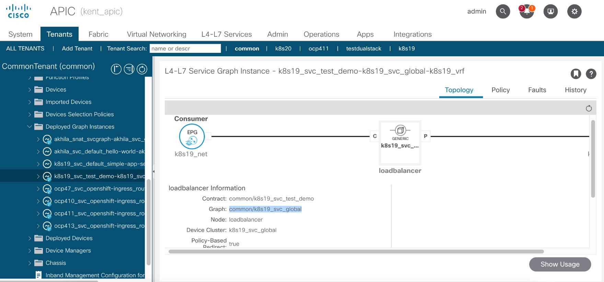

5. To use the user defined service graph template `k8s19_svc_custom`, we need to annotate the service with `opflex.cisco.com/service-graph-name: k8s19_svc_custom`.

```
	apiVersion: v1
	kind: Service
	metadata:
  	  name: demo
          namespace: test
          annotations:
	    opflex.cisco.com/service-graph-name: "k8s19_svc_custom"
	spec:
  	  type: LoadBalancer
  	  selector:
            app: demo
          ports:
	  - port: 80
            targetPort: 80
            protocol: TCP
```

6. After applying the annotation to the service, remove the service graph template name used in the contract created for demo service​.

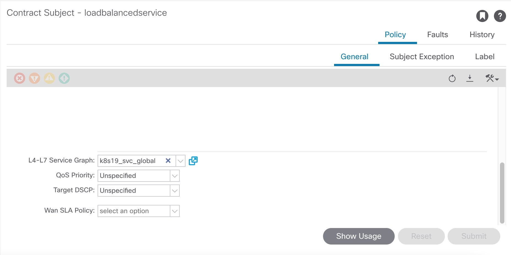

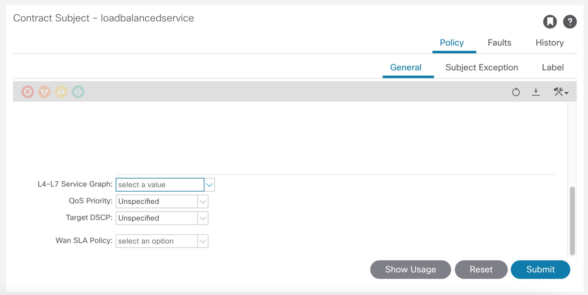

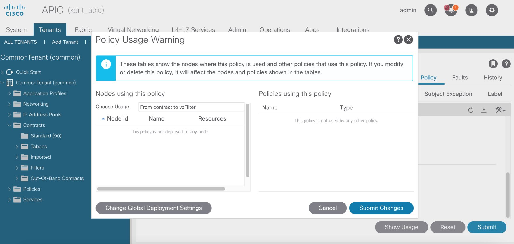

7. Create Device Selection Policies for the contract for firewall (node N1).

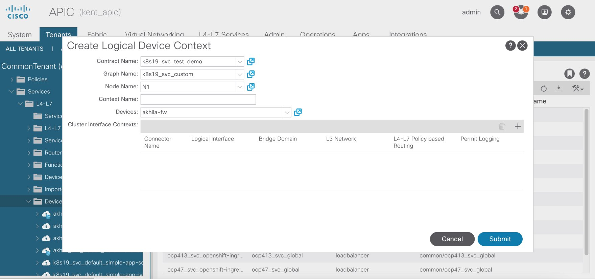

Make sure that there are no faults.

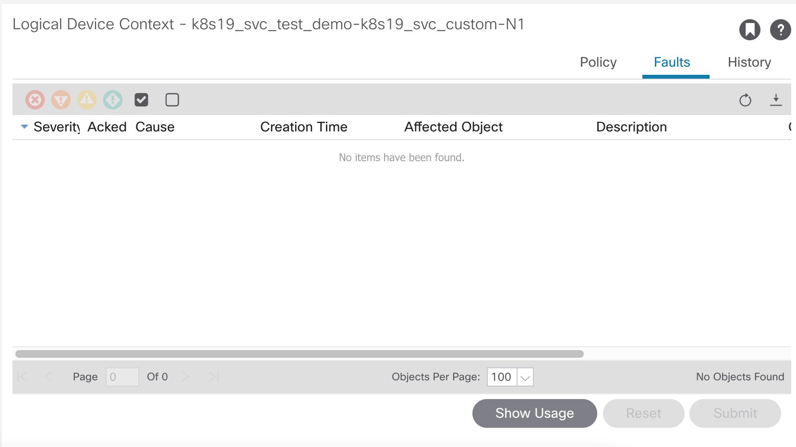

8. Create cluster interface contexts (Provider and Consumer), using the BD created for firewall.

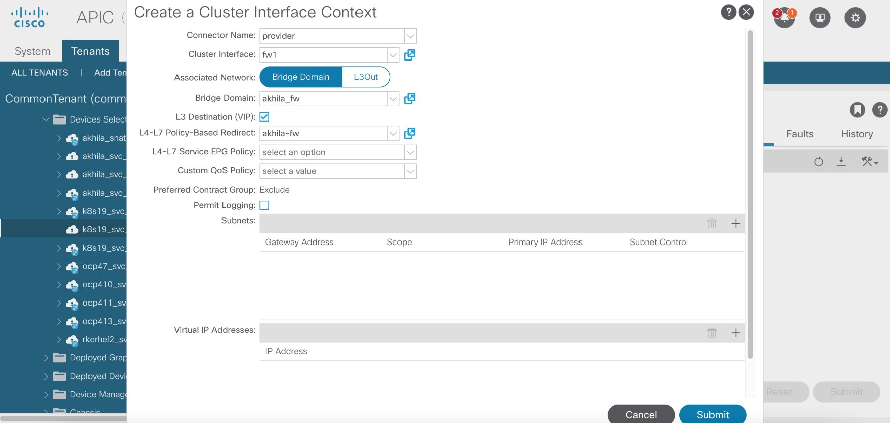

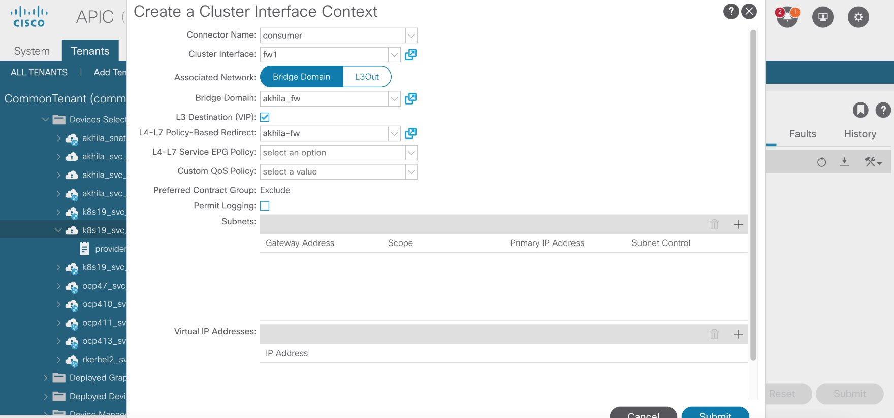

9. Now, create Device Selection Policies for the contract for loadbalancer (node N2)  where we will be reusing the device (`k8s19_svc_global`) which is already created by CNI. We have to make sure that there are no faults simar to what we did for N1.

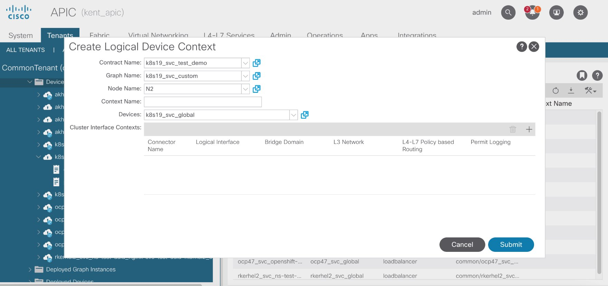

10. Create cluster interface contexts (Provider and Consumer), reusing the BD(`<tenant>_bd_kubernetes-service`) created by CNI for loadbalancer.

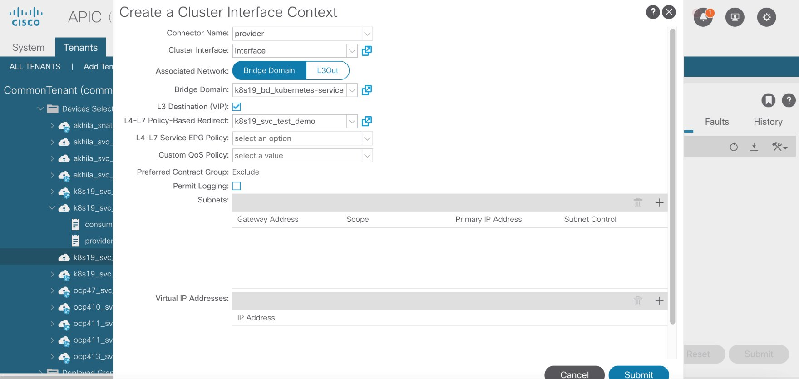

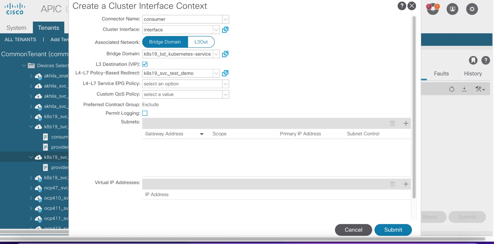

11. Now select the user created service graph name (`k8s19_svc_custom`) for the contract created for demo service. ie change its value from empty to `k8s19_svc_custom`.

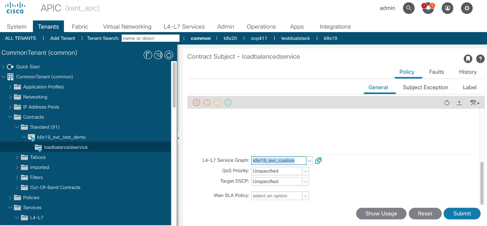

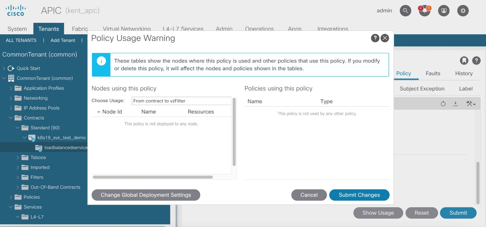

After following above steps, we can see that the service graph instance created for demo service is modified to use `k8s19_svc_custom`

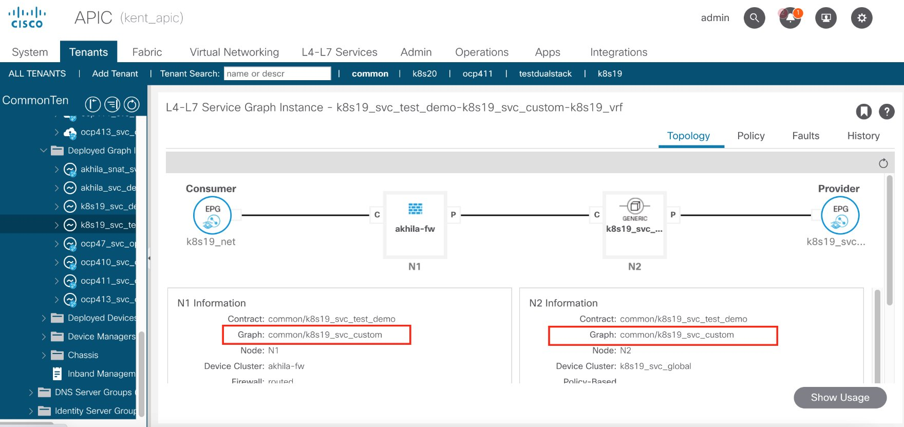

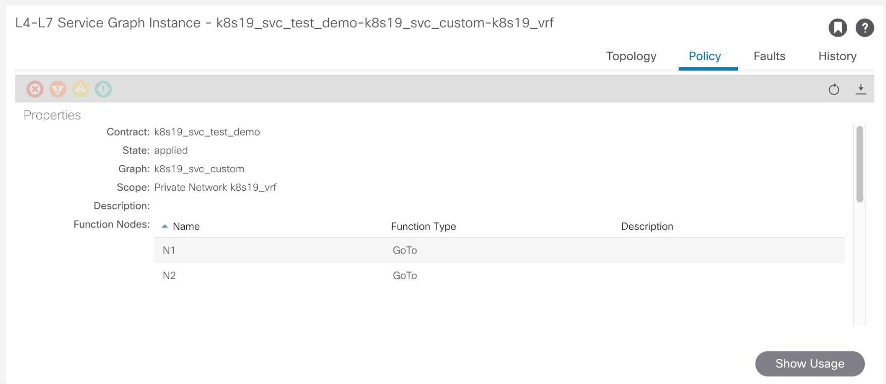


## Troubleshooting

1. Immediately after changing the service graph name in the controller, we can see following debug logs in controller​:

```sh
kubectl logs -n aci-containers-system <controller pod>  -f | grep -i ign​

time="2023-09-25T12:16:26Z" level=debug msg="Ignoring comparison of tnVnsAbsGraphName attribute of vzRsSubjGraphAtt class" mod=APICAPI​

time="2023-09-25T12:16:26Z" level=debug msg="Ignoring comparison of tnVnsAbsGraphName attribute of vzRsSubjGraphAtt class" mod=APICAPI​
```

2. Check for any errors in ACI CNI controller pod:

    `kubectl logs –n aci-containers-system <pod-name> | grep -I error​`

3. Bring down the controller by changing the replicas of aci-containers-controller deployment to 0 and then make sure that after changing the service graph name in the contract, the service graph instance is updated to use the user defined service graph.

